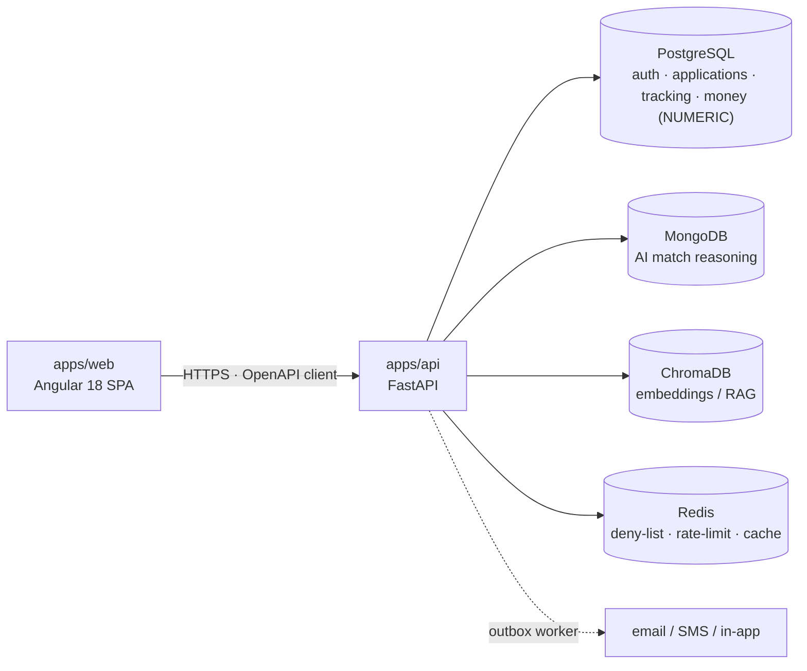

# Architecture

A one-screen map of how FundsLink Academy is built and where everything lives. It links to the
authoritative documents rather than restating them — for depth, follow the references.

> Canonical sources: [`docs/architecture/technical-architecture.md`](docs/architecture/technical-architecture.md)
> (topology) · [`docs/architecture/engineering-architecture.md`](docs/architecture/engineering-architecture.md)
> (layering & rules) · [`docs/decisions/`](docs/decisions) (ADRs) · [`docs/database/`](docs/database)
> (data law). Precedence order: [`docs/README.md`](docs/README.md).

## What it is

A non-profit platform that funds South African students who fall through NSFAS cracks. A student
creates a profile, submits a funding application, the system pre-screens eligibility and surfaces
AI-matched bursaries, and a **human** makes every funding decision. Money and counselling are
handled with deliberate, audited care.

## System at a glance



- **Stack** (ADR-001): Angular 18 (Vercel) + FastAPI (Railway). RS256 JWT auth; refresh token in an
  HttpOnly cookie, access token in Angular memory.
- **Store topology** (ADR-003; ADR-004 *rejected*): **PostgreSQL** is the system of record and the
  *only* home of monetary values (NUMERIC, append-only); **MongoDB** holds AI reasoning; **ChromaDB**
  holds embeddings; **Redis** is a cache/deny-list, never a store of record.

## Repository layout

```
apps/
  api/                 FastAPI service — app/{core,common,db,modules}/ ; Alembic migrations
  web/                 Angular 18 workspace — libs/{ui,auth,data-access,util}
packages/
  contracts/           openapi.yaml — the single source of truth for every endpoint (S2.7)
infra/                 docker-compose.dev.yml — the full dev stack in one command
scripts/               CI gate scripts (contract-diff, permission-lint, store-isolation, drills)
governance/            pinned-SHA sync of the KSDRILL constitutions (ADR-002 §4)
docs/                  the governing documents, filed by concern (see docs/README.md)
claude-instructions/   per-stage build briefs (00–06)
.github/workflows/     CI gates: api · web · contract · security · deploy
```

## Layering (enforced by CI)

`router → service → repository`. **Only repositories import a database driver** — `import-linter`
fails the build otherwise. Routers and services hold no SQL.

- **Money paths** use raw, parameterised SQL over NUMERIC, append-only ledgers; **CRUD** uses
  SQLAlchemy (ADR-003).
- **Contract-first** (S2.7): every endpoint is generated *from* `packages/contracts/openapi.yaml`;
  CI diffs the running app against it and fails on drift.

## Backend modules (Stage 03)

`profile · application · eligibility · matching · tracking · notification` — each a self-contained
`router/service/repository` unit. Status changes ride transition tables and enqueue an outbox row
**in one transaction**; the notification worker drains the outbox (`--loop`) with `FOR UPDATE SKIP
LOCKED`, consent/preference checks, and retry/backoff/DEAD.

## Security model

- **RLS, fail-closed** on every sensitive table — no request context ⇒ no rows.
- **Append-only** audit/event/ledger tables enforced by trigger *and* revoked privileges.
- **Human-Final** (`fn_human_final`): the `SYSTEM` principal can never reach an approval state —
  the database rejects it (MASTER-SPEC §5.8).
- **Store isolation** (S5.3): no monetary field may exist outside PostgreSQL — CI-asserted.
- **RBAC, deny-by-default** (S3.21): every route declares a permission or CI fails.
- **Auth**: RS256 JWT, refresh-token family revocation, TOTP MFA mandatory for privileged roles.
- **Counselling data** never enters the main schema or matching inputs (§6.4).

## Quality gates (CI)

`api`: ruff · import-linter · permission-lint · contract-diff · store-isolation · Alembic
upgrade/downgrade roundtrip · integrity · pytest. `web`: Vitest · strict AOT build. `contract`:
OpenAPI validation. `security`: gitleaks.

## Delivery

Stage-gated build **G0 → G6** (scaffold → database → auth → backend → frontend → integration →
launch). At deploy time **FastAPI ships before Angular** (S6.29). See
[`docs/process/implementation-process.md`](docs/process/implementation-process.md) and
[`CONTRIBUTING.md`](CONTRIBUTING.md).
