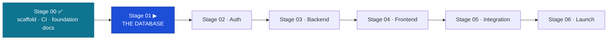

# FundsLink Academy — Handoff: Stage 00 (Foundation) → Stage 01 (Database)

The relay baton. Everything the next engineer needs to pick up at the highest level.
Date: 2026-06-13 · From: Engineer 02 (Claude Code, L3) · To: Engineer 02 (terminal) · Approver: Founder (L4).

---

## 1. What is built (Stage 00 + foundation hardening) — all verified green

- **Monorepo (ADR-002):** `apps/api` (FastAPI, `/healthz` only), `apps/web` (Angular 18 + `libs/{ui,auth,data-access,util}`, Tailwind wired), `packages/contracts` (OpenAPI + codegen), `infra/docker-compose.dev.yml` (postgres16 + mongo7 + chromadb + redis7, healthchecks), `governance/` (pinned-SHA sync stub), `PARKED.md`.
- **CI gates armed:** `api` (ruff + import-linter + pytest), `web` (vitest + build), `contract` (OpenAPI validate), `security` (gitleaks CLI), `deploy` (ordered, disabled). Layering gate **proven to bite** (router importing `sqlalchemy` → CI failed → reverted).
- **Foundation docs (diagram-first):** DBLC, SDLC, Engineering-Architecture, ADR-005, runbook sequence diagrams, doc-suite map — all merged and indexed in `docs/README.md`.
- **Store topology corrected:** ADR-004 (PG-only) **rejected**; schema + every doc realigned to the 3-store polyglot.
- **Verified on final main:** `pytest` ✓ · `ruff` ✓ · `import-linter` KEPT ✓ · `vitest` ✓ · `ng build` ✓ · CI green · structure per ADR-002.

## 2. Locked stack & decisions

| | |
|---|---|
| Stack | Angular 18 + FastAPI (ADR-001) |
| Stores | **PostgreSQL** (auth/apps/tracking/match record) + **MongoDB** (AI reasoning, S5.33) + **ChromaDB** (embeddings, S5.45) + **Redis** (deny-list/cache) |
| Auth | RS256 JWT; refresh in HttpOnly cookie, access in Angular memory (S3.13/S3.14) |
| ADRs | 002 monorepo · 003 hybrid data access · **004 REJECTED** · 005 frontend (Tailwind + spartan/ui; Aceternity/Magic reproduced in Angular) |
| Deploy | Railway (API) before Vercel (web), S6.29 |

## 3. How we work (must follow)

- **Governance:** Engineer 02 = L3, build-only; the **Founder (L4) approves/merges**; cite `S{C}.{N}` on every non-trivial decision; flag violations, never silently comply. `.ksdrill/` holds the GOVERNOVA constitutions (gitignored clone).
- **GitHub workflow** (docs/50-process/FUNDSLINK-GITHUB-WORKFLOW): every task → **Issue first** (type `Task`, assignee `MALULEKE-KS`, labels, `Stage NN` milestone, `FundsLink Academy` project + Status) → **branch** → **PR** with `Closes #N` → documented self-review → **squash-merge**. One task = one branch = one PR.
- **Docs standard:** clean, professional **Mermaid** for anything words can't carry — including PR descriptions.
- **Layering (enforced):** router → service → repository; only repositories import DB drivers (import-linter). No business logic in UI (S4.12). No hardcoded business values — config table (DB-D24). Secrets never in code (S3.20).
- **Tooling:** `gh` via full path `"/c/Program Files/GitHub CLI/gh.exe"`; auto squash-merge is granted EXCEPT for PRs that change `.claude/` permissions (Founder merges those).

## 4. ▶ NEXT TASK — Stage 01: THE DATABASE

**Command:** "execute stage 01". **Brief:** `claude-instructions/01-DATABASE.md`. **Forbidden:** endpoints, services, Angular, auth logic — the database exists alone until G1.

**Read first:** `docs/30-database/` (DBLC, DB-DOCTRINE, ERD-PACKAGE, `fundslink-v1-schema.sql`) · `docs/50-process/FUNDSLINK-IMPLEMENTATION-PROCESS-v1.0.md §3` · reference TAD §4, ADR-003.

**Tasks:** migration 0001 (wrap the validated schema — do **not** redesign) · seeds 0002 (roles/permissions, lookups, both transition tables, config, eligibility rulesets, theme tags) · **DB-D37 constraint test suite** (attempt every violation, assert rejection — append-only guards, human-final trigger, uniqueness, transition tables, FK RESTRICT) · integrity-job skeleton · partition maintenance · repository base layer (async session, raw-SQL helper, cuid) · restore drill #1.

**Gate G1:** `alembic upgrade head` from empty clean; downgrade→upgrade roundtrip clean; 100% of DDL constraints exercised; restore drill green.

**⚠ 3-store scope note (this brief predates the ADR-004 rejection):** Stage 01 per the brief is **PostgreSQL** (Alembic + constraints). The schema no longer holds embeddings (→ ChromaDB) or reasoning (→ MongoDB). Recommendation: keep Stage 01 PG-only as written; introduce **MongoDB/ChromaDB collection bootstrap + the DB-D35 cross-store integrity job with the matching module (Stage 03)**, behind repository seams (its first consumer). Confirm with the Founder before starting.

## 5. Founder open actions (not code)

- **Revoke** the Session-00 PAT once setup is done.
- **Branch protection** on `main` (S1.16) — enable on GitHub Pro.
- **Gate G0 Docker check** (couldn't run on the build host — no Docker): `docker compose -f infra/docker-compose.dev.yml up -d && curl localhost:8000/healthz`.
- **governance/sync.sh** `GOVERNANCE_SHA` is a `<PINNED_SHA>` placeholder — pin to a real commit when first vendoring governance.

---

*Stage 00 closed by Engineer 02 (Claude Code, L3) on 2026-06-13. Foundation verified solid; no blocking gaps for Stage 01.*
