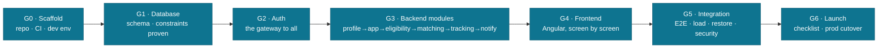
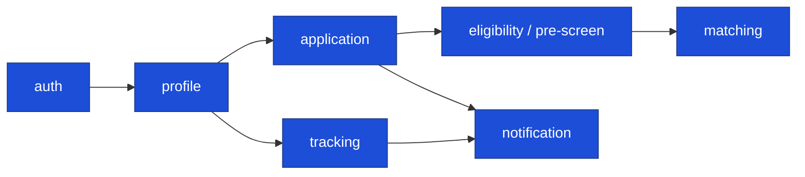

# FundsLink Academy — Software Development Lifecycle (SDLC) v1.0

The build foundation, **bounded to FundsLink**: what we build (FRs), how well it must behave
(NFRs), how each requirement traces to design + standard + stage, and the gated lifecycle that
delivers it. Diagram-first; derived from MASTER-SPEC, the constitutions, the
[STRESS-TEST-AUDIT](../60-audits/FUNDSLINK-STRESS-TEST-AUDIT-v1.0.md), and the
[IMPLEMENTATION-PROCESS](FUNDSLINK-IMPLEMENTATION-PROCESS-v1.0.md).

| Attribute | Value |
|-----------|-------|
| v1 done-when | A student applies and receives ≥1 matched funding opportunity, end-to-end, in production |
| Scope | 5 features max (S9.9); everything else → PARKED |
| Method | Design-first, gated stages — "done" is verified by command output, not confidence |

---

## 1. The gated lifecycle (G0 → G6)



**Law:** one stage at a time; a stage is DONE only when its gate passes; no stage starts while the
prior gate is open. Parallel work is allowed only on the Human Track (partnerships, legal, reviewer
recruitment) which has no code dependency.

---

## 2. Functional Requirements (FR)

The v1 feature set (S9.9 — max 6). Each FR realises business rules cataloged in the ERD-PACKAGE.

| FR | Feature | Group | Business rules | Stage |
|----|---------|-------|----------------|-------|
| **FR-1** | Authentication & accounts (register, login, RS256 JWT, MFA for privileged roles, consent capture) | G1 | BR-A01–A07 | G2 |
| **FR-2** | Student profile (create/manage, verification tiers, document upload) | G1 | BR-A03, BR-S06–S07 | G3 |
| **FR-3** | Funding application (submit; types incl. OTHER+motivation; pre-screening; status lifecycle; returns/resubmit; appeals; waitlist; recusal) | G1 | BR-S01–S09, BR-E01–E10 | G3 |
| **FR-4** | AI eligibility matching (queued; embeddings; advisory scores + reasoning; browse-all; fallback) | G1 | BR-M01–M04 | G3 |
| **FR-5** | Application status tracking (external bursaries, status events, deadlines, 30/45/60 follow-ups) | G2 | BR-T01–T06 | G3 |
| **FR-6** | Notifications (outbox, per-trigger preferences, consent-gated) | — | BR-N01–N03 | G3 |

> Financial (donations, disbursement, ledgers) and Institution features are **[FWD v1.5/v2]** — designed (BR-F, BR-I) but flag-gated, not built at v1.

### Module build-dependency



---

## 3. Non-Functional Requirements (NFR)

By quality attribute. Each cites its governing standard and, where it closes a stress-test finding,
the ST-id it answers.

### 3.1 Security (C3 — Auth Override)
| NFR | Requirement | Standard | Closes |
|-----|-------------|----------|--------|
| SEC-1 | RS256 JWT; refresh in HttpOnly cookie, access in Angular memory | S3.13, S3.14 | — |
| SEC-2 | MFA (TOTP) mandatory for privileged roles | S3.x | ST-2.1 (BLOCKING) |
| SEC-3 | bcrypt cost ≥12 + HIBP breach check | S3.3 | ST-2.2 |
| SEC-4 | Three-layer rate limiting on auth endpoints | S3.4 | — |
| SEC-5 | Ownership verification + mandatory cross-user 403 tests (no IDOR) | S3.22, S7.11 | ST-2.3 |
| SEC-6 | Upload safety: magic-byte + AV + EXIF strip + separate origin + CSP | — | ST-2.4 |
| SEC-7 | HTTPS+HSTS, CORS locked (no wildcard in prod), security headers | S3.28–S3.31 | ST-2.8 |
| SEC-8 | Secrets only in Railway secret store — never in repo | S3.20, CF-04 | — |
| SEC-9 | Per-user quotas + spend circuit breaker on matching | — | ST-2.6 |
| SEC-10 | Universal auth-event logging | S3.33 | — |

### 3.2 Performance & scalability
| NFR | Requirement | Standard | Closes |
|-----|-------------|----------|--------|
| PERF-1 | Matching is a queued job (202 + poll), never inline | TAD §6.2 | ST-1.2, ST-4 |
| PERF-2 | Cached embeddings, recomputed only on source change | BR-M04 | ST-1.2 |
| PERF-3 | N outbox workers, `SKIP LOCKED`, spread scheduling | TAD §7 | ST-1.3 |
| PERF-4 | PgBouncer transaction-mode pooling | — | ST-3.6 |
| PERF-5 | Monthly RANGE partitioning from day one | DB-D44 | ST-3.5 |
| PERF-6 | CI under 5 minutes | S8.10 | — |
| PERF-7 | Pagination on every list; no unbounded queries | S5.14 | — |

### 3.3 Reliability & availability
| NFR | Requirement | Standard | Closes |
|-----|-------------|----------|--------|
| REL-1 | Zero-downtime deploys; FastAPI before Angular | S8.6, S6.29 | — |
| REL-2 | Three isolated environments (dev/staging/prod) | S8.5, S8.24 | — |
| REL-3 | Uptime monitoring, 60-second checks | S8.33 | — |
| REL-4 | Tested restore drills + PITR (single-region) | — | ST-6.4 |
| REL-5 | SEV framework + rollback procedures | S8.47, S8.67 | — |
| REL-6 | AI degradation → graceful fallback to manual application | S8.51 | ST-2.6 |
| REL-7 | k6 load baseline in CI | — | ST-6.5 |

### 3.4 Accessibility & experience (C4)
| NFR | Requirement | Standard |
|-----|-------------|----------|
| UX-1 | WCAG 2.1 AA; colour contrast ≥4.5:1 | S4.21 |
| UX-2 | Touch targets 44×44px mobile | S4.18 |
| UX-3 | Full keyboard accessibility; ARIA on icon-only controls | S4.19, S4.23 |
| UX-4 | Mobile-first, 320px baseline; no page-level horizontal scroll | S4.2, S4.9 |
| UX-5 | Body text ≥16px; respect `prefers-reduced-motion` | S4.20, S4.22 |
| UX-6 | **Tailwind for layout/spacing/responsive; custom CSS for brand/complex patterns; no duplication; tokens as CSS vars** | S4.13–S4.16 |
| UX-7 | Visual regression at 320/375/390px on every UI PR | S4.10, S7.19 |
| UX-8 | Every async view has loading/error/success states | S4.11 |
| UX-9 | Emotional-design law incl. the "kind rejection" spec | UX-MAP P1–P8 |

### 3.5 Data integrity · observability · privacy · localization · maintainability
| NFR | Requirement | Standard / Source |
|-----|-------------|-------------------|
| DATA-1 | Money as NUMERIC, never float; parameterised raw SQL | S5.28, S5.21 |
| DATA-2 | Append-only events/ledgers + soft delete; timestamptz UTC | S5.8, DB-D41 |
| DATA-3 | Cross-store integrity job (PG ↔ Mongo ↔ Chroma) | DB-D35 |
| OBS-1 | Structured JSON logs; Sentry FE+BE; X-Request-ID propagation | S8.31, S8.32 |
| OBS-2 | Cost alerts from week one | ST cost rulings |
| PRIV-1 | POPIA: append-only consent; withdrawal supported | BR-A05 |
| PRIV-2 | Counselling content segregated; never in main schema/matching | BR-S09, §6.4 |
| PRIV-3 | ID numbers encrypted (AES-256-GCM) + blind-index uniqueness | BR-A04 |
| PRIV-4 | Data minimisation; hardship narrative excluded from logs | TAD §4.4 |
| LOC-1 | Motivation accepted in any SA official language | E11 |
| MNT-1 | Layering router→service→repository (import-linter enforced) | CLAUDE.md, S2.1 |
| MNT-2 | Contract-first: endpoints come from the OpenAPI file | S2.7 |
| MNT-3 | Coverage gates: Angular 75% · Python 80% | S7.25 |
| MNT-4 | No hardcoded business values — config table with history | DB-D24 |

---

## 4. Quality-attribute scenario — matching under load (the headline NFR path)

```mermaid
sequenceDiagram
  participant SPA as Angular SPA
  participant API as FastAPI
  participant Q as Queue (Redis)
  participant W as Worker
  participant CH as ChromaDB
  participant AI as OpenAI
  participant MG as MongoDB
  participant PG as PostgreSQL
  SPA->>API: POST /matches/run
  API->>Q: enqueue job
  API-->>SPA: 202 Accepted
  W->>CH: ANN over cached embeddings
  W->>AI: score (spend breaker + quota)
  alt budget exceeded / AI down
    W->>PG: write match_result mode=FALLBACK
  else live
    W->>MG: store reasoning (keyed by match id)
    W->>PG: write match_result mode=LIVE
  end
  SPA->>API: GET /matches/me (poll)
  API->>PG: read results (advisory; browse-all unaffected)
```

This single path closes ST-1.2 (rate-limit/cost), ST-2.6 (cost attack) and S8.51 (AI degradation).

---

## 5. Requirements traceability (FR/NFR → design → standard → gate)

| Requirement | Design source | Key standards | Verified at gate |
|-------------|---------------|---------------|------------------|
| FR-1 Auth | TAD §3, ERD §3.1 | S3.13/14, S3.3/4 | G2 (200/401/403 suite) |
| FR-2 Profile | ERD §3.1, DBLC §3.1 | S5.4, S4.* | G3 + G4 |
| FR-3 Application | ERD §3.2, DBLC §5.1 | BR-S/E, DB-D37 | G1 (constraints) + G3 |
| FR-4 Matching | TAD §6, DBLC §3.4 | BR-M, S5.45/S5.33, S8.51 | G3 + G5 (load) |
| FR-5 Tracking | ERD §3.3, DBLC §5.2 | BR-T | G3 |
| FR-6 Notifications | TAD §7 | BR-N | G3 |
| NFR Security | TAD §3/§4.4 | C3 (S3.*) | G2 + G5 (security pass) |
| NFR Performance | TAD §6/§7/§12 | DB-D44, S8.10 | G5 (k6 load) |
| NFR Reliability | TAD §8, runbooks | S8.*, ST-6 | G5 (restore drill) + G6 |
| NFR Accessibility | UX-MAP | C4 (S4.*) | G4 (visual + axe) |
| NFR Data integrity | DB-DOCTRINE, DBLC | S5.*, DB-Dx | G1 (DB-D37 suite) |

---

## 6. Pre-production blocking gates (from the stress-test)

Non-negotiable before money or public launch (ST-6):

| Gate | Blocks | Source |
|------|--------|--------|
| Second human authorizer (named, trained, MFA'd) | any money release (v1.5+) | ST-6.1 / TAD R7 |
| Continuity pack (access escrow + runbook index) | public launch | ST-6.2 |
| Legal: NPC, PBO, §18A, Information Officer, privacy policy | v1.5 | ST-6.3 |
| Restore drill performed | launch | ST-6.4 |
| k6 load baseline in CI | launch | ST-6.5 |

---

*v1.0 — derived from MASTER-SPEC, C0–C10, STRESS-TEST-AUDIT v1.0, IMPLEMENTATION-PROCESS v1.0.
Reflects the 3-store polyglot and Tailwind + custom CSS styling.*
