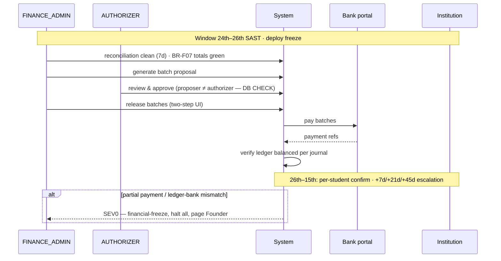

# FUNDSLINK ACADEMY — RUNBOOK: Monthly Disbursement (the 25th) | v1.0 [activates at v2]
**Window:** 24th 00:00 – 26th 23:59 SAST. Deploy freeze. FINANCE_ADMIN + AUTHORIZER on standby.

## Flow

## Pre-flight (24th)
1. Reconciliation clean for trailing 7 days (zero variance) — else STOP: financial-freeze runbook.
2. Batch proposal generated; per-institution totals vs AllowanceAllocation sums verified (BR-F07 job green).
3. Authorizer reviews & approves (proposer ≠ authorizer — DB CHECK will refuse otherwise).
4. Institution bank details: no unverified changes in last 30 days (BR-I04); any change → out-of-band phone confirm.

## Execution (25th)
5. Release batches via two-step UI. Capture payment refs against each batch.
6. Verify ledger entries balanced per journal; transparency counters updated.

## Failure modes
- Single batch fails → SEV1: retry once after bank confirmation; else hold THAT batch only, notify institution, log incident.
- Partial payment / ledger-bank mismatch → **SEV0: financial-freeze runbook, all disbursements halt, Founder paged.**
- Bank portal down → batches stay APPROVED-unreleased; communicate ETA to institutions; never bypass the system with manual EFT.

## Post (26th–15th)
7. Institutions confirm per-student in portal by the 15th; +7d reminder, +21d pause next batch, +45d partnership review (MASTER-SPEC §7.7).
8. Returns processed as reversing entries. Post-mortem for any deviation.
