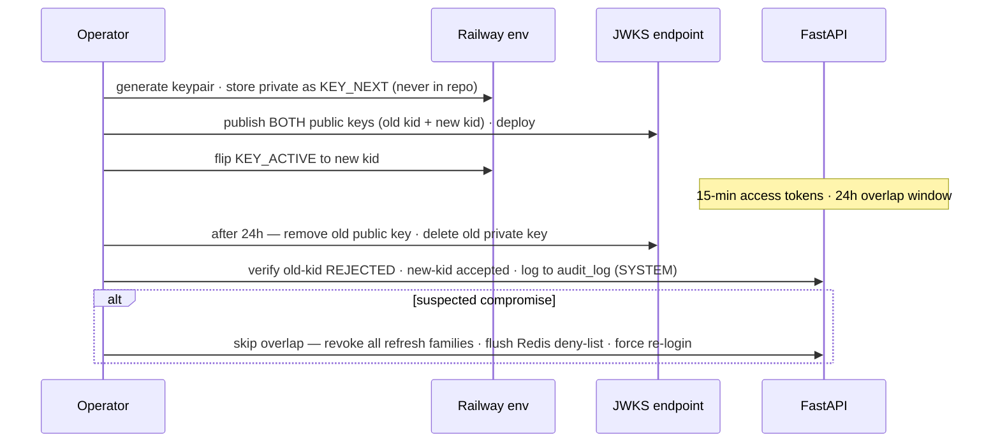

# FUNDSLINK ACADEMY — RUNBOOK: JWT Key Rotation (RS256) | v1.0 [ST-2.9]
**Cadence:** every 90 days, or immediately on suspected compromise.

1. Generate new keypair offline; store private key in Railway env as KEY_NEXT (never in repo).
2. Publish BOTH public keys at JWKS endpoint (old kid + new kid). Deploy.
3. Flip signing to new kid (env KEY_ACTIVE). Access tokens are 15-min — overlap window 24h is generous.
4. After 24h: remove old public key from JWKS; delete old private key everywhere.
5. Compromise path: skip overlap — flip immediately, revoke ALL refresh-token families (forced re-login), Redis deny-list flush-and-rebuild, notify users, incident post-mortem.
6. Verify: staging token signed with old kid is REJECTED post-removal; new kid accepted. Log rotation in audit_log (SYSTEM principal).
