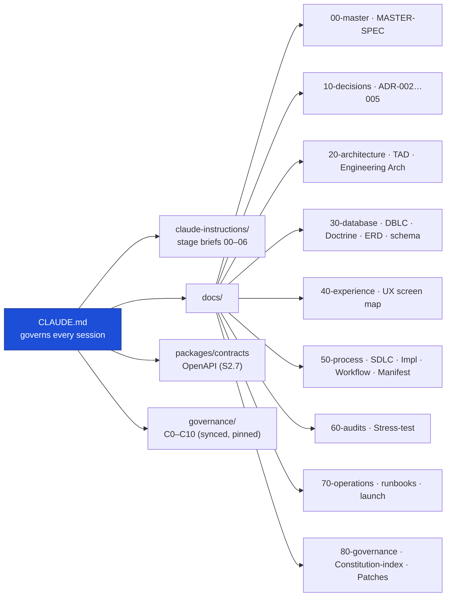

# FundsLink Academy — Documentation Suite

The governing documents for FundsLink Academy, filed by concern. This index gives a
one-line description of every document and the **precedence order** used to resolve
conflicts between them. Stage briefs live in [`/claude-instructions`](../claude-instructions);
master Claude Code instructions live in [`/CLAUDE.md`](../CLAUDE.md).

> Suite v1.5 — Design phase complete (+ v1.1 Eligibility Wave). The store topology is
> **v1 store topology = PostgreSQL + MongoDB + ChromaDB + Redis** (constitutional polyglot). ADR-004's PostgreSQL-only consolidation was **REJECTED (L4, 2026-06-13)**.

---

## Precedence order (conflict resolution)

When documents disagree, the **higher** source wins; the lower document must be amended,
never silently ignored (manifest §2 · [CLAUDE.md](../CLAUDE.md) "IF SOMETHING CONFLICTS").

```
1. Constitutions C0–C10 + ADR-001        ← governance/ (system-design-template, synced & pinned)
2. FUNDSLINK MASTER-SPEC                  ← business truth
3. ADRs 002–004                          ← locked technical decisions
4. TAD                                   ← architecture (how)
5. DB-DOCTRINE                           ← database law (DB-D1–D44), gates the ERD
6. STRESS-TEST-AUDIT                      ← adversarial findings register (feeds amendments upward)
   then → stage briefs (claude-instructions/00–06)
```

Conflicts are reported to the Founder with both citations — never resolved silently.

---

## Doc map



## Document index

### `00-master/` — what & why
| Document | Description |
|----------|-------------|
| [FUNDSLINK-MASTER-SPEC-v1.1.md](00-master/FUNDSLINK-MASTER-SPEC-v1.1.md) | ⭐ THE MAIN DOCUMENT — full description of operations, the v1 Release Map, and business rules. |

### `10-decisions/` — locked technical decisions (ADRs)
| Document | Description |
|----------|-------------|
| [ADR-002-fundslink-monorepo.md](10-decisions/ADR-002-fundslink-monorepo.md) | Single-system monorepo + application topology (two apps + worker). **accepted**. |
| [ADR-003-fundslink-data-access.md](10-decisions/ADR-003-fundslink-data-access.md) | PostgreSQL hybrid data access — raw SQL for money paths, SQLAlchemy for CRUD. **accepted**. |
| [ADR-004-v1-store-consolidation.md](10-decisions/ADR-004-v1-store-consolidation.md) | Proposed v1 PostgreSQL-only consolidation — **REJECTED (L4, 2026-06-13)**; v1 keeps the 3-store polyglot. |
| [ADR-005-frontend-component-strategy.md](10-decisions/ADR-005-frontend-component-strategy.md) | Angular-native frontend — Tailwind + custom CSS + spartan/ui (shadcn-for-Angular); Magic/Aceternity effects reproduced in Angular. **accepted (L4, 2026-06-13)**. |

### `20-architecture/` — how
| Document | Description |
|----------|-------------|
| [FUNDSLINK-TAD-v1.2.md](20-architecture/FUNDSLINK-TAD-v1.2.md) | Technical Architecture Document — topology, queued matching, MFA, eligibility module. |
| [FUNDSLINK-ENGINEERING-ARCHITECTURE-v1.0.md](20-architecture/FUNDSLINK-ENGINEERING-ARCHITECTURE-v1.0.md) | Layering (router→service→repository), shared/common homes, enforced hard rules, and design-for-extension seams (diagram-first). |

### `30-database/` — database law & schema
| Document | Description |
|----------|-------------|
| [FUNDSLINK-DBLC-v1.0.md](30-database/FUNDSLINK-DBLC-v1.0.md) | Database lifecycle — conceptual/logical/physical models, normalization (1NF→BCNF), status state machines, store assignment (diagram-first). |
| [FUNDSLINK-DB-DOCTRINE-v1.1.md](30-database/FUNDSLINK-DB-DOCTRINE-v1.1.md) | Database law DB-D1–D44 — gates all schema work. |
| [FUNDSLINK-ERD-PACKAGE-v1.1.md](30-database/FUNDSLINK-ERD-PACKAGE-v1.1.md) | Entity-relationship package (+ BR-E01–E10, eligibility tables). |
| [fundslink-v1-schema.sql](30-database/fundslink-v1-schema.sql) | PostgreSQL DDL — auth, applications, tracking, match records. Embeddings → ChromaDB; AI reasoning → MongoDB. |

### `40-experience/` — UX
| Document | Description |
|----------|-------------|
| [FUNDSLINK-UX-SCREEN-MAP-v1.0.md](40-experience/FUNDSLINK-UX-SCREEN-MAP-v1.0.md) | 21 screens, emotional-design law (P1–P8), the kind-rejection spec. |

### `50-process/` — how we build
| Document | Description |
|----------|-------------|
| [FUNDSLINK-SDLC-v1.0.md](50-process/FUNDSLINK-SDLC-v1.0.md) | SDLC foundation — gated lifecycle, Functional + Non-Functional Requirements, traceability, quality scenarios (diagram-first). |
| [FUNDSLINK-IMPLEMENTATION-PROCESS-v1.0.md](50-process/FUNDSLINK-IMPLEMENTATION-PROCESS-v1.0.md) | Stage-gated build order G0–G6 (database first) + Human Track. |
| [FUNDSLINK-DOCS-MANIFEST-v1.5.md](50-process/FUNDSLINK-DOCS-MANIFEST-v1.5.md) | The suite index, precedence order, and cross-document consistency record. |
| [FUNDSLINK-GITHUB-WORKFLOW-v1.0.md](50-process/FUNDSLINK-GITHUB-WORKFLOW-v1.0.md) | GitHub workflow: issue → branch → linked PR → self-review → squash-merge; labels & milestones. |

### `60-audits/` — adversarial findings
| Document | Description |
|----------|-------------|
| [FUNDSLINK-STRESS-TEST-AUDIT-v1.0.md](60-audits/FUNDSLINK-STRESS-TEST-AUDIT-v1.0.md) | Stress-test findings register (ST-1…ST-6) — blocking gates feed amendments upward. |

### `70-operations/` — runbooks & launch
| Document | Description |
|----------|-------------|
| [runbook-disbursement.md](70-operations/runbook-disbursement.md) | Operational runbook for disbursement handling. |
| [runbook-jwt-key-rotation.md](70-operations/runbook-jwt-key-rotation.md) | Operational runbook for RS256 JWT key rotation. |
| [FUNDSLINK-LAUNCH-CHECKLIST-v1.0.md](70-operations/FUNDSLINK-LAUNCH-CHECKLIST-v1.0.md) | Production launch checklist + cutover steps. |

### `80-governance/` — the project's constitutional layer
| Document | Description |
|----------|-------------|
| [CONSTITUTION-INDEX-fundslink.md](80-governance/CONSTITUTION-INDEX-fundslink.md) | Claude Code entry point — read order, hard rules, standard-ID map (`S10.21`). |
| [FUNDSLINK-GOVERNANCE-PATCHES-v1.1.md](80-governance/FUNDSLINK-GOVERNANCE-PATCHES-v1.1.md) | Approved constitutional amendments for this system (DB-D21 third trigger class). |

### `packages/contracts/` — the API source of truth
| Document | Description |
|----------|-------------|
| [FUNDSLINK-API-v1.yaml](../packages/contracts/FUNDSLINK-API-v1.yaml) | OpenAPI contract — every endpoint comes FROM here (`S2.7`); CI diffs against it. |

---

*The full GOVERNOVA constitutions (C0–C10) are not stored here — they are synced into
`governance/` from `system-design-template` at a pinned SHA (ADR-002 §4). See
[CLAUDE.md](../CLAUDE.md) for the stage workflow and hard rules.*
