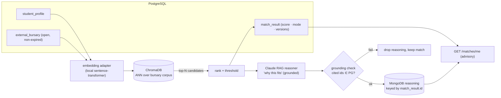

# AI Enablement — design & implementation brief

The design and build plan for replacing the matching stub with a real, trustworthy AI. Pairs with
the locked decisions in [ADR-007](../decisions/adr-0007-ai-enablement.md). When the AI-Enablement
milestone opens, this document is the brief — read it, build the phases, pass the eval gate, ship.

> Status: **PLANNED (v1.x)** · Owner: Engineer 02 (build) once ADR-007 is ratified (L4).
> Canonical context: [system-overview §6](system-overview.md) · [TAD §6](technical-architecture.md) ·
> [ADR-003](../decisions/adr-0003-data-access.md) · the `matching` module.

## 1. Principles (the measure of a good AI here)

For a platform funding vulnerable students, **trustworthy beats flashy**. Every design choice below
serves five non-negotiables:

1. **It never decides funding** — advisory only; `fn_human_final` stands.
2. **It never invents a bursary** — grounded to real, retrieved candidates.
3. **It never leaks student data** — local-first, PII-minimised, counselling-data-excluded (§6.4).
4. **It never runs away with cost** — the spend breaker + quota govern every paid call.
5. **It never regresses silently** — no model/prompt ships without passing the eval harness.

## 2. The target pipeline

Funding amounts never leave PostgreSQL (S5.3). The reasoning store holds score/text/tags only.

## 3. Components to build (all behind existing ports)

| Component | Replaces / adds | Notes |
|-----------|-----------------|-------|
| `LocalEmbedder` | `embed_text()` (the hashing stub) | A sentence-transformer; multilingual for SA languages (P7). Output dim is the model's (e.g. 384), Chroma collection sized to match. |
| `ChromaEmbeddingStore(EmbeddingStore)` | `InMemoryEmbeddingStore` | Real ANN; upsert profile/bursary vectors keyed by cuid; recompute only on `source_hash` change (BR-M04). |
| `MongoReasoningStore(ReasoningStore)` | `InMemoryReasoningStore` | Beanie/Mongo adapter; the `MatchReasoning` model already exists and is money-free (S5.3). |
| `ClaudeReasoner` | the templated `_summary()` | A grounded RAG call (latest Claude) → a short, warm "why this fits". Behind the spend breaker. |
| `GroundingValidator` | new | Every bursary id the reasoner cites must exist in the candidate set / PG; else the reasoning is dropped (the match still stands). |
| `eval harness` | new | Golden profile→bursary set; precision@k + grounding/safety checks; gates model/prompt changes in CI. |

The matching **service does not change** — it already calls `get_embedding_store()` /
`get_reasoning_store()` and scores candidates; we swap what those return (env-gated at deploy).

## 4. Model references (eval decides; these are the candidate set)

**Embeddings (local-first — ADR-007 §2):**
| Option | When |
|--------|------|
| Local sentence-transformer (e.g. a multilingual MiniLM/E5 class) | **Default** — free, offline, POPIA-private, low-bandwidth |
| Hosted embeddings (Voyage — Anthropic-recommended — / Cohere) | Only behind the privacy gate **and** if the eval set shows a material lift |

**Reasoning (RAG):** the **latest Claude** (currently Opus 4.8) — strong instruction-following and
refusal behaviour suit a sensitive, grounded "why this fits" explanation. Prompts are versioned
(`prompt_version`) like the eligibility rulesets.

> No benchmark numbers are asserted here on purpose — the **golden eval set is the arbiter**. The
> harness picks the model; this doc picks the *shortlist and the rules*.

## 5. Privacy & POPIA envelope

- **Local by default.** Embeddings run on-host; student text need not leave the platform.
- **Minimise + consent-gate** any external call (reasoning, or hosted embeddings). Send the least
  text needed; never raw SA ID / contact PII.
- **Counselling data NEVER enters AI inputs** (§6.4) — enforced by the same exclusion the matching
  inputs already honour.
- **Auditable:** every AI output carries `model_version` + `prompt_version`; reasoning is keyed to
  the match and subject to the same retention rules as the match record.

## 6. Cost & reliability

- **Spend breaker + per-user quota** (already built) govern every paid call; budget is ZAR in PG
  config; Redis counts calls, never money (S5.3).
- **FALLBACK** stays: breaker OPEN ⇒ local-only scoring + a templated summary, never an error.
- **Grounding** drops ungrounded reasoning, never the match — the student always gets candidates.
- **Eval gate** in CI blocks a model/prompt change that drops precision@k or fails a safety check.

## 7. Implementation process (phased; each phase is independently shippable)

| Phase | Build | Done when |
|-------|-------|-----------|
| **P0 · Real embeddings + vector search** | `LocalEmbedder` + `ChromaEmbeddingStore`; wire `get_embedding_store()` at deploy (env-gated) | Matches come from real ANN; in-memory path still used by tests; cross-store + isolation tests green |
| **P1 · Reasoning store** | `MongoReasoningStore` behind the port; live Mongo at deploy | Reasoning persists to Mongo, keyed by `match_result.id`; S5.3 lint + S7.15 cross-store test green |
| **P2 · Claude RAG reasoning + grounding** | `ClaudeReasoner` + `GroundingValidator`, behind the spend breaker | "Why this fits" is real and grounded; ungrounded output is dropped; breaker/quota honoured |
| **P3 · Eval harness + prompt versioning** | Golden set + precision@k + safety checks in CI | No model/prompt ships without a green eval; prompts versioned |
| **P4 · (optional) hosted-embedding upgrade** | Privacy-gated hosted embeddings adapter | Only if P3 shows a material lift; behind consent/privacy gate |

Each phase is **one issue → one branch → one PR**, advisory-only and human-final throughout.

## 8. Stage placement

- **Seams:** Stage 03 — ✅ done (ports, in-memory adapters, isolation, keys, cost-fuse).
- **This milestone (P0–P4):** a **dedicated v1.x "AI-Enablement" pass**, wired during/after
  **Stage 05 (Integration)** when ChromaDB + MongoDB come up in the real stack and are load-tested.
  It is sequenced *after* a working frontend (Stage 04) so the intelligence lands on a usable
  product — but it is fully specced **now** so it is execution, not design, when its gate opens.

## 9. Testing & evaluation strategy

- **Unit:** adapters (embedding upsert/rank, reasoning save/get), the grounding validator (rejects
  an invented id), the FALLBACK path.
- **Cross-store (S7.15):** a match round-trip writes no money outside PostgreSQL.
- **Eval (the gate):** a curated golden set of human-judged profile→bursary matches; report
  precision@k and a grounding/safety pass; CI fails a regression.
- **No live external calls in CI:** the embedder/reasoner are ports — tests inject deterministic
  fakes (the existing pattern), exactly as today.

## 10. Open questions (carried to ADR-007 ratification)

- Local embedding model choice (size vs. SA-language quality).
- v1.x: local-only, or also a privacy-gated hosted embeddings option?
- LLM reasoning daily budget + the FALLBACK quality bar.
- Who curates and refreshes the golden eval set.
