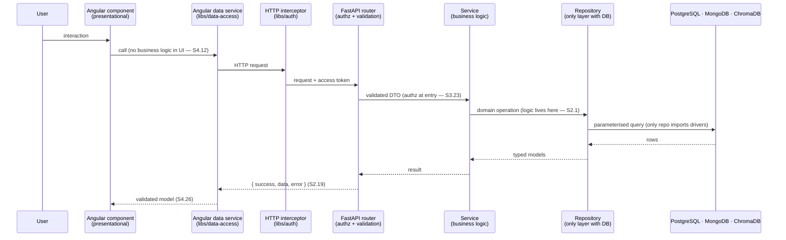
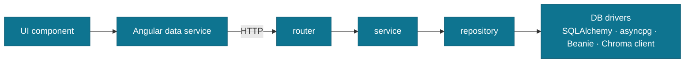
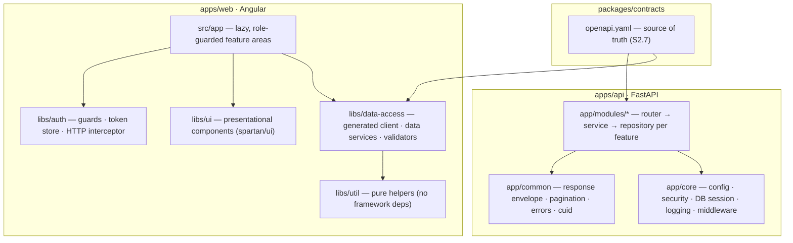
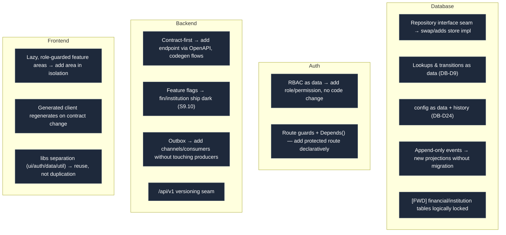
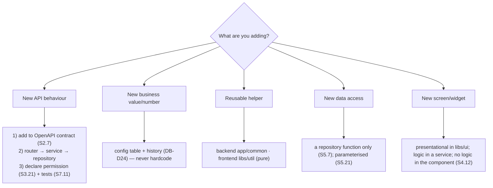

# FundsLink Academy — Engineering Architecture & Practices v1.0

How the system is layered, where shared code lives, the rules that are **enforced** (not just
hoped for), and how every layer is **designed for extension** so v1.5/v2 slot in without rework.
Diagram-first; companion to the [TAD](technical-architecture.md), derived from ADR-002/003, the
constitutions (C1–C6), and the CLAUDE.md hard rules.

---

## 1. The layered request flow

One direction, one job per layer. Business logic lives in the service layer; only repositories
touch a database; the UI never holds business logic.

### Dependency direction (what may import what)

> **The line import-linter enforces (CI):** `app.modules.*.router` and `app.modules.*.service`
> may **not** import `sqlalchemy` / `asyncpg` — only `repository` may. Proven biting in CI (Stage 00).

---

## 2. Where shared code lives (the common home)

Nothing shared is copy-pasted; it has one home. Cross-cutting concerns live in `core`/`common`
(backend) and the `libs/*` (frontend); the OpenAPI contract is the single source both sides build from.

| Need a home for… | Backend | Frontend |
|------------------|---------|----------|
| Config / settings | `app/core/config.py` (env-driven, S3.20) | `environment` + `libs/util` |
| Cross-cutting (auth, logging, sessions) | `app/core` | `libs/auth` |
| Reusable, domain-agnostic helpers | `app/common` | `libs/util` (pure) |
| API access | repository (`app/modules/*/repository.py`) | `libs/data-access` services only (S4.55) |
| Presentational UI | — | `libs/ui` (spartan/ui) |
| Feature logic | `app/modules/<feature>/service.py` | feature-area container components |

---

## 3. The hard rules (documented + enforced)

| Rule | Standard | Enforced by |
|------|----------|-------------|
| **Only repositories call the database** (no DB from router/service/UI) | S2.1, S5.7 | import-linter (CI), review |
| **No business logic in UI components** | S4.12 | review, container/presentational split (S4.4) |
| **No hardcoded business values** (allowance, SLAs, budgets) — use the `config` table with history | DB-D24 | review, config-as-data |
| **No invented endpoints** — every endpoint comes from the OpenAPI contract | S2.7 | contract-diff (CI) |
| **Every endpoint declares a permission** (deny-by-default) | S3.21 | permission-lint (CI) |
| **Secrets never in code/logs/history** — env / secret store only | S3.20, CF-04 | gitleaks (CI + pre-commit) |
| **Money: NUMERIC + parameterised raw SQL + append-only** | S5.21, S5.28 | review, DB triggers |
| **Status change = transition-validated + event + outbox, one transaction** | TAD §7 | service + DB transition tables |
| **SYSTEM principal can never approve/reject** | §5.8 / BR-E03 | DB trigger (`fn_human_final`) |
| **Counselling data never in main schema / matching** | §6.4 / BR-S09 | schema segregation |

---

## 4. Design for extension (S2.8–S2.10) — the seams

v1 is built so v1.5/v2 attach at defined seams, not by surgery. Each layer exposes an extension point.

| Layer | Extension-first mechanism | Pays off at |
|-------|---------------------------|-------------|
| **Database** | Repository interfaces hide PG/Mongo/Chroma; lookups, transitions & config are data; events are append-only | v2.5 store moves; new statuses/rules without DDL |
| **Auth** | Roles & permissions are rows; guards/`Depends()` are declarative | new roles (DONOR, INSTITUTION_OFFICER) added as data |
| **Backend** | Contract-first endpoints; service interfaces; feature flags; outbox; API versioning | fin (v1.5) + institution (v2) ship dark, then flip a flag |
| **Frontend** | Lazy role-guarded areas; regenerated client; libs separation | donor/institution portals added without touching student flow |

---

## 5. "Where does X go?" — the decision guide

---

*v1.0 — derived from TAD v1.2, ADR-002/003, C1–C6, CLAUDE.md hard rules. Layering, shared homes,
enforced rules, and extension seams for DB · auth · backend · frontend.*
