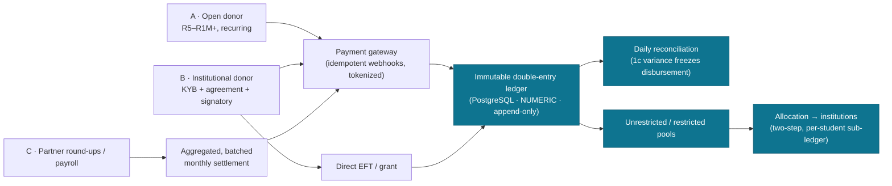

# FUNDSLINK ACADEMY — FUNDING & DONATIONS ARCHITECTURE (v1.5+ forward design)

## Status: **PROPOSED** — L4 lock pending (C0 §8). Forward design for MASTER-SPEC §3.2 Release Map phases v1.5 → Vision.
## Scope: how FundsLink *receives* money. Authored as the consolidated design of record so the funding engine is engineered before it is built — never improvised on a money path.

---

## 0. Why this document exists

FundsLink's reason to exist is to collect money and fund students (MASTER-SPEC §1). The *intake* of that money — who can give, how they onboard, how it is stored, governed, and reconciled — is the highest-stakes surface in the system. The business spec already specifies it in depth (§8 Donation Ecosystem, §9 Round-Up, §10 Corporate/Government, §14 Trust/Anti-Fraud, §15 POPIA, §16 Financial Controls), and the Release Map defers it to **v1.5+ (deferred, not promised — §3.3)**.

This document does three things:
1. **Confirms the foundation is ready** — the v1 auth/DB we shipped already reserves every seat the funding world needs (no rebuild).
2. **Deepens four areas** the business spec under-specifies, so the build is unambiguous.
3. **Locks the phased build order + the open L4 decisions**, with the legal long-pole called out.

> **The two laws of money here (MASTER-SPEC §16.1, never violated):**
> *"If a rand moved and the ledger doesn't show it, the system is broken. If one person alone can move a rand, the system is broken."*

---

## 1. The three ways money comes in

The Founder framed three donor archetypes. They map cleanly onto the spec and onto **distinct onboarding rigor**:

| Archetype | Who | Onboarding rigor | Auth identity | Primary spec / phase |
|-----------|-----|------------------|---------------|----------------------|
| **A — Open donor** | Any individual | **Low-friction**: email + minimal profile; guest-donate allowed, account optional (needed for §18A receipt / recurring / donor wall) | `DONOR` role | §8, §8.5 · **v1.5** |
| **B — Institutional donor** | Companies, foundations, government, SETAs | **High**: KYB (company reg, tax clearance, bank verification), authorised signatories, grant/MOU agreement, due diligence, multi-user org account | `DONOR` (org) + org-scoped sub-roles | §10, §14.4/§14.5 · **v2/v3 corporate portal** |
| **C — Embedded / partner** | Banks, retailers, fintech, payroll, round-ups | **Integration, not a "donor account"**: partner holds the customer; FundsLink receives aggregated, settled funds + a reconciled feed | Partner API credentials (machine, not human) | §9, §8.2, §9.5 Vision · **v3/v4/Vision** |



**Independence firewall (MASTER-SPEC §8.5):** donor recognition never buys influence over student selection — board observer seats are non-voting with no access to student data. The design keeps donor intent (restrictions, §4.1 below) *declarative data*, never a human lever on a specific student.

---

## 2. Foundation readiness audit — the seats are already reserved

The single most important finding for the Founder's question *"does everything have to be updated?"* — **No. The v1 foundation is extension-ready by design** (engineering-architecture: design-for-extension). Each v1.5+ need already has a v1 capability:

| v1.5+ requirement | Already in place (v1) | Reference |
|-------------------|----------------------|-----------|
| Donor / finance / institution identities | `DONOR`, `FINANCE_ADMIN`, `INSTITUTION_OFFICER`, `ADMIN_AUTHORIZER` roles **seeded** | migration 0002 · TAD §3.2 |
| MFA for money-handlers | **Already mandatory** for `FINANCE_ADMIN` + `INSTITUTION_OFFICER` | PR-F `MFA_REQUIRED_ROLES` · TAD §3.1 |
| Donor / org login | RS256 + split-token + refresh-rotation + RBAC auth module | C3 · PRs D–H |
| Org-scoped (institution / corporate) data isolation | Row-scoped tenancy designed + `InstitutionScopedRepository` seam | TAD §3.5 · Stage 01 |
| Immutable money ledger | Append-only trigger + privilege-revoke pattern **proven** on audit/consent | migrations 0005/0007/0009 |
| Exact money arithmetic | NUMERIC + raw parameterised SQL mandated | ADR-003 · C5 (S5.21/S5.28) |
| No-single-approver | `proposed_by ≠ authorized_by` CHECK reserved | TAD §3.4 [FWD] · §16.4 |
| Donor PII protection | POPIA consent records + field-encryption + tokenization-at-gateway classified | §15.3 · Stage 01 consent_record |
| New endpoints "just fit" | Contract-first (S2.7) + deny-by-default permission-lint + RLS, all live | PRs D/E |

**Conclusion:** v1.5+ is an *additive* build (`fin`/`institution`/`donations` modules, currently dark behind flags) on a foundation that already anticipates it. There is **no teardown**.

---

## 3. The four design deepenings (where the spec needs sharpening)

The spec covers an enormous amount already (idempotent webhooks §8.4.2; refunds-as-reversing-entries §8.4.5/§16.2; mandate state machine §8.4.4; donor-influence firewall §8.5; anti-fraud §14.4). These four are the genuine additions — proposed for fold-in to the relevant spec sections at v1.5 design lock:

### 4.1 Restricted / earmarked donor funds
A government or corporate grant may be restricted ("NWU engineering only", "first-year tuition only"). **Design:** every inbound ledger entry carries an optional `restriction` (institution / level / field / programme). The allocation engine (v2) may only draw a student's funding from pools whose restriction the student satisfies; **unrestricted** pool is the default. The per-student sub-ledger (§16.3) records which donor pool funded which allocation → true provenance, end to end.

### 4.2 Institutional donor accounts — multi-user + signatory + agreement
A company is not one person. **Design:** an institutional donor is an **organisation account** with org-scoped sub-roles (`ORG_ADMIN`, `ORG_FINANCE`, `ORG_VIEWER`) reusing the RBAC + RLS tenancy already built. Onboarding is a **state machine**: `INVITED → KYB_PENDING → AGREEMENT_PENDING → ACTIVE → SUSPENDED`. The grant/MOU agreement is an **e-signature artifact** captured as an immutable record (like ConsentRecord), with the authorised signatory identity logged. Payout-account changes already require two-step + re-verification (§14.4).

### 4.3 Donor-side AML / FICA + anonymity threshold
The spec's anti-fraud is student/payout-focused; **donor-intake AML** is the addition a PBO taking large gifts needs. **Design:** a configurable **anonymity threshold** — donations below it may be anonymous (donor wall opt-in); at/above it, **KYC is required** (identity, source-of-funds). Institutional donors and large gifts run **sanctions / PEP screening** before funds are usable. Suspicious activity → flag + the financial-freeze runbook. (FICA applies to FundsLink as it scales; this keeps us ahead of it.)

### 4.4 Pledge vs received
A R1M corporate *pledge* is a commitment, not cash. **Design:** model `Pledge` (committed) separately from ledgered *receipts*. The matching/allocation spend-guard may **only** allocate **received, reconciled, unrestricted (or matching-restricted)** funds — never pledged-but-unpaid. Pledges drive forecasting + donor follow-up, not student promises ("promises we can keep", §2).

---

## 4. The money ledger (the spine)

Per MASTER-SPEC §16.2 + C5 + ADR-003:
- **Double-entry, append-only.** Every movement (donation in, gateway fee, disbursement out, return, refund, reversal) is a ledger record. Never edited, never deleted — corrections are **reversing entries** referencing the original (covers chargebacks, refunds, gateway clawbacks).
- **PostgreSQL only, NUMERIC, raw parameterised SQL** (S5.3/S5.21/S5.28). Reuses the proven append-only trigger + privilege-revoke wall from Stage 01.
- **Per-student sub-ledger** (§16.3): every bulk institution payment decomposes into per-student allocations whose sum equals the bulk; restrictions (§4.1) attach here.
- **Daily reconciliation** (§16.5): gateway settlement vs ledger; any variance ≥ 1c freezes disbursements (financial-freeze runbook).

> **Pending constitutional amendment (already noted in §16.2, awaiting your C0 §8 approval):** add to **C5** — *"Ledger tables are immutable; corrections are reversing entries."* This should be ratified **before** the v1.5 ledger is built. **→ L4 action.**

---

## 5. Payment integration

- **One gateway at v1.5** (§8.2) — one integration, one settlement report, one reconciliation. Additional channels unlock only after 60 clean reconciliation days.
- **Idempotent webhooks** (§8.4.2): the gateway transaction id is a unique key; replays/retries never double-record.
- **PCI-DSS by avoidance** (§15.3): card data is **tokenized at the gateway**; FundsLink never stores card numbers. This keeps PCI scope minimal — a deliberate, world-class posture.
- **Gateway vendor selection is an ADR + L4 decision** (candidates for SA: Ozow/Yoco/Peach/Stitch/PayFast) — I will *propose* the comparison ADR; I will **not** pick a money vendor unilaterally.

---

## 6. Compliance map (what gates real money)

| Dimension | Requirement | Owner / gate |
|-----------|-------------|--------------|
| **Legal entity** | NPC → PBO → **§18A** approval → Information Officer registration | **Human Track (long pole)** — gates ALL live donations regardless of code (implementation-process §9) |
| Tax receipts | Auto §18A receipts, sequential numbering, permanent retention | v1.5 build + PBO status |
| POPIA | Donor consent records, data minimization (open donors), donor data-subject rights | §15 (already designed) |
| AML / FICA | Anonymity threshold + KYC + sanctions/PEP for large/institutional | §4.3 (new) |
| PCI-DSS | Tokenization-at-gateway (no card storage) | §5 |
| Money governance | Immutable ledger + two-step + daily reconciliation | §16 (designed) + C5 amendment |

**The hard truth (and why sequencing matters):** donation *code* without the PBO/§18A legal entity is code we cannot legally operate. The legal lane must run **in parallel, now** — it is the real critical path, not the software.

---

## 7. Phased build order (mapped to the Release Map)

```mermaid
flowchart TD
  V1["v1 ✅ Student core<br/>(auth shipped)"] --> V15
  LEGAL["Human Track: NPC to PBO to Section 18A<br/>(parallel, long pole)"] -. gates .-> V15
  V15["v1.5 Donations Online<br/>open donors · gateway · ledger · §18A · recurring"] --> V2
  V2["v2 Money Out<br/>institution portal · disbursement · two-step · sub-ledger"] --> V25
  V25["v2.5 Verification at Scale"] --> V3
  V3["v3 Growth<br/>round-ups (batched) · corporate portal · pledges"] --> V4
  V4["v4 Partnerships<br/>payroll · SETA · channels (APIs)"] --> VIS["Vision<br/>National Round-Up (advocacy/policy)"]
  classDef now fill:#1d4ed8,color:#fff; classDef legal fill:#b45309,color:#fff;
  class V15 now; class LEGAL legal;
```

**Recommendation (L4 to confirm):** hold this order. Finish the v1 student core to its "Done When" (one student funded end-to-end), run the legal lane in parallel, and build v1.5 donations against a ready foundation + a ratified ledger amendment. Pulling money forward is possible but buys legal/AML/reconciliation rigor *and* the §18A dependency early — a large Release-Map amendment.

---

## 8. Open decisions for the Founder (L4)

| # | Decision | Recommendation |
|---|----------|----------------|
| D-F1 | Ratify the **C5 ledger-immutability amendment** (C0 §8) | Approve before v1.5 ledger build |
| D-F2 | **Payment gateway** vendor | Commission a comparison ADR; decide on cost/settlement/EFT support |
| D-F3 | **Guest donation vs account-required** for open donors | Allow guest-donate; account optional (lowest friction, §18A on request) |
| D-F4 | **Anonymity threshold** (R-value) for KYC trigger | Set conservatively; align with FICA guidance |
| D-F5 | Confirm **Release-Map order** (hold vs pull-forward) | Hold; build in sequence with legal in parallel |

---

## 9. What is NOT changing

- v1 (the shipped auth/student core) — **no rebuild**; it already reserves the seats.
- The Release Map order — **unless** the Founder amends it (C0 §8).
- The money laws — immutable ledger, two-step, no cash to students — **inviolable**.

*Authored by the sole operating engineer (design+build) under L4 direction, 2026-06-14. PROPOSED — awaiting the Founder's review and DONE-stamp. New refinements (§3) logged in PARKED.md for Release-Map triage.*
