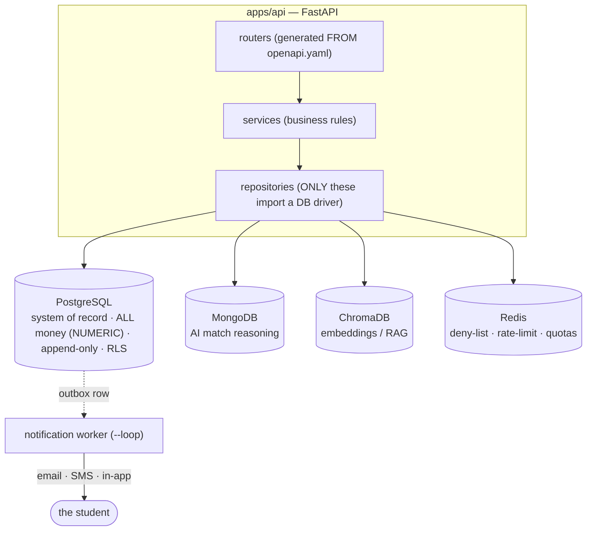
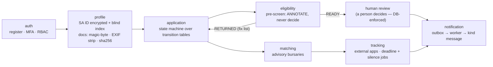

# System Overview — what is built and how it works

A professional, current snapshot of the FundsLink Academy platform as built through **Stage 03** —
the topology, how the modules integrate, the invariants that make it trustworthy, and an honest
account of the AI layer (what is real today and the path to a production model).

> This document is descriptive — it summarises the system and links to the authoritative sources.
> Canonical references: [`technical-architecture.md`](technical-architecture.md) ·
> [`engineering-architecture.md`](engineering-architecture.md) · [`../decisions/`](../decisions) ·
> [`../database/`](../database) · [`../../ARCHITECTURE.md`](../../ARCHITECTURE.md).
> Build status & precedence: [`../README.md`](../README.md).

## 1. What it is

A non-profit platform that funds South African students who fall through NSFAS cracks. A student
**registers → builds a profile → applies for funding → is pre-screened → is matched to bursaries →
tracks them**, and **a human makes every funding decision**. Money and dignity are handled by
design, not by hope.

**Built today (Stages 00–03):** the full database spine, the authentication gateway, and six
backend modules — the entire server-side brain. **Not yet built:** the frontend (Stage 04), real
money movement (v1.5), and a live AI model (a wired seam — see §6).

## 2. Topology — the four stores and the layering

- **Stack** (ADR-001): Angular 18 (Vercel) + FastAPI (Railway); RS256 JWT auth.
- **Store law** (ADR-003; ADR-004 *rejected*): **PostgreSQL is the only home of money** (`NUMERIC`,
  append-only). MongoDB holds AI reasoning, ChromaDB holds embeddings, Redis is a cache/limiter —
  never a store of record. This law is **machine-enforced** (§5).

## 3. The student journey — how the six modules integrate

| Module | Owns | Key guarantees |
|--------|------|----------------|
| **auth** | Registration, RS256 JWT, refresh-token family rotation, TOTP MFA, RBAC | Deny-by-default; MFA mandatory for privileged roles; every mutation writes `audit_log` |
| **profile** | `student_profile`, document pipeline | SA ID **AES-GCM encrypted + HMAC blind index**; docs magic-byte validated, EXIF-stripped, sha256'd, served from a separate origin |
| **application** | Lifecycle state machine over transition tables | Status event + status cache + outbox + audit in **one transaction** (BR-N01) |
| **eligibility** | Pre-screening engine | **Annotates, never decides** — reads the NSFAS decision, flags fields for a human (§5.7) |
| **matching** | Advisory bursary matching | Spend breaker + per-user quota + FALLBACK; reasoning in Mongo keyed by the PG match id; no money outside PG |
| **tracking** | External-application dashboard + reminders | Self-report transitions; T-3 deadline + 30/45/60-day silence jobs enqueue to the outbox |
| **notification** | Outbox worker + channels | `SKIP LOCKED`, retry/backoff/DEAD; consent + preference checks; warm per-trigger copy |

**The integration discipline:** when an application changes status, the `application` module writes
the append-only **status event** (the truth), updates the **status cache** (the fast read),
enqueues the **outbox row** (the message), and writes the **audit_log** — all in **one database
transaction**. There is no window where status changed but the message was lost.

## 4. The intelligent design — invariants that make it trustworthy

### Defense in depth — four walls, different failure modes
| Wall | Catches |
|------|---------|
| Append-only trigger + revoked `UPDATE`/`DELETE` | An app bug or insider rewriting history |
| RLS, fail-closed | A forgotten ownership check — no context ⇒ zero rows, never a leak |
| Least-privilege role (`NOBYPASSRLS`) | A leaked credential — still can't bypass RLS or escalate |
| Service-layer ownership predicate | The normal path |

### Human-Final, enforced at the database
The `SYSTEM` principal can **never** reach a funding decision state — `fn_human_final` (a PostgreSQL
trigger) raises an exception if it tries. A human deciding funding is a **law of the data layer**,
not an application policy. Proven in the G3 pipeline demo.

### Eligibility annotates, never decides
The engine reads the decision NSFAS already made and raises a `field_flag` (severity `review_flag`)
that **annotates** — it never returns or rejects. It closed the income-eligibility gap **without
building a means-test** (D-016/017/018, master-spec v1.2).

### AI that can't bankrupt the mission
Matching is fused three ways: a **spend circuit breaker** (budget in PG config), a **per-user daily
quota** (Redis counts calls, never money), and a **FALLBACK** mode that degrades instead of erroring.

### Dignity, enforced
Student messages obey the emotional-design law (P1–P8): a return is "a few small things to fix,"
never failure; the kind rejection names the event, never the person, and always opens three doors
(appeal · matched bursaries · reapply) — locked by a unit test that forbids leaking an ID or framing
a person as a failure.

## 5. What is machine-enforced (gates, not conventions)

Five invariants are **CI gates that fail the merge** — the architecture cannot silently decay:

| Gate | Fails the build when… |
|------|------------------------|
| `import-linter` | a router/service imports a DB driver (layering broken) |
| `contract_diff` | the running API drifts from `openapi.yaml` (S2.7) |
| `permission_lint` | a route has no declared permission (deny-by-default, S3.21) |
| `store_isolation_lint` | a money field appears outside PostgreSQL (S5.3) |
| `uv sync --frozen` | the dependency tree drifts from `uv.lock` (reproducibility) |

## 6. The AI layer — honest reality and the roadmap

**Where it lives:** the **`matching` module** — a citizen of the FastAPI app, not a separate
service. It accesses data **through repositories** (only those touch a driver), under `SYSTEM` RLS
context with explicit ownership predicates, and it is **forbidden from writing money** to
MongoDB/Redis (the store-isolation gate + a money-free reasoning model enforce it). The AI is
sandboxed by the *same* walls as everything else.

**The design (excellent):** Ports & Adapters (hexagonal). `matching/service.py` depends on abstract
ports — `EmbeddingStore`, `ReasoningStore` — so the model swaps in **without touching business
logic**. It is cost-fused, isolated, cross-store keyed (the Mongo reasoning doc is keyed by the PG
`match_result.id`), and fully testable with no external services.

**The model (a stub, by design):**
- `embed_text()` is a **deterministic hashing vectoriser** (blake2b → 256-dim bag-of-words) — shared
  words raise similarity. It is a labelled drop-in for a real embedding model, **not** a learned one.
- The Mongo "reasoning" is a templated summary, not LLM-generated.
- ChromaDB and MongoDB ship as **in-memory adapters** in v1; the real adapters swap in behind the
  same ports at deploy.

**Why this order is correct:** the safety rails, cost controls, and isolation are proven *before* a
real (paid, privacy-sensitive) model is introduced. The socket is wired; the brain is not yet
plugged in — deliberately.

**Roadmap to a production AI** (a controlled swap, not a rewrite):

| Step | What | Reliability rationale |
|------|------|-----------------------|
| 1 · Real embeddings | Replace `embed_text` — a local sentence-transformer (free, offline, POPIA-private) or a hosted API (Voyage / Cohere) | Start local & private for student data |
| 2 · Real vector search | Implement the `ChromaEmbeddingStore` adapter (ANN over the bursary corpus) | Same port — no business-logic change |
| 3 · LLM reasoning (RAG) | A latest-Claude call that explains *why* a bursary fits, grounded in the real profile + candidate | Where the felt intelligence appears |
| 4 · Reliability layer | Eval harness (golden match set) · **grounding** (explain only real candidates — no hallucinated bursaries) · prompt/model versioning · the existing spend breaker · **human-final stays** | This — not model size — is what makes it best-in-class and trustworthy |

**Which stage:** the **seams are Stage 03 (done)**; the real ChromaDB/MongoDB adapters + a real
embedding model + LLM reasoning are best delivered as a **dedicated v1.x "AI-Enablement" pass**
(model selection, RAG, evaluation, prompt versioning), wired during/after **Stage 05 (Integration)**
when external services come up. Matching stays **advisory — a human always decides.**

## 7. The honest seams (what is not built yet)

- **Frontend** — Stage 04 (the contract and the kind-rejection copy are ready for it).
- **Live AI embeddings / ChromaDB / MongoDB** — repository seams with in-memory defaults; the LIVE
  matcher is a local heuristic (§6).
- **Money / disbursement** — deferred to v1.5 (the append-only ledger doctrine is already written).
- **The worker's runner** — the `--loop` drainer exists; what launches it (cron/Railway) + the daily
  tracking-reminder cron are gated in the Stage-06 launch checklist.

## 8. Build & review status

Stages **00–03 complete**, each independently reviewed (Engineer-02, L3) — see
[`../reviews/`](../reviews/README.md) for the per-stage findings, gate evidence, and verdicts. The
foundation is reviewed, hardened, dependency-locked (`uv`), and professionally documented; the next
gate is **Stage 04 (Frontend)**.

---

*Snapshot as of the Stage-03 completion + hardening/professionalisation pass. For the living build
status and document precedence, see [`../README.md`](../README.md).*
