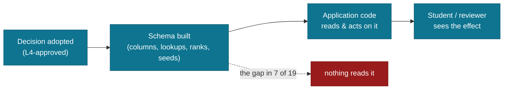

# v1 Completeness Audit

Date: 2026-09-13 · Engineer 02 (Claude Code, L3) · Approver: Founder (L4).

**Question asked by the Founder:** does the system have and do everything it promises and is
required to do, in full, before anything is deployed?

**Method.** v1 scope is MASTER-SPEC §3.2 (five features). What "complete" means for those five
is fixed by the adopted decisions in `docs/product/scenarios-and-decisions.md` (D-001…D-019),
the edge-case register (MASTER-SPEC §14.6, E-codes) and the screen map. Every decision was
checked against the **application code**, not against the schema or the docs — a column that
exists but that nothing reads delivers nothing to a student.

## The finding

**The database was built for these decisions and the application layer never uses them.** In
several cases the schema even ships the exact instrument needed — `lk_priority.rank`,
`lk_income_band.rank`, `respond_by`, `lk_theme_tag`, a `recusal` table, seeded SLA config — and
no application code reads it. The product therefore *stores* promises it does not *keep*.

## Gap register

| # | Decision | What was promised | What the code does | Harm |
|---|---|---|---|---|
| G1 | **E4 · D-017** | Waitlist ordered by **postgraduate priority, then need severity** — SASSA / ≤R350k floated to the top | `fn_waitlist_position` orders by **when** the student was waitlisted (FIFO). Introduced in #244. | A student in the greatest need is shown — and given — a worse place than a comfortable one who waited longer. **A wrong number on a screen a student trusts.** |
| G2 | **D-002 · D-013** | Priority/emergency lane: defunded-late students triaged first, shorter SLA | Review queue is `ORDER BY created_at DESC`. `priority`, its `rank`, and `needed_by` are ignored. `emergency_review_sla_days` / `review_sla_days` are seeded and **read by nothing**. | A CRITICAL application (Lerato — defunded at year-end) waits behind newer NORMAL ones. No reviewer can see an SLA breach coming. |
| G3 | **D-006** | "RETURNED_FOR_INFO carries `respond_by`; **remind**, don't punish" | `respond_by` is written. No job, no notification, nothing reminds. | A returned application dies silently. The student is never nudged; the "don't punish" half holds only because nothing happens at all. |
| G4 | **A04** (screen map) · recusal | A reviewer with a conflict of interest steps aside | A `recusal` table exists. **No endpoint, no service, no UI.** | Nothing stops a reviewer deciding the application of someone they know. An integrity control that exists only as a table. |
| G5 | **D-018** | Reviewer tags an OTHER-category case with a theme, so recurring edges can be promoted to first-class categories | `lk_theme_tag` and `motivation_theme_tag` exist; **nothing reads or writes them**. | The quarterly theme clustering §5.6 depends on has no data, so Category D can never evolve. |
| G6 | **D-008** | 11 SA official languages; student chooses | `student_profile.preferred_language` exists; **not in the API or the profile screen**. | A student cannot say which language they think in; every message defaults to English. |
| G7 | **ST-2.1** (launch blocking) | MFA enforced on every ADMIN_* account | Enrol + activate only. **No status, no disable, no regenerate-recovery-codes.** | An admin cannot tell whether MFA is on, and a lost device has no recovery path short of the database. |

## Closure log

The register above is the audit as it stood on 2026-09-13 and is left exactly as written — a
finding that quietly edits itself into "resolved" is not a record of anything. This is what has
since closed each gap, and what each fix deliberately did **not** claim.

| # | Closed by | What it took, and what it did not claim |
|---|---|---|
| G1 | #244 → waitlist ordering | `fn_waitlist_position` now orders by postgraduate priority then need severity, from `lk_income_band.rank` — the rank the schema already carried. |
| G2 | Review-queue triage | The queue reads `priority`, its rank, `needed_by` and the seeded SLA config; a reviewer can see a breach coming instead of inferring it. |
| G3 | #298/#299 → return reminders | A returned application is reminded before and after `respond_by`. It still never punishes: no status changes, no penalty — D-006's second half was the easy half to keep while nothing happened at all. |
| G4 | #300/#303 → recusal | The table became an endpoint, a rule and a screen: a recused reviewer's actions are refused and the case leaves their queue. |
| G5 | #317 → theme tags | A reviewer records what an out-of-category case was about; the next reviewer sees it; `adminThemeClusters` counts it over a quarter and the admin overview shows what keeps recurring. Tags are added and never removed — the table has a staff INSERT policy and no DELETE, and the screen says so rather than letting a reviewer discover it. |
| G6 | #315 → preferred language | Asked on the profile, stored, returned, and used: notification templates are keyed by language with a per-trigger fallback to English. **English is the only complete set** — the other ten are a translation task, and the interface itself is not translated and does not claim to be. |
| G7 | #305/#306, #307/#308 | MFA status, disable and recovery-code replacement. #307 was found by creating a real reviewer and signing in: the status endpoint refused the first-sign-in token, so a new reviewer could not enrol through the product at all. |

**Every gap in the register is now closed.**

Two things outside the original register were found while closing it, both by using the product
rather than reading it, and both fixed: **no application could be approved** (the authorise step
and the appeal ruling were never built — #309), and the runtime least-privilege guard **passed a
role that bypasses every RLS policy** (#313).

**Verified as delivered** (no gap): D-001 open intake · D-004 one active application per year ·
D-005 expired document → return, never reject · D-007 SA ID before submit · D-010 the machine
never decides (DB trigger) · D-014 no edits under review (no update endpoint exists) · D-016/D-017
income signals and rulesets · D-019 channel↔consent policy.

**Deferred by the Release Map, correctly absent:** E4's *auto-promotion as funds arrive* and
D-012's *COMPLETED at `funding_end`* both depend on money moving, which is v2 (Money Out). The
**ordering** in G1 is v1 because the waitlist position is shown to students in v1 (S16-WAIT).

## Already known and tracked

`#253` four E2E painful journeys · `#271` LCP 2.9 s against 2.5 s · `#269` intermittent profile
500 · `#252` staging (deployment is **deliberately** not next — Founder, 2026-09-13).

## Order of work

Ordered by harm to a real student, and by whether the defect is one this build introduced:

1. **G1** — a wrong number shown to a student, and my own defect.
2. **G2** — the most vulnerable applicants queued behind everyone else.
3. **G3** — returned applications dying silently.
4. **G4** — an integrity control that does not exist.
5. **G7** — launch-blocking (ST-2.1).
6. **G6**, **G5** — promised capabilities with no surface.

Each lands as its own issue and PR, with the decision it implements cited, and a test that fails
without the fix.
