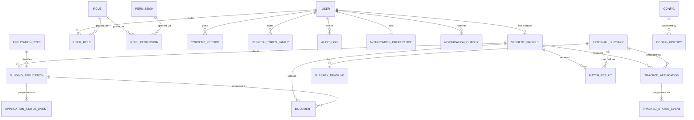
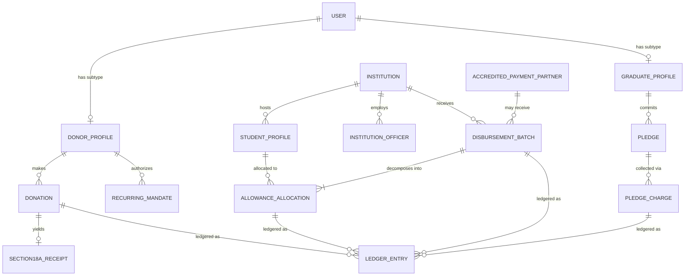
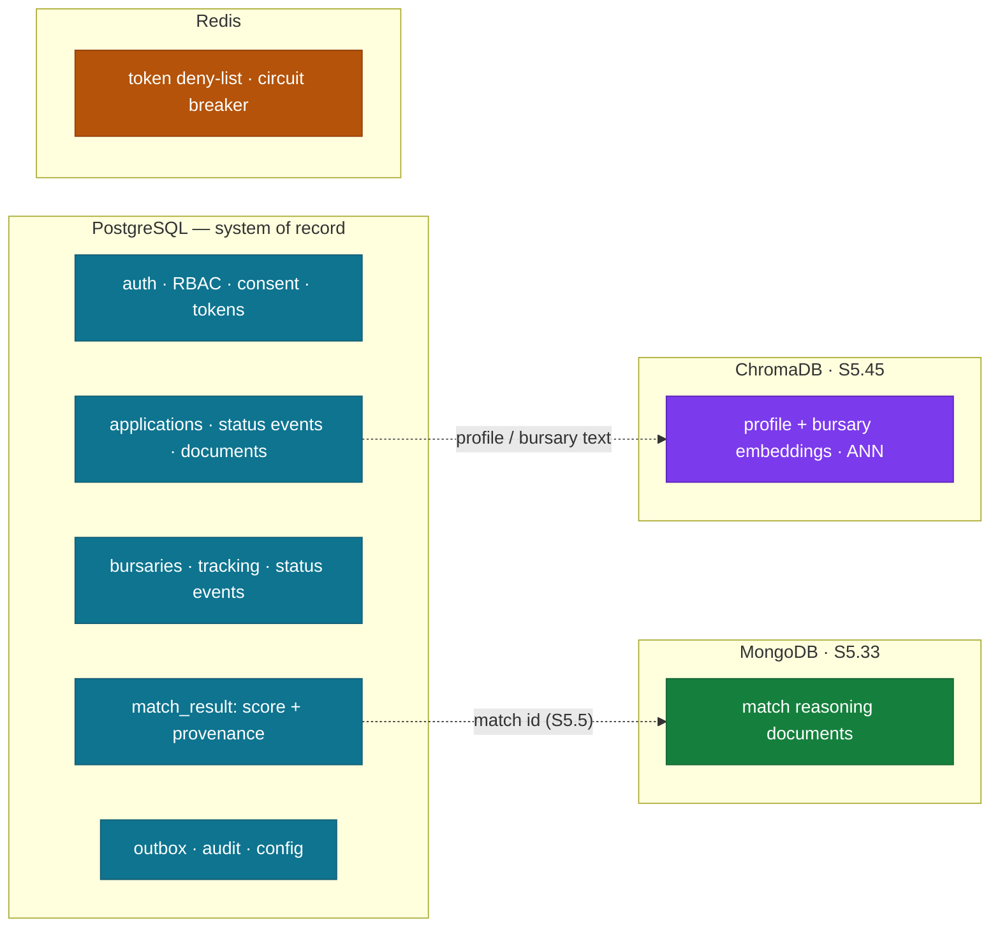
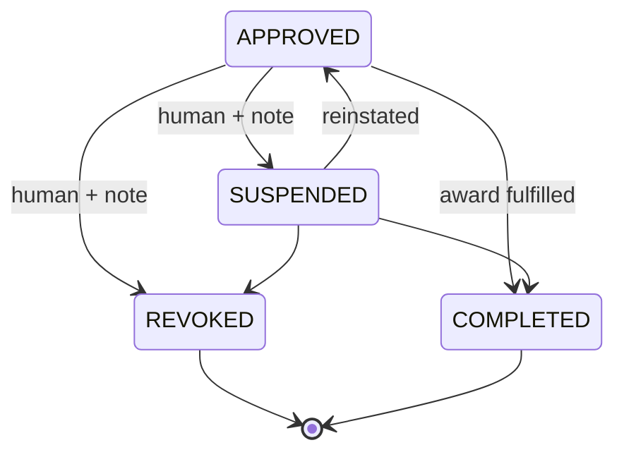

# FUNDSLINK ACADEMY — ERD PACKAGE v1.1
### v1.1: Pre-Screening Engine + Category D (OTHER) + edge-case structures (BR-E01–E10; MASTER-SPEC v1.1 §5.6–5.8, §14.6)
## Business Rule Catalog · Conceptual ERD · Logical Model · Physical DDL
### 2026 | Status: LOCKED upon Founder signature | Gated by DB-DOCTRINE v1.1 §11

---

## DOCUMENT CONTROL

| Attribute | Value |
|-----------|-------|
| Pipeline position | Item 09 (DOCS-MANIFEST §3) |
| Inputs | MASTER-SPEC v1.0 · TAD v1.1 · DB-DOCTRINE v1.1 (DB-D1–D44) · ADR-002/003/004 |
| Store decision | **Constitutional 3-store polyglot (ADR-004 REJECTED, Founder L4 2026-06-13):** PostgreSQL (auth, applications, tracking, match records) + MongoDB (AI reasoning — S5.33) + ChromaDB (embeddings — S5.45) + Redis (token deny-list / cache) |
| Scope | **[BUILD]** = v1 tables, full DDL shipped in `schema.sql`. **[FWD]** = v1.5/v2 tables, logical model locked now, DDL arrives as Alembic migrations in their phase |
| Companion file | `schema.sql` — executable PostgreSQL DDL for all [BUILD] tables |
| Method | Top-down from MASTER-SPEC v1.0 (DB-D27), bottom-up field-walk verification at §6 |

---

# PART 1 — BUSINESS RULE CATALOG (DB-D4–D6)

Every rule traces to MASTER-SPEC v1.0. Relationships state both directions (DB-D5). Connectivity and participation are decisions, not defaults (DB-D11).

## 1A. Identity & Access (BR-A)

| ID | Rule | Source |
|----|------|--------|
| BR-A01 | A User may hold many Roles; a Role may be held by many Users. (M:N → `user_role`) | TAD §3.2 |
| BR-A02 | A Role grants many Permissions; a Permission may belong to many Roles. (M:N → `role_permission`) | TAD §3.3 |
| BR-A03 | A User has at most one StudentProfile; a StudentProfile belongs to exactly one User. (1:1, subtype, partial+overlapping per DB-D22) | TAD §3.2, Doctrine §8 |
| BR-A04 | One SA ID number identifies at most one User. (UNIQUE blind index) | Spec §14.4 |
| BR-A05 | A User owns many ConsentRecords; each ConsentRecord belongs to exactly one User. Consent is append-only; withdrawal is a new record. | Spec §15.4 |
| BR-A06 | A User owns many RefreshTokenFamilies; each family belongs to one User and dies whole on reuse-detection. | TAD §3.1 |
| BR-A07 | Privileged roles (ADMIN_*, FINANCE_ADMIN, INSTITUTION_OFFICER, COUNSELLOR) require an enrolled MFA factor before first privileged action. (Service-enforced, cataloged per DB-D6) | TAD §3.1 [ST-2] |

## 1B. Students & Funding Applications (BR-S)

| ID | Rule | Source |
|----|------|--------|
| BR-S01 | A StudentProfile submits many FundingApplications; each FundingApplication is submitted by exactly one StudentProfile. Student participation optional (may register without applying). | Spec §13 Phase 1 |
| BR-S02 | A FundingApplication is of exactly one ApplicationType {POSTGRAD, UG_CAT_A, UG_CAT_B, UG_CAT_C, OTHER}. OTHER requires a structured Motivation. (Lookup FK, DB-D9) | MASTER-SPEC §5.1/§5.6 |
| BR-S03 | A FundingApplication has many ApplicationStatusEvents; each event belongs to one application. Events are append-only; current status is a cache (DB-D24). | Spec §13, Doctrine §8 |
| BR-S04 | Application status transitions follow the locked state machine: DRAFT→SUBMITTED→PRE_SCREENING→{READY_FOR_REVIEW, RETURNED_FOR_INFO→RESUBMITTED→PRE_SCREENING, UNSCREENED}→UNDER_REVIEW→{INTERVIEW_SCHEDULED→INTERVIEWED}→{APPROVED_PROPOSED→APPROVED, APPROVED_WAITLISTED→APPROVED, REJECTED→APPEALED→{APPROVED_PROPOSED, REJECTED_FINAL}}; WITHDRAWN from any pre-decision state. Illegal transitions rejected. (Transitions table, DB-D6) | MASTER-SPEC §5.7/§14.6 |
| BR-S05 | Funding approval requires proposer ≠ authorizer. ([FWD] CHECK constraint) | Spec §16.4 |
| BR-S06 | A StudentProfile uploads many Documents; each Document belongs to exactly one StudentProfile and optionally to one FundingApplication. | Spec §13 |
| BR-S07 | Verification level (BRONZE→SILVER→GOLD→PLATINUM) only ascends, never skips. (Service-enforced) | Spec §14.2 |
| BR-S08 | Postgraduate funding continues only at ≥65% average; undergraduate categories A and C fund for one year only; category B is one-time. (Service + config, DB-D6 — undrawable) | Spec §4–5 |
| BR-S09 | Counselling/redirection case content lives only in the segregated `counselling` schema; the main application stores only the case id and structured outcome. ([FWD v2.5]) | Spec §6.4 |

## 1B-bis. Pre-Screening, Other Reasons & Decision Edge Cases (BR-E) — v1.1

| ID | Rule | Source |
|----|------|--------|
| BR-E01 | Every SUBMITTED/RESUBMITTED application produces exactly one PreScreenResult per run; results are append-only and attached to the review queue. | §5.7 |
| BR-E02 | Pre-screen requirements are versioned config per ApplicationType (effective-dated — DB-D24); the engine evaluates against the version active at submission. | §5.7 |
| BR-E03 | **Human-Final:** transitions to APPROVED, REJECTED, REJECTED_FINAL require a human actor; the SYSTEM principal is barred at the transition layer AND by DB trigger. | §5.8 |
| BR-E04 | A RETURNED_FOR_INFO event carries an itemized fix-list; after 3 return cycles the case is flagged for direct human outreach. | §5.7 |
| BR-E05 | An OTHER application has exactly one Motivation (structured fields + docs); each decided OTHER case carries ≥1 reviewer-assigned ThemeTag; theme clusters report quarterly. | §5.6 |
| BR-E06 | One ACTIVE application per student per academic year. (Partial unique index) | §14.6 E1 |
| BR-E07 | One Appeal per decided application; appeal reviewer ≠ original decision actor. (CHECK + service) | §14.6 E3 |
| BR-E08 | APPROVED_WAITLISTED is an explicit, ordered state (postgrad priority, then need severity, then time); promotion to APPROVED is human-confirmed. | §14.6 E4 |
| BR-E09 | Reviewer recusal is recorded; a recused reviewer cannot act on that application. (Service + audit) | §14.6 E8 |
| BR-E10 | Pre-screen extraction discrepancies are annotations, never failures; documents past their validity window trigger return, never rejection. | §14.6 E6/E7 |

## 1C. Bursary Tracking (BR-T)

| ID | Rule | Source |
|----|------|--------|
| BR-T01 | A StudentProfile tracks many ExternalBursaries and an ExternalBursary is tracked by many StudentProfiles. (M:N → bridge `tracked_application`, DB-D10) | Spec §12.3 |
| BR-T02 | An ExternalBursary may exist tracked by no one (new bursaries start unreferenced — the never-rented tape). | Doctrine §4 |
| BR-T03 | A TrackedApplication has many TrackedStatusEvents; each event records its source {SELF_REPORT, EMAIL_CAPTURE, PARTNER_API}. | Spec §12.4 |
| BR-T04 | Tracked statuses follow: REGISTERED→SUBMITTED→UNDER_REVIEW→SHORTLISTED→INTERVIEW→{APPROVED, REJECTED}; NO_RESPONSE reachable from any active state at day 60; WITHDRAWN from any state. | Spec §12.4–12.5 |
| BR-T05 | An ExternalBursary has many BursaryDeadlines; each deadline belongs to one bursary. Deadlines drive T-3 reminders. | Spec §12.4 |
| BR-T06 | Follow-ups fire at 30/45/60 days of silence per TrackedApplication. (Scheduled job → outbox, DB-D6) | Spec §12.5 |

## 1D. AI Matching (BR-M)

| ID | Rule | Source |
|----|------|--------|
| BR-M01 | A StudentProfile receives many MatchResults; each MatchResult pairs one StudentProfile with one ExternalBursary. (Bridge with score) | Spec §11/§17 |
| BR-M02 | Every MatchResult stores score, model version and prompt version in PostgreSQL; the reasoning document lives in MongoDB (S5.33), keyed by the match id (S5.5). Matches are advisory and never filter the browse-all path. | Spec §17.2 |
| BR-M03 | Expired-deadline bursaries cannot produce new MatchResults. (Query predicate, DB-D6) | Spec §17.5 |
| BR-M04 | Profile embeddings are recomputed only on profile change; bursary embeddings on bursary change. Embeddings are stored in ChromaDB (S5.45). | TAD §6.2 |

## 1E. Notifications (BR-N)

| ID | Rule | Source |
|----|------|--------|
| BR-N01 | Any status-changing transaction enqueues its NotificationOutbox rows in that same transaction. | TAD §7 |
| BR-N02 | A User has at most one NotificationPreference set; channel upgrades are per-trigger; SMS defaults only for outcome-critical triggers. | Spec §18.1 |
| BR-N03 | Notification sends without recorded consent for the channel are skipped and logged. | Spec §18.3 |

## 1F. Financial [FWD — v1.5/v2] (BR-F)

| ID | Rule | Source |
|----|------|--------|
| BR-F01 | A Donor makes many Donations; each Donation is made by exactly one DonorProfile (or the system anonymous principal). | Spec §8 |
| BR-F02 | One gateway transaction id maps to at most one Donation. (UNIQUE — idempotency) | Spec §8.4 |
| BR-F03 | Every money movement produces balanced LedgerEntries (debits = credits per journal); entries are append-only; corrections are reversing entries referencing the original. | Spec §16.2 |
| BR-F04 | Each LedgerEntry references exactly one business object via typed FKs. (DB-D43) | ST-3 |
| BR-F05 | A qualifying Donation yields at most one Section18AReceipt; every Receipt belongs to exactly one Donation; receipt numbers are sequential and permanent. | Spec §8.4 |
| BR-F06 | An Institution receives many DisbursementBatches; each batch is paid to exactly one Institution and contains ≥1 AllowanceAllocations (mandatory participation). | Spec §7 |
| BR-F07 | SUM(allocations.amount) = batch.total at all times. (Service + nightly job, DB-D6) | Spec §16.3 |
| BR-F08 | A batch is released only when proposed_by ≠ authorized_by. (CHECK) | Spec §16.4 |
| BR-F09 | (batch, student) pairs are unique within a batch. (UNIQUE, DB-D8) | Doctrine §4 |
| BR-F10 | A RecurringMandate follows ACTIVE→PAUSED→CANCELLED / FAILED_RETRY(≤3); a GraduatePledge is a mandate with a 24-month horizon and zero dunning pressure. | Spec §8.4, §11 |
| BR-F11 | AccreditedPaymentPartners are vetted entities; payments to them require invoice + named student + two-step approval; individuals are ineligible. | Spec §14.5 |
| BR-F12 | Allowance amount and review dates come from `config` with effective-dated history. (DB-D24) | Spec §7.12 |

## 1G. Institutions [FWD — v2] (BR-I)

| ID | Rule | Source |
|----|------|--------|
| BR-I01 | An Institution hosts many StudentProfiles (current enrolment); each StudentProfile is enrolled at exactly one Institution at a time — the single declared path (fan-trap rule DB-D25; money questions route ONLY through AllowanceAllocation). | Spec §7, Doctrine §8 |
| BR-I02 | An InstitutionOfficer belongs to exactly one Institution; all officer queries are institution-scoped at the repository base class. | TAD §3.5 |
| BR-I03 | Officers confirm AllowanceAllocations per student; unconfirmed batches at +21 days pause the next batch. (Service workflow) | Spec §7.7 |
| BR-I04 | Institution bank-detail changes require re-verification + two-step + out-of-band phone confirmation. | Spec §14.4 [ST-2] |

---

# PART 2 — CONCEPTUAL ERD (Crow's Foot, DB-D12)

## 2.1 v1 [BUILD] Diagram



## 2.2 [FWD] Financial & Institution Diagram (v1.5/v2)



## 2.3 Decomposition & Participation Register (DB-D10/D11)

| M:N resolved | Bridge | Natural UNIQUE pair | Participation notes |
|--------------|--------|---------------------|---------------------|
| User↔Role | user_role | (user_id, role_id) | both optional (user may be role-less pre-verification) |
| Role↔Permission | role_permission | (role_id, permission_id) | seeded data |
| Student↔ExternalBursary | tracked_application | (student_profile_id, external_bursary_id) | bursary optional to tracking (BR-T02) |
| Student↔Bursary (matching) | match_result | (student_profile_id, external_bursary_id, model_version) | re-runs create new versions, not updates |
| Batch↔Student | allowance_allocation | (batch_id, student_profile_id) | batch side MANDATORY ≥1 (BR-F06) |

## 2.4 Fan-Trap & Redundant-Relationship Pass (DB-D25)

**Fan trap examined:** Institution —< DisbursementBatch and Institution —< StudentProfile. "Which batch paid which student?" does NOT route through Institution — it routes Batch —< AllowanceAllocation >— Student. PASS.
**Redundant relationship examined:** Student→Institution exists once (BR-I01); no second path via application. Money-to-student linkage exists ONLY via allocation (no direct Student→LedgerEntry edge — by design, students never receive money). PASS.

---

## 2.5 Polyglot Store Assignment (ADR-001; ADR-004 rejected)

Each datum lives in exactly one store of record. Cross-store links carry the PostgreSQL cuid (S5.5); DB-D35's nightly job reports dangling references.



---

# PART 3 — LOGICAL MODEL (key tables; full column detail in DDL)

Legend: 🔑 PK · 🔗 FK · ⭐ UNIQUE · ⏱ timestamptz · all PKs cuid (DB-D23) · all tables carry created_at/updated_at/created_by unless append-only (DB-D32)

## 3.1 [BUILD] Identity

| Table | Essentials |
|-------|-----------|
| user | 🔑id · ⭐email · password_hash · account_state(FK lookup) · mfa_secret NULL · ⭐id_number_blind_idx NULL · id_number_enc NULL · deleted_at |
| role / permission / role_permission / user_role | seeded RBAC-as-data (TAD §3.3); bridges per §2.3 |
| student_profile | 🔑id=🔗user_id (1:1 subtype, PK=FK per DB-D22) · institution_id 🔗NULL until v2 · level(FK) · field_of_study · verification_level(FK) · profile JSONB-free: structured columns |
| consent_record | append-only: 🔑id · 🔗user_id · purpose(FK) · wording_version · granted ⏱ · withdrawn_at ⏱NULL |
| refresh_token_family / refresh_token | rotation + reuse-detection per TAD §3.1 |

## 3.2 [BUILD] Applications & Tracking

| Table | Essentials |
|-------|-----------|
| funding_application | 🔑id · 🔗student_profile_id · 🔗application_type · status(FK, cache per DB-D24) · academic_year · amounts NUMERIC(14,2) NULL · funding_start/end date |
| application_status_event | append-only, **partitioned monthly (DB-D44)**: 🔑id · 🔗application_id · from_status/to_status(FK) · actor_user_id · created_at ⏱ |
| document | 🔑id · 🔗student_profile_id · 🔗application_id NULL · doc_type(FK) · storage_uri · sha256 · av_status · ON DELETE RESTRICT everywhere (DB-D16) |
| external_bursary | 🔑id · name · provider · level_eligibility · field_tags TEXT[] · status(FK) · source_url |
| bursary_deadline | 🔑id · 🔗bursary_id · deadline_type(FK) · due_on date |
| tracked_application | 🔑id · 🔗student_profile_id · 🔗external_bursary_id · ⭐pair · status(FK cache) · last_activity_at ⏱ |
| tracked_status_event | append-only, partitioned: + source(FK: SELF_REPORT/EMAIL_CAPTURE/PARTNER_API) |

## 3.2-bis [BUILD v1.1] Pre-Screening & Decisions

| Table | Essentials |
|-------|-----------|
| pre_screen_result | append-only: 🔑id · 🔗application_id · ruleset_version · outcome(READY/RETURNED/UNSCREENED) · checks JSONB (per-check pass/fail/annotation) · created_at ⏱ |
| application_return | append-only: 🔑id · 🔗application_id · cycle_no · fix_list JSONB · resolved_at ⏱NULL |
| application_motivation | 🔑id · 🔗application_id ⭐ · situation text · why_not_categories text · support_needed text · language text — the Other-Reasons store (BR-E05) |
| motivation_theme_tag | 🔑id · 🔗motivation_id · tag(FK lk_theme_tag) · 🔗tagged_by (human) |
| appeal | 🔑id · 🔗application_id ⭐ · new_information text · 🔗submitted_by · 🔗reviewed_by NULL · outcome NULL · CHECK(reviewed_by IS NULL OR reviewed_by <> original_decider_id) via service+trigger note |
| recusal | append-only: 🔑id · 🔗application_id · 🔗reviewer_id · reason · created_at ⏱ |
| eligibility_ruleset | 🔑id · application_type(FK) · version ⭐(type,version) · rules JSONB · effective_from ⏱ — config-as-data (BR-E02) |

## 3.3 [BUILD] Matching (constitutional 3-store form)

| Table / Store | Essentials |
|---------------|-----------|
| match_result (**PostgreSQL**) | 🔑id · 🔗student_profile_id · 🔗external_bursary_id · score NUMERIC(5,4) · model_version · prompt_version · mode(LIVE/FALLBACK) · ⭐(student,bursary,model_version) |
| match reasoning (**MongoDB**, S5.33) | document keyed by match_result.id (cross-store cuid, S5.5): full LLM reasoning, prompt trace, advisory notes |
| profile / bursary embeddings (**ChromaDB**, S5.45) | collections keyed by student_profile_id and (external_bursary_id, chunk_no) · 1536-d vectors · source_hash recompute marker (BR-M04) · ANN search in Chroma — not PG tables |

## 3.4 [BUILD] Notifications, Audit, Config

| Table | Essentials |
|-------|-----------|
| notification_outbox | partitioned: 🔑id · 🔗user_id · trigger(FK) · channels TEXT[] · payload JSONB (DB-D15 exception: queue payload) · state(PENDING/SENT/DEAD) · attempts · claimed via SKIP LOCKED |
| notification_preference | 🔑id · 🔗user_id ⭐ · per-trigger channel upgrades JSONB |
| audit_log | append-only, partitioned: actor, action, resource_type/id, request_id, created_at ⏱ |
| config / config_history | key ⭐ · value · effective-dated history with approver (DB-D24, BR-F12) |

## 3.5 [FWD] Financial & Institution (logical lock — DDL in v1.5/v2 migrations)

| Table | Essentials |
|-------|-----------|
| institution | 🔑id · name · type(FK) · bank details (verified, change-controlled BR-I04) |
| donor_profile / graduate_profile | subtypes, PK=FK on user_id |
| donation | 🔑id · 🔗donor_profile_id NULL(anon) · gateway(FK) · ⭐gateway_txn_id · gross/fee/net NUMERIC(14,2) · currency CHAR(3) 'ZAR' (DB-D42) |
| recurring_mandate / pledge / pledge_charge | state machines per BR-F10 |
| section18a_receipt | 🔑id · 🔗donation_id ⭐ · ⭐seq_no (legal sequence as UNIQUE attribute, not PK — Doctrine §8) |
| ledger_entry | append-only, partitioned: journal_id · account(FK chart) · direction(D/C) · amount NUMERIC(14,2) CHECK>0 · currency · **typed FKs: donation_id/batch_id/allocation_id/pledge_charge_id/refund_id, CHECK num_nonnulls(...)=1 (DB-D43)** · reverses_id 🔗NULL self |
| disbursement_batch | 🔑id · 🔗institution_id (or 🔗partner_id — exactly one, CHECK) · type(FK) · total NUMERIC(14,2) · proposed_by/authorized_by · **CHECK proposed_by<>authorized_by** · status(FK) |
| allowance_allocation | 🔑id · 🔗batch_id · 🔗student_profile_id · ⭐pair · amount NUMERIC(14,2) · status(ALLOCATED/CONFIRMED/RETURNED/VOID) |
| accredited_payment_partner | vetting fields per BR-F11 |

## 3.6 Deliberate Denormalizations (DB-D14)

| Stored | Honesty mechanism |
|--------|-------------------|
| donation.net (gross−fee) | transaction-time snapshot; immutable row |
| disbursement_batch.total | nightly job: SUM(allocations)=total, alert on variance (BR-F07) |
| status caches on application/tracked_application | rebuilt from event tables; nightly consistency check |
| tracked_application.last_activity_at | maintained in same transaction as events; drives 30/45/60 job cheaply |

---

# PART 4 — PHYSICAL DDL

Shipped as **`schema.sql`** (companion file): all [BUILD] tables, lookup seeds, partitioning (native declarative, monthly, with 12 months pre-created + maintenance note for pg_partman), the two approved triggers only (append-only guard + updated_at, DB-D21), full index plan (DB-D28: every FK indexed, partial index on outbox PENDING, composite (student_id, created_at DESC) on event partitions, blind-index UNIQUE), and role grants (app role: no UPDATE/DELETE on append-only tables — DB-D30; no grants on future `counselling` schema).

---

# PART 5 — THE GATE (DB-DOCTRINE §11) — COMPLETED

```
[x] BR Catalog: 40 rules, two statements per relationship, undrawable
    rules carry enforcement locations (D4–D6)
[x] Crow's Foot; every M:N via surrogate-PK bridge + UNIQUE pair (D10–D12)
[x] 3NF/BCNF; tier/institution-name transitive deps eliminated;
    Deliberate Denormalizations table §3.6 (D13–D15)
[x] Leading-zero test applied (id_number TEXT-enc, phone TEXT,
    seq_no INTEGER); RESTRICT default, CASCADE only on auth mechanics
    (D16–D18)
[x] Supertype/subtype user model, overlapping+partial; cuid PKs;
    history structures incl. config_history (D22–D24)
[x] Fan-trap & redundancy pass §2.4 (D25)
[x] Four-stage package, traceable BR→ERD→logical→DDL (D26–D27)
[x] Index plan tied to v1 API surface (D28)
[x] D29–D44 in DDL: NUMERIC money, append-only guards, timestamptz,
    currency, typed ledger FKs, monthly partitions
[x] Bottom-up field walk: SPEC §§4–18 fields all housed; §6 counselling
    fields intentionally ABSENT from main schema (segregation is the
    requirement — BR-S09)
```

**LOCKED upon signature:**

_________________________
**Maluleke Kurhula Success** — Founder (L4)

---

# PART 6 — v1.2 EVOLUTION (migrations 0003–0004, Founder-approved 2026-06-14)

The physical schema is now applied by **Alembic migrations** (the authoritative path);
`schema.sql` is the consolidated readable reference. **0001** = v1.0/v1.1 baseline · **0002** =
seeds · **0003** = review hardening · **0004** = application lifecycle · **0005–0007** =
security (least-privilege role, privilege lockdown, Row-Level Security) · **0008** = updated_at
alignment · **0009** = RLS completeness · **0010–0014** = auth (table-RLS, token_version, MFA,
auth_token, SELECT-only reference) · **0015** = matching config · **0016–0017** = eligibility
signals + rulesets v2 (Part 7). Single head = `0017`. Overview: [`README.md`](README.md).

## 6.1 New business rules

| ID | Rule | Enforced at |
|----|------|-------------|
| BR-S10 | An APPROVED award may be SUSPENDED, REVOKED, or COMPLETED by a **human actor** with a recorded reason; only COMPLETED frees the student's academic year. | transition table + `application_status_event.note` + service |
| BR-S11 | Every application carries a **priority** (NORMAL/URGENT/CRITICAL) and optional `needed_by`; emergency cases use a shorter review SLA. | `lk_priority` FK + `config.emergency_review_sla_days` + service triage |
| BR-S12 | FundsLink **intake is always open** (no application submission deadline); review is paced by `config.review_sla_days`. | absence of a deadline column + service |
| BR-E10⁺ | A document past its validity window triggers a **return**, never a rejection. | `document.issued_at`/`valid_until` + service |
| BR-N04 | WhatsApp is a consented notification channel alongside email/SMS. | `lk_consent_purpose = MARKETING_WHATSAPP` + service |
| BR-A08 | A student's preferred language is one of the **11 SA official languages**. | `ck_sp_language` / `ck_motiv_language` |

## 6.2 Logical-model deltas

| Table | Added |
|-------|-------|
| `funding_application` | `priority` (FK `lk_priority`, default NORMAL), `needed_by date` |
| `application_status_event` | `note text` (reason for any transition) |
| `document` | `issued_at date`, `valid_until date`, `ck_doc_validity` |
| `application_return` | `respond_by date` |
| `student_profile` | `preferred_language text` + `ck_sp_language` |
| `lk_priority` *(new)* | `code` PK, `rank int` (NORMAL=1, URGENT=2, CRITICAL=3) |
| `lk_app_status` | + `SUSPENDED`, `REVOKED`, `COMPLETED` |
| `config` | + `emergency_review_sla_days=3` |

## 6.3 State machine — post-approval lifecycle (BR-S04 extension)



## 6.4 Index plan deltas (DB-D28/D40, EXPLAIN-verified)

`ix_app_status(status, created_at DESC)` (paginated review queue — ordered Index Scan, no
sort); FK indexes `ix_rtf_user`, `ix_ta_bursary`, `ix_match_bursary`, `ix_user_role_role`,
`ix_role_perm_perm`; `ix_app_review_triage(priority, created_at)` partial on the live queue.
The two student-dashboard composites were **tested and rejected** (tiny per-student
cardinality — bitmap+sort wins; no speculative indexes). DEFAULT partitions on all four
partitioned tables are overflow safety nets.

## 6.5 Security model (migrations 0005–0007)

| Layer | Control |
|-------|---------|
| Roles | owner (migrations only) · `fundslink_app` (non-owner, no DDL, NOBYPASSRLS, fenced by timeouts) · `fundslink_readonly` (SELECT-only) |
| Append-only | **two walls** — `fn_block_mutation` trigger **and** privilege revoke (no UPDATE/DELETE on the 7 tables) |
| Cross-user access | **two walls** — Row-Level Security (all student-data + audit tables, fail-closed; auth tables → Stage 02) **and** service ownership checks |
| RLS contract | backend sets `SET LOCAL app.user_id` / `app.user_role` per request; jobs use `SYSTEM`; no context ⇒ no rows |
| Hardening | revoke ambient PUBLIC; search_path pinned on trigger fns; no `SECURITY DEFINER`; resource guardrails |

Backend integration contracts and the "enforced where" matrix: [`README.md`](README.md).
Deployment-side controls (TLS, PgBouncer, backups/PITR, key rotation):
[`../operations/security-deployment-checklist.md`](../operations/security-deployment-checklist.md).

---

# PART 7 — ELIGIBILITY SIGNALS (migrations 0016–0017, master-spec v1.2, Founder-approved 2026-06-18)

Self-declared signals that let the Pre-Screening Engine **annotate** an application for the human
reviewer — never decide it (§5.7, D-010). We do **not** build a means-test (we don't oppose NSFAS,
§1.7): UG Category C reads the reason off the already-required NSFAS outcome letter; postgrad gets
its own income line because no public rail reaches that level.

## 7.1 New reference lookups (read-only to `fundslink_app`, the 0014 pattern)
| Lookup | Values | Note |
|--------|--------|------|
| `lk_income_band` | `SASSA_GRANT`(rank 1) · `LTE_350K`(2) · `MISSING_MIDDLE_350_600K`(3) · `GT_600K`(4) · `PREFER_NOT_TO_SAY`(9) | rank = income ascending; need-severity ordering (E4/§16). Rand thresholds live in config/ruleset, not code (DB-D24) |
| `lk_nsfas_decline_reason` | `MEANS_INCOME` · `DOCUMENTATION` · `ADMINISTRATIVE` · `ACADEMIC_NPLUS` · `OTHER` | bounds §5.4's old free-text "various reasons" (D-016) |
| `lk_prior_funder` | `NSFAS` · `OTHER_BURSARY` · `SELF` · `NONE` | D-016 NSFAS-first redirect signal |

## 7.2 New columns on `funding_application` (inherit the table's 0007 RLS; all nullable)
`household_income_band` → `lk_income_band` · `nsfas_decline_reason` → `lk_nsfas_decline_reason` ·
`prior_funder` → `lk_prior_funder` · `defunded_by` (free text) · `needed_by` (date — the student's
urgency *request*, D-002/D-013). Priority itself is `priority` → `lk_priority` (from 0004).

## 7.3 Ruleset evolution (config-as-data, `eligibility_ruleset`)
`0017` adds **version 2** rulesets (`ers_ug_cat_c_v2`, `ers_postgrad_v2`) carrying `field_flag`
annotation checks (severity `review_flag` — surface to the human, never return/reject). v1 versions
are **preserved** and remain pinned for in-flight applications (§5.7 "history is preserved").
