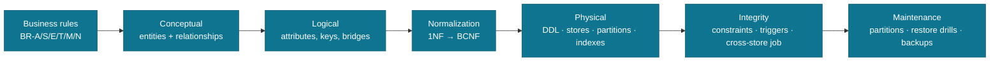
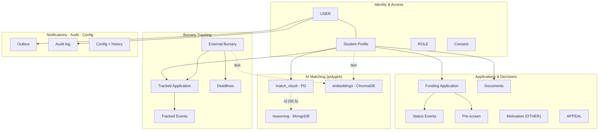
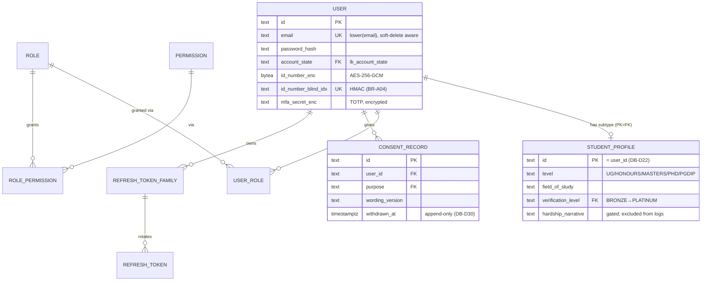
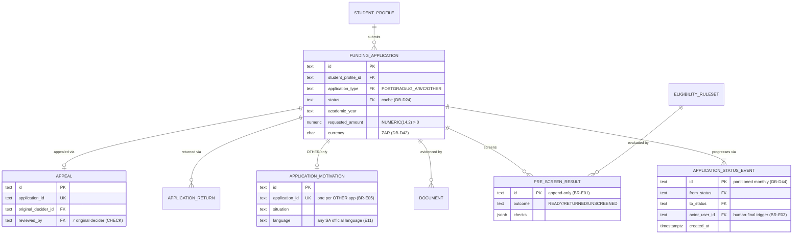
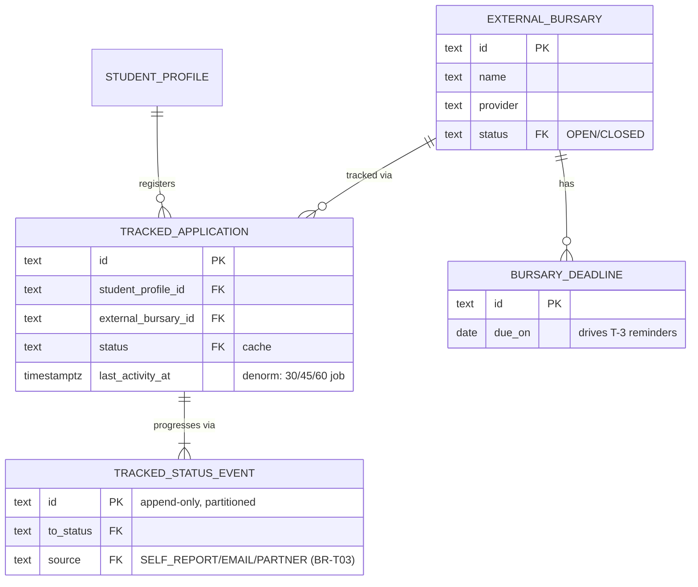
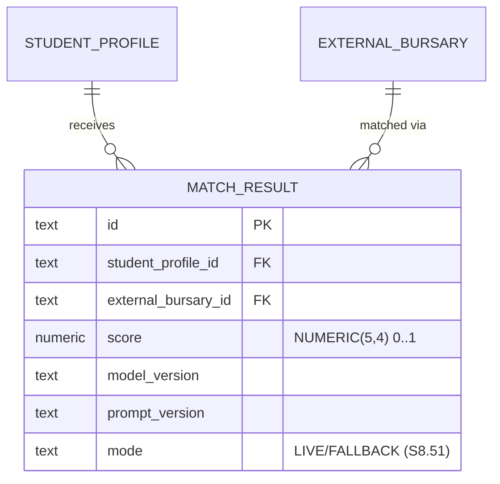
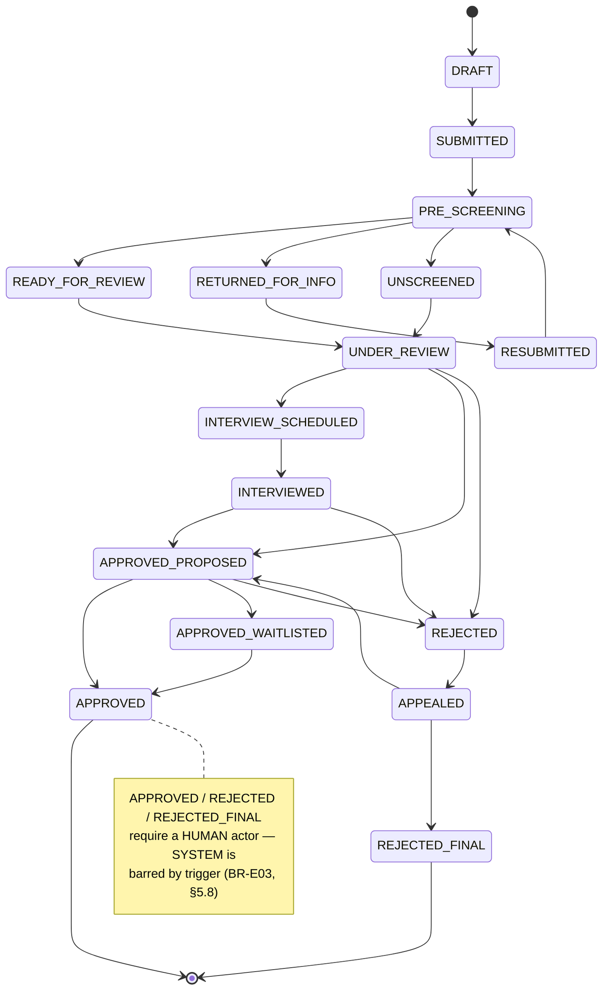
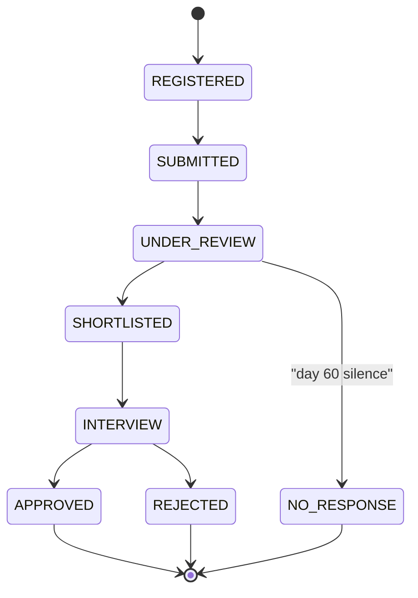
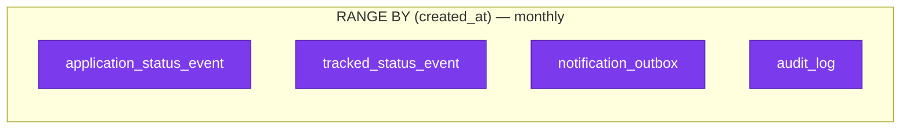
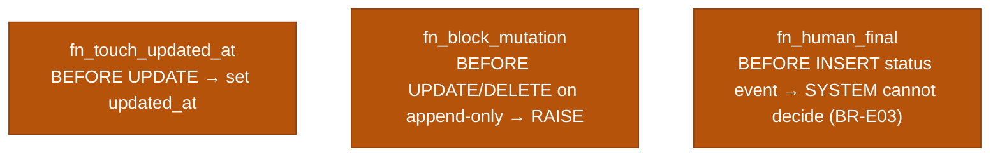

# FundsLink Academy — Database Lifecycle (DBLC) v1.0

The database foundation, end to end, **bounded to FundsLink**. This document is diagram-first:
the visuals carry the model; prose only connects them. It **derives from** (never duplicates)
[ERD-PACKAGE v1.1](data-model.md), [DB-DOCTRINE v1.1](doctrine.md),
and the validated [schema](schema.sql).

| Attribute | Value |
|-----------|-------|
| Stores | PostgreSQL (record) · MongoDB (S5.33) · ChromaDB (S5.45) · Redis (cache) |
| Keys | cuid PKs (DB-D23); cross-store refs carry the PG cuid (S5.5, DB-D35) |
| Money | NUMERIC, never float (S5.28); append-only ledgers [FWD v1.5] |
| Status | ADR-004 rejected — full polyglot from v1 |

---

## 1. The DBLC pipeline

Traceability is one-way and total (DB-D26/D27): every physical column answers to a logical
attribute, which answers to a business rule, which answers to the MASTER-SPEC.

---

## 2. Conceptual domain map

Entity clusters and the relationships that cross them. Detailed entities are in §3.

---

## 3. Logical model — attribute-level ERDs (by subsystem)

Split for clarity (DB-D12 Crow's Foot). Key attributes only — full column detail lives in the DDL.
All PKs are cuid `text`; `⏱` = `timestamptz`; append-only tables carry no `updated_at`.

### 3.1 Identity & Access

### 3.2 Applications & Decisions (incl. v1.1 pre-screening / Category D)

### 3.3 Bursary Tracking

### 3.4 AI Matching — the polyglot seam

`match_result` (PostgreSQL) is the queryable record. Its **reasoning document** lives in **MongoDB**
(S5.33) keyed by `match_result.id`; **profile/bursary embeddings** live in **ChromaDB** (S5.45).
See ERD-PACKAGE §2.5 for the store-assignment diagram.

---

## 4. Normalization analysis (1NF → BCNF)

The relational core is **BCNF**; the only departures are deliberate, documented denormalizations
(DB-D14) with a stated honesty mechanism.

| Form | Rule | How FundsLink satisfies it |
|------|------|----------------------------|
| **1NF** | Atomic values; no repeating groups / CSV-in-a-column | Notification channels are rows in `notification_preference` per-trigger JSON, not a CSV; lists like `level_eligibility` use typed `text[]` only where order-free sets are intended (DB-D15) |
| **2NF** | No partial dependency on part of a composite key | All M:N relations resolved to bridges with **surrogate cuid PKs** + a natural `UNIQUE` pair (`user_role`, `role_permission`, `tracked_application`, `match_result`) — no attribute hangs off half a key |
| **3NF** | No transitive dependency (non-key → non-key) | Domains extracted to **lookup tables** (`lk_*`, DB-D9): account state, app status, doc type, etc. Institution name, verification tier, status labels are never copied into child rows |
| **BCNF** | Every determinant is a candidate key | Subtype `student_profile` uses **PK = FK** to `user` (DB-D22); `id_number` uniqueness via a blind index; no non-key determinants remain |

**Status as data, not enum drift:** allowed transitions live in `app_status_transition` /
`tracked_status_transition` tables (BR-S04/T04) — the state machine is data the service validates,
not hard-coded.

### Deliberate denormalizations (DB-D14)

| Stored | Why | Honesty mechanism |
|--------|-----|-------------------|
| `funding_application.status` / `tracked_application.status` | read-hot current state | rebuilt from the append-only event log; nightly consistency check |
| `tracked_application.last_activity_at` | cheap 30/45/60-day silence scan | written in the same transaction as the event |
| `donation.net`, `disbursement_batch.total` [FWD] | transaction-time financial snapshot | immutable row; nightly `SUM(children) = total` variance alert |

---

## 5. Status state machines

### 5.1 Funding application (BR-S04, v1.1)

WITHDRAWN is reachable from every pre-decision state (omitted above for clarity).

### 5.2 Tracked external application (BR-T04)

---

## 6. Physical design

**Store assignment:** see ERD-PACKAGE §2.5. **Partitioning** — four high-volume append-only tables
are RANGE-partitioned monthly (DB-D44), 12 partitions pre-created, then `pg_partman`/job:

**Three (and only three) approved trigger classes (DB-D21):**

**Index strategy (DB-D28):** every FK indexed; partial index on `notification_outbox` PENDING;
composite `(owner_id, created_at DESC)` on event partitions; partial unique
`uq_app_active_per_year`; blind-index UNIQUE on `id_number`. ANN indexing lives in ChromaDB.

---

## 7. Integrity & maintenance

| Concern | Mechanism | Standard |
|---------|-----------|----------|
| Append-only truth | `fn_block_mutation` on consent, status events, audit, config_history, pre_screen, recusal | DB-D30 |
| Human-final decisions | `fn_human_final` trigger + service guard | BR-E03 / §5.8 |
| One active app / year | partial unique index | BR-E06 |
| Cross-store integrity | nightly job: PG cuid ↔ MongoDB reasoning ↔ ChromaDB vectors; reports dangling refs | DB-D35 |
| Constraint proof | pytest suite attempts every violation and asserts rejection (Stage 01, DB-D37) | DB-D37 |
| Recoverability | `pg_dump` → drop → restore → full constraint suite green; logged | restore drill |
| Partition horizon | job keeps month N+12 partitions present | DB-D44 |

> Counselling case content (Spec §6.4) never enters this schema — segregation is the requirement
> (BR-S09). The main schema holds only a case id + structured outcome [FWD v2.5].

---

*v1.0 — derived from ERD-PACKAGE v1.1, DB-DOCTRINE v1.1, and the validated schema. ADR-004 rejected:
full polyglot (PostgreSQL + MongoDB + ChromaDB + Redis) from v1.*
