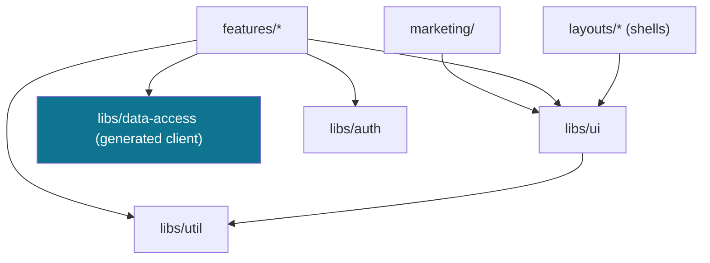

# Frontend Structure — the Stage 04 Angular workspace

The file/folder architecture for `apps/web`. This is the **foundation** of the Stage 04 design
package — every later design doc (design system, components, navigation, marketing) and the build
itself reference this structure. Design-only: no code ships this session.

> Grounded in: [ADR-002](../decisions/adr-0002-monorepo.md) (one Angular workspace + the four libs)
> · [ADR-005](../decisions/adr-0005-frontend-strategy.md) (Tailwind + custom CSS + spartan/ui +
> CSS-custom-property tokens) · [ux-screen-map](ux-screen-map.md) (the 21 student + 4 admin screens
> + marketing) · [engineering-architecture](../architecture/engineering-architecture.md)
> (no business logic in components, S4.12). The Stage 04 brief: **the generated client only**.

## 1. Principles (the structure enforces these)

1. **Angular 18, standalone, signals, `OnPush`.** No NgModules; signal-based state; change detection
   on push. Lightweight by construction (P6).
2. **Lazy everything.** Each feature area is a lazily-loaded route group behind a layout shell — the
   marketing visitor never downloads the application bundle, and vice-versa.
3. **No business logic in components** (S4.12). Components render and emit; rules live on the server.
   The frontend branches on the stable `error.code`, never on `message`.
4. **Generated client only.** All API types/services come from `packages/contracts/openapi.yaml`
   into `libs/data-access` — never hand-written (S2.7 / S4.x).
5. **Tokens, not hard-coded styles.** Color/space/type/radius/shadow/motion are CSS custom
   properties (ADR-005); components consume tokens, never raw hex.
6. **Three shells, DRY.** One app shell, one marketing shell, one auth shell — shared header/footer
   systems, each premium (see `navigation-and-shells.md`).
7. **Money is a decimal string.** Render `requested_amount` as-is; never `parseFloat` for logic.

## 2. The workspace

```
apps/web/
  src/
    app/
      app.config.ts            # standalone bootstrap: router, HttpClient, the generated client, Sentry
      app.routes.ts            # top-level lazy routes -> the three shells
      app.component.ts         # thin root (router outlet)
      core/                    # app-wide singletons: config, error/toast service, the global interceptors
      layouts/                 # THE SHELLS (header + nav + footer composition)
        app-shell/             # authenticated student/admin shell
        marketing-shell/       # public marketing shell
        auth-shell/            # minimal centered shell (login/register/verify/reset)
      features/                # one lazily-loaded folder per journey area
        onboarding/            # register · verify-email · login · MFA · forgot/reset      (S04-S07)
        profile/               # profile create/edit · documents · avatar upload           (S09)
        applications/          # apply wizard · list · detail · submit · returned-for-info  (S10-S14)
        decisions/             # approved · the KIND REJECTION (S16-REJ) · appeal
        matching/              # my matches · browse-all bursaries (equal prominence)       (S17)
        tracking/              # tracked dashboard · register · self-report                 (S18-S19)
        notifications/         # preferences · history
        admin/                 # review queue · review/decide · priority · data-export      (4 admin)
      marketing/               # public pages: home(hero) · about · how-it-works · for-students · for-donors · faq · contact
    styles/
      tokens.css               # design tokens (CSS custom properties, HSL) — light + dark
      base.css                 # reset, base typography, Tailwind @layer wiring
    assets/                    # logo, imagery (AVIF/WebP), subsetted fonts
    environments/
  tailwind.config.ts           # maps Tailwind scale -> the token custom properties (no duplication, S4.15)

libs/
  ui/                          # the PREMIUM component library + primitives
    src/lib/
      components/              # button · card · table · input · select · modal · badge · avatar · toast ...
      states/                 # loading · empty · error · success (the four mandatory states, first-class)
      nav/                    # the horizontal auto-scroll navbar + edge-arrow controller
      motion/                 # reduced-motion-aware animations (Magic/Aceternity effects reproduced)
      layout/                 # container, grid, section, stack primitives
  auth/                        # token service · 401-refresh interceptor · guards   (EXISTS - Stage 02)
  data-access/                 # GENERATED OpenAPI client + typed API services       (EXISTS - no hand-written types)
  util/                        # pure helpers: money/decimal render · dates · file-size · validators
```

`libs/auth` and `libs/data-access` already exist (Stages 02–03); Stage 04 fills `libs/ui` and the
`apps/web/src/app` tree.

## 3. Boundaries (who may import what)



- **`libs/ui` is presentation-only** — it imports `util`, never `data-access`/`auth` (no API calls in
  the component library; it takes inputs, emits outputs).
- **`features/*` own data** — they call the generated `data-access` services, hold signal state, and
  compose `libs/ui` components. One feature never imports another's internals.
- **`marketing/` is API-light** — mostly static/CMS-ready content + `libs/ui`; no auth bundle.

## 4. Routing & shells

```
''            -> marketing-shell   -> marketing/*            (public, lazy)
'auth'        -> auth-shell        -> features/onboarding/*  (public, lazy)
'app'         -> app-shell [authGuard] -> features/{profile,applications,decisions,matching,tracking,notifications}
'admin'       -> app-shell [adminGuard] -> features/admin/*
```

Each feature exposes a `*.routes.ts`; the shell wraps them with the shared header/nav/footer. Guards
come from `libs/auth` (already built). Code-splitting is per shell **and** per feature.

## 5. State & data

- **Server state:** the generated `data-access` services (typed from the contract) wrapped in small,
  signal-based feature services (`*.store.ts`) — load/loading/error signals feeding the four UI
  states. **No NgRx** — signals + services keep it lightweight (P6).
- **Forms:** typed reactive forms; validation mirrors the contract but the server is the authority;
  drafts persist (P8 — multi-step beats mega-form; progress survives).
- **Errors:** one `error.code` → UI mapping (from [error-codes.md](../architecture/error-codes.md));
  a global toast/inline-error service in `core/`.

## 6. Conventions

| Thing | Convention |
|-------|------------|
| Files | kebab-case; `feature.component.ts` / `feature.store.ts` / `feature.routes.ts` |
| Components | standalone, `OnPush`, selector `fl-*` (app) / `ui-*` (library) |
| Styles | Tailwind utilities for layout/space; component CSS for brand; **tokens only**, no raw hex |
| State | signals; a `*.store.ts` per feature for server state |
| API | generated client only; never hand-write a request/response type |
| Money | decimal string in, decimal string rendered — never `parseFloat` for logic |
| a11y | every interactive element keyboard-reachable + labelled (carried into every later design doc) |

## 7. What references this

The rest of the Stage 04 design package builds on this skeleton:
`design-system.md` (tokens fill `styles/tokens.css`) · `brand-identity.md` (assets) ·
`component-library.md` (`libs/ui`) · `navigation-and-shells.md` (`layouts/` + `libs/ui/nav`) ·
`marketing-site.md` (`marketing/`). The Stage 04 build engineer scaffolds this tree first, then
fills it screen-by-screen in journey order.
