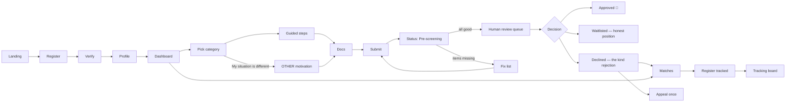

# FUNDSLINK ACADEMY — v1 UX SCREEN MAP
## Version 1.0 | 2026 | Suite item 16 | Status: PROPOSED (L4 lock pending)
### The student journey as actual screens — where the database's kindness becomes visible

---

## 0. EMOTIONAL DESIGN PRINCIPLES (govern every screen)

| # | Principle | Meaning in pixels |
|---|-----------|-------------------|
| P1 | **Dignity first** | The user is a capable adult in a hard moment, not a case number. No bureaucratic tone, no red walls of error text, no shame patterns. |
| P2 | **Never a dead end** | Every screen — especially bad-news screens — ends with a next step the student can actually take. |
| P3 | **Honest status, always** | Show what we know, when we knew it, and the source (MASTER-SPEC §12.4 freshness labels). Never imply omniscience. |
| P4 | **A return is not a rejection** | RETURNED_FOR_INFO screens are styled as help ("3 small things to fix"), never as failure. Different color language from rejection entirely (amber/info, never red). |
| P5 | **Humans are visible** | Wherever a human decides, the UI says so: "A person reviews every application." The Human-Final Principle (§5.8) is a *feature we show*, not plumbing we hide. |
| P6 | **Low-bandwidth reality** | SA mobile data is expensive. Light pages, system fonts, no hero videos, offline-tolerant form drafts, SMS-critical events only. |
| P7 | **Language respect** | Motivation fields accept any SA official language (E11); microcopy avoids idioms that don't translate. |
| P8 | **One thing per screen** | Multi-step beats mega-form. Progress is always visible and saved (drafts survive). |

---

## 1. SCREEN INVENTORY (v1)

```
PUBLIC          AUTH              STUDENT CORE                ADMIN (REVIEWER)
S01 Landing     S04 Register      S08 Dashboard (home)        A01 Review queue
S02 How it      S05 Login         S09 Profile builder         A02 Application detail
    works       S06 Verify email  S10 Apply — category picker     + pre-screen report
S03 Browse      S07 Forgot/reset  S11 Apply — guided steps    A03 Decision compose
    bursaries                     S12 Apply — OTHER motivation     (the kind rejection)
    (no login                     S13 Documents upload        A04 Recusal action
     required)                    S14 Application status
                                  S15 Returned-for-info fix list
                                  S16 Decision screens (4 variants)
                                  S17 Matches (advisory)
                                  S18 Tracked applications board
                                  S19 Register tracked application
                                  S20 Notifications & preferences
                                  S21 Data & privacy (POPIA self-service)
```

## 2. FLOW MAP



---

## 3. KEY SCREEN SPECS (the ones that carry the mission)

### S10 — Apply: Category Picker
**Purpose:** route honestly without jargon. Four cards in plain language ("I'm starting Honours/Masters/PhD" · "I failed and NSFAS paused my funding" · "NSFAS approved me but my fees weren't fully paid" · "I never qualified for NSFAS") **plus the fifth, equal-sized card: "My situation is different — let me explain."** Category D is a first-class door, not a footnote link (§5.6).
**Emotional note:** Category A's card never says "you failed" as identity — it describes the *event*, mirroring §5.2's neutral wording.

### S12 — OTHER Motivation (Category D)
**Purpose:** the structured motivation (situation / why the categories don't fit / what I need), each with a guiding example, autosaved every field. Language selector up top: *"Write in the language you think in."*
**Promise line on-screen (verbatim from MASTER-SPEC §5.6):** *"If your story doesn't fit our forms, our forms are incomplete — not your story. Tell us. A human will read every word."*
**API:** `POST /applications` with `motivation` object.

### S14 — Application Status
**Purpose:** one card, one truth. Status timeline (vertical steps, current step pulsing), what happens next in plain words, and the SLA honestly: "Reviews currently take about N days" (config-driven, E12). During PRE_SCREENING: *"Our system is checking that everything we need is here — it cannot approve or decline you. Only a person can do that."* (P5 — the Human-Final Principle, shown.)

### S15 — Returned-for-Info (the fix list) ⭐ P4 flagship
**Tone:** a helpful colleague, amber accents, checklist UI.
**Header:** *"Almost there — 3 small things and you're back in the queue."*
Each item: what's needed, **why we need it** (one sentence), and an inline upload/fix control. Resubmit button enabled when all checked → `POST /applications/{id}/resubmit`. Cycle 3 adds: *"Struggling with these? Leave your number — we'll call and sort it out together"* (BR-E04 outreach).
**Forbidden:** the word "rejected", red color, error iconography.

### S16-REJ — The Kind Rejection ⭐ the screen we build first in every design review
**Structure (locked):**
1. The decision, stated plainly and respectfully in the first line — no burying it.
2. The human-written reason (from A03; never auto-generated, never citing language/writing quality — §5.8).
3. **Immediately, the doors that remain open** (P2): → "See 12 bursaries matched to your profile" (S17) → "You can appeal once with new information" (`POST /applications/{id}/appeal`) → "Reapply next intake — here's what would strengthen your application" → redirection support where relevant (§6).
4. Sign-off from a named human role: *"— Reviewed with care by the FundsLink team."*
**Forbidden:** "Unfortunately" as the opener, exclamation marks, links that loop back to the same dead end.

### S16-WAIT — Waitlisted (E4 honesty)
*"You qualify. Right now the pool can fund N students and you are position #K. As donations arrive, we fund down the list — postgraduate first, then by need. We'll notify you the moment your position changes."* A live position number. Brutal honesty, fully kept promise.

### S18 — Tracking Board
Columns or cards by status; every status chip carries its **source badge** (You reported · From email · From partner — P3). Deadline countdown chips from `bursary_deadline`. Silent-bursary indicator at day 25+: *"We'll nudge them for you on day 30"* (§12.5).

### A02 — Application detail: what an out-of-category case was about (§5.6 · D-018)

Beside the applicant's own words, a reviewer records the themes of an OTHER-category case from six
fixed choices. §5.6 counts them quarterly and promotes a recurring theme to a real funding
category — which is how a student whose situation fits nothing today causes a category to exist
tomorrow. The list is short on purpose: if every case can invent its own theme, nothing recurs and
nothing is ever promoted.

Tags are added, never removed (`motivation_theme_tag` has a staff INSERT policy and no DELETE),
and the screen says so before a reviewer ticks anything. A student is never shown the theme put on
their case — it is a characterisation written for a count, not a message addressed to them. The
counts appear on **A00** as "What the categories keep missing", because a report nobody can see is
the same failure as no report at all.

### A03 — Decision Compose (admin)
The reviewer cannot submit a rejection without: selecting reason category, writing ≥40 words of human text, and ticking *"I confirm this message offers a concrete next step."* The kind rejection is **enforced at the compose screen**, not hoped for, and the same floor applies to an authorizer's refusal and to an upheld appeal — a student turned down at the last step reads the same considered message as one turned down at the first.

Approve routes to APPROVED_PROPOSED, which is a proposal and not a decision. A **second person** holding APPLICATION_AUTHORIZE rules on it in the authorise card on A02 (§16.4): approve, approve-and-waitlist, or refuse, always with a recorded reason. The proposer may not authorise their own proposal — the server reads who proposed it from the append-only status event and refuses with `two_person_rule`. On an APPEALED application the compose screen becomes the appeal ruling (BR-E07): overturn (back to APPROVED_PROPOSED, so a second person still authorises it) or uphold (REJECTED_FINAL, the end of the road), and the reviewer may not be the person who made the original decision.

---

## 4. STATES EVERY SCREEN MUST DESIGN (no exceptions)
Loading (skeletons, not spinners) · Empty (warm, instructive — an empty tracking board teaches S19) · Error (plain words + retry + request_id for support) · Offline (drafts held, banner) · Degraded (matching FALLBACK banner: "Smart matching is resting — showing rule-based results" — S8.51).

## 5. ACCESSIBILITY & PERFORMANCE BUDGET
WCAG 2.1 AA · 4.5:1 contrast · full keyboard nav · screen-reader labels on status timelines · ≤200KB first load on student routes · system font stack · works on a 3-year-old Android on 3G.

## 6. TRACEABILITY
Every screen lists its API operations from openapi.yaml; no screen may require an endpoint that isn't in the contract (S2.7 applies to pixels too). Angular feature areas per ADR-002: S01–S03 shell/public, S04–S07 libs/auth, S08–S21 student area, A01–A04 admin area.

**Lock:** _________________ Maluleke Kurhula Success (L4)
