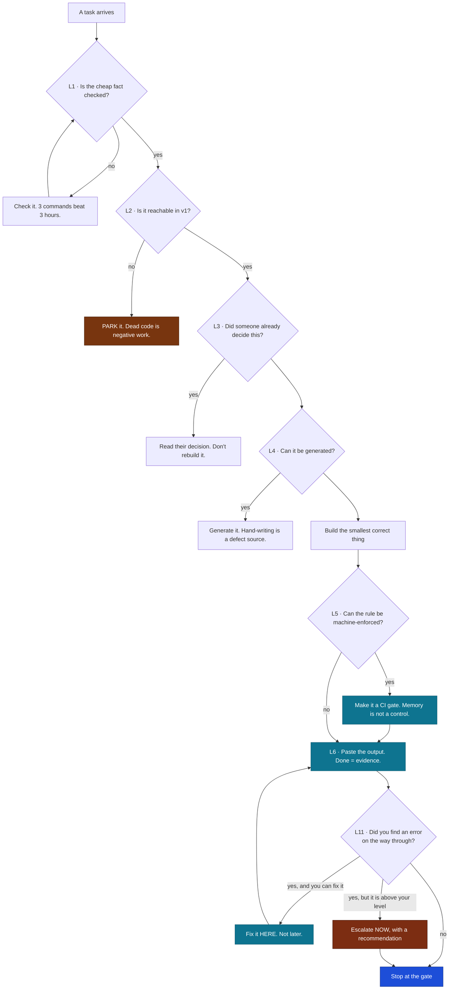

# Build Doctrine — we don't build harder, we build smarter

| Attribute | Value |
|-----------|-------|
| **Status** | active — Founder standing order |
| **Applies to** | every engineer terminal on this system, and portable to any KSDRILL system |
| **Authority** | Founder (L4). The laws below are *how* the standards get satisfied; the standards themselves live in `governance/` |
| **Related** | [CLAUDE.md](../../CLAUDE.md) · [github-workflow.md](github-workflow.md) · [implementation-process.md](implementation-process.md) · [session-playbook.md](session-playbook.md) |

> ### **"We aren't working or building harder. We are working and building smarter."**
> — Maluleke Kurhula Success, Founder

That line is not a slogan. It is a **testable claim about every unit of work**, and this document is
how it gets applied. `CLAUDE.md` tells an engineer *what the rules are*. This tells them *how the
best decision on this build was reached* — because a terminal that inherits the rules but not the
judgement will build the expensive version of the right thing.

Every law below is earned. Each one carries the **cheap test** that applies it and the **receipt** —
the thing this repository actually did that proves it pays.

---

## The shape of it

---

## L1 — Check the cheap fact before the expensive action

Before any irreversible or large move, spend the thirty seconds that tells you whether the move is
even correct. The cost of the check is almost always a rounding error against the cost of being
wrong.

**Cheap test:** *What is the one command that would prove this task is unnecessary, or dangerous?
Run that first.*

**Receipt.** This build was asked to "merge `Dev` into `main`". Three commands —
`git merge-base --is-ancestor`, and `rev-list --count` each way — showed `Dev` was a strict ancestor
of `main`: 0 ahead, 90 behind. The requested merge would have deleted **43,614 lines across 377
files**. The check cost seconds. See [github-workflow.md §0](github-workflow.md#0-branching-model).

---

## L2 — Don't build what cannot be reached

Code that nothing can execute is not progress, it is inventory: it must be written, reviewed,
tested, maintained, and migrated, and it earns nothing until the path that reaches it exists. Scope
discipline is not saying no to good ideas; it is **sequencing** them.

**Cheap test:** *Name the live user action that reaches this line today. If you can't, it belongs in
[`PARKED.md`](../../PARKED.md) with the condition that would un-park it.*

**Receipt.** The post-approval lifecycle (`SUSPEND` / `REVOKE` / `COMPLETE`, D-003/D-012) was
specified, understood, and **deliberately not built** — `APPROVED` is unreachable through the v1 API
because the second-authorizer step is money-adjacent (BR-S05, v1.5). Building it would have produced
dead, untestable code ahead of the Release Map. It was flagged to the Founder with the cause, not
silently skipped. That distinction is the whole law: **deferred with a reason is engineering;
skipped in silence is debt.**

---

## L3 — Read the decision someone already made

The most expensive thing an engineer can build is a system that re-derives a judgement another
institution has already published. Find the existing signal and consume it.

**Cheap test:** *Is there an authoritative artefact that already contains this answer? Consume it
instead of computing it.*

**Receipt.** The platform needed to know whether a student is genuinely missing-middle. The heavy
version is a means test — income modelling, household verification, an appeals surface, and a
political posture against NSFAS that contradicts MASTER-SPEC §1.7. The smart version reads the
**NSFAS decline reason off the outcome letter the student already uploads**, as a bounded enum
(D-016). A whole subsystem replaced by a lookup table, and the product got *more* correct, not less.
Postgraduates, who have no such letter, got their own income ceiling instead (D-017) — the exception
is scoped to where the shortcut genuinely doesn't reach.

---

## L4 — Generate it, don't hand-write it

Anything derivable from a source of truth must be derived from it. A hand-written copy is a second
source of truth that will drift, and drift in a contract is an outage.

**Cheap test:** *Does a machine-readable source for this already exist? Then no human types the
copy.*

**Receipt.** Every endpoint comes **from** `packages/contracts/openapi.yaml` (S2.7), the TypeScript
client is generated into `libs/data-access` and never hand-written, and `contract_diff.py` fails CI
if the implementation and the contract disagree. 32 operations stay exact without anyone
remembering to keep them exact.

---

## L5 — Make the rule a gate, not a memory

A rule that lives only in a document is a rule that survives exactly as long as the attention of the
person reading it. A rule wired into CI is permanent, applies to everyone, and costs nothing to
enforce forever. **Automate the discipline, not just the work.**

**Cheap test:** *If this rule were violated at 2am by a tired engineer, what would catch it? If the
answer is "a careful reviewer", build the check instead.*

**Receipt.** Every architectural law on this build is machine-enforced rather than remembered:

| Law | The gate that makes it true |
|-----|-----------------------------|
| router → service → repository; only repositories import DB drivers | `lint-imports` (import-linter) |
| every endpoint declares a permission, deny-by-default | `scripts/permission_lint.py` |
| the implementation never drifts from the contract | `scripts/contract_diff.py` |
| no money field outside PostgreSQL; Redis keys allowlisted | `scripts/store_isolation_lint.py` |
| the SYSTEM principal can never approve an application | a **database trigger** — `fn_human_final` |
| the constitution applies to changed code | `governance.yml` → `governova-enforce --changed` |

The last row of that table is the law applied to itself. And note the strongest one: Human-Final is
enforced in the **database**, not the service layer — the deepest place a rule can live is the place
that cannot be bypassed by the next engineer's shortcut.

---

## L6 — Done means output, not confidence

A gate passes on **pasted evidence**. Not on a summary, not on "should be fine", not on a green
feeling. This is the single cheapest defence against the most expensive class of error: work that is
reported complete and is not.

**Cheap test:** *Paste the command and its real output. If you can't run it, say so plainly and say
what you ran instead.*

**Receipt.** Every gate table in every handoff carries the command and its literal result, re-run
from a clean tree. When the local host could not run PostgreSQL (a Windows UCRT fault), the handoff
**says so in writing** and points at the CI run that proved the migration roundtrip instead. An
honest gap in the evidence is worth more than a confident claim, because the reader can act on it.

---

## L7 — Build seams, not commitments

When a decision is genuinely not ready, ship the **interface** and a working default behind it.
That keeps the system whole and honest, and turns the future decision into a swap instead of a
rewrite.

**Cheap test:** *What is the smallest honest placeholder that keeps the rest of the system real?
Ship that, and label it clearly as a stub.*

**Receipt.** Matching ships behind `EmbeddingStore` / `ReasoningStore` ports with in-memory adapters
and a **labelled** deterministic embedder. The cost breaker, the per-user quota, the FALLBACK path,
store isolation, and the cross-store keys are all **real** — only the model is not, and ADR-0007
ratified its properties (grounding, advisory-only, privacy) *before* a model exists. The build is
now execution rather than improvisation.

---

## L8 — Decide the design before you spend the build

Deciding while typing produces rework, and rework is the most expensive way to discover an opinion.
Separate the deciding from the doing (S4.83 — design-package-first).

**Cheap test:** *Could a second engineer build this from what is written, without asking a question
that changes the outcome? If not, the design isn't finished.*

**Receipt.** Stage 04 opened with a **seven-document design package** — structure, tokens, brand,
components, shells, marketing, and a build-ready handoff — with the palette, type, logo, and
navigation locked at L4 *before* one component was written. The build sequence in
[`stage-04-design-package.md`](../experience/stage-04-design-package.md) §3 is explicitly ordered
"to avoid rework": tokens before components, components before shells, the generated client before
the screens.

---

## L9 — Surgical over sweeping

The smallest diff that fully solves the problem is the correct diff. Small changes review
themselves, revert cleanly, and bisect to a single cause. A rewrite discards working, tested
behaviour to buy taste.

**Cheap test:** *Can this be an addition next to what exists instead of a replacement of it? Prefer
the addition.*

**Receipt.** One task = one branch = one PR, all the way through: six backend modules were six PRs,
the hardening pass was seven, the eligibility pass four. When a professionalization pass swept the
documentation, **no file was renamed or moved** — because renames cost every reader their bearings
and bought nothing.

---

## L10 — Stop at the gate

Finish the stage, produce the evidence, hand the baton over, and **stop**. Momentum past a gate is
not speed; it is unreviewed work accumulating, and the further it runs the more expensive the
correction becomes.

**Cheap test:** *Has the Founder (L4) seen the evidence and approved? If not, this is where the
session ends.*

**Receipt.** The staging model itself — one stage per session, gates G1 through G6, the Founder
approving each. Stage 03 stopped at G3 with a pasted gate table; the eligibility and hardening
passes then landed *because* the stop created the space to see what was missing. **The pause is
what made the next pass smart.**

---

## L11 — Fix the error you find, in the work you are doing

Every error a terminal finds along the way — **pre-existing or introduced** — is fixed inside the
implementation that is happening at that moment. Not flagged for later. Not parked.

A found-and-flagged defect is worse than an unfound one: it now costs a second engineer, a second
context load, and a second review to fix something that was already understood by someone with the
file open. That is the definition of building harder.

**Cheap test:** *You found it. You have the context. Is there a reason other than convenience not to
fix it right now?*

Two boundaries, because this law fails if it swallows the ones either side of it:

1. **Defects are fixed now; ideas are still parked.** A bug, a vulnerability, a broken gate, a wrong
   number — fixed in the current work. A feature, an improvement, a "while we're here" — still
   [`PARKED.md`](../../PARKED.md). L2 and L9 are unchanged: this law is about **defects**, not scope.
2. **A fix above your authority is escalated immediately, with a recommendation — never deferred
   silently.** Where the fix is a stack change, an ADR amendment, or anything the Founder (L4) owns,
   you stop and ask *in that moment*, with the evidence and a recommendation attached. Escalating is
   how you discharge this law. Going quiet is the failure it exists to prevent.

**Receipt.** This law was written because the doctrine's first application broke it. The foundation
build (#189) found three real defects — Sentry loading on first paint for every visitor, 87
Dependabot alerts, a missing CSP hash — and **flagged all three rather than fixing them**, citing L9.
That is a misreading L9 invites, and the Founder corrected it on sight. The correction is now the
law, and the first thing it produced was the discovery that the framework itself carried unpatched
XSS advisories — found precisely because "flag it and move on" was no longer available.

---

## Conflicts

If a law here appears to conflict with a standard, the standard wins and the conflict is **reported
to the Founder with both citations** — never resolved silently. Precedence is unchanged:

`governance/` constitutions → MASTER-SPEC → ADRs → TAD → DB-DOCTRINE → stage files → this doctrine.

---

## In one line

Smart is not clever. Smart is **checking the cheap fact, refusing the unreachable work, consuming
the decision that already exists, generating what can be generated, turning every rule into a gate,
proving it with output, and stopping where you said you would.**

Everything else is just typing.
