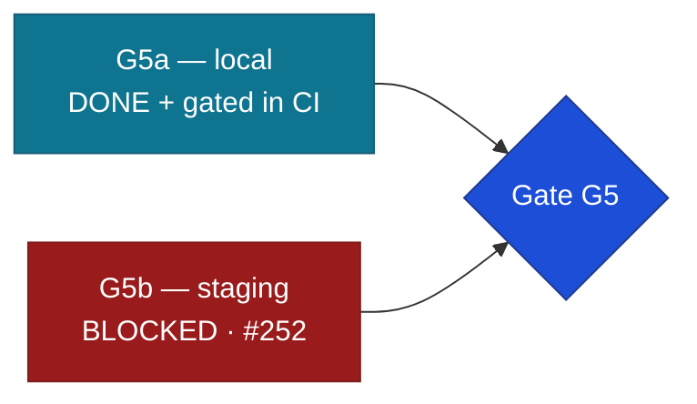

# Gate G5 — Integration & hardening: evidence

Opened 2026-09-12 · Engineer 02 (Claude Code, L3) · Approver: Founder (L4).
Brief: `claude-instructions/05-INTEGRATION.md`. Checklist: `../operations/launch-checklist.md`.

**G5 is NOT passed, and cannot be from this machine.** Three of its five items measure a
deployed environment, and nothing has ever been deployed. Everything that does not require
one is done and gated in CI. This document records what is proven, with the command that
proves it, and refuses to tick what it has not earned.



## The five items

| # | Item | Status | Gated in CI |
|---|---|---|---|
| 1 | Playwright E2E — golden + painful journeys | **PARTIAL** — golden journey complete, 4 painful owed (#253) | yes — `e2e.yml` |
| 2 | k6 baseline vs staging, p95 < 2s @ 200 (ST-6.5) | **BLOCKED** — no staging (#252) | — |
| 3a | Dependency audit + gitleaks full history | **DONE** | yes — `security.yml` |
| 3b | External port scan, only 443 public (ST-2.8) | **BLOCKED** — nothing publicly listening (#252) | — |
| 4 | Restore drill #2 from PITR, timed (ST-6.4) | **BLOCKED** — no staging, no PITR (#252) | — |
| 5 | Chaos hour — 3 cases | **DONE, 3 of 3** | yes — `api.yml` |

## 1. E2E — the golden journey, gated

`apps/web/e2e/`, run against the real stack by `e2e.yml`: PostgreSQL 16 → migrations →
run-scoped RS256/PII keys → real FastAPI → the built Angular app. **`e2e` passes in CI in
~2m21s.** Preview fixtures are off, so every assertion travels to a real row.

```
npx playwright test
  ✓ golden journey › a student can register and reach their account
  ✓ golden journey › a reload keeps the student signed in
  ✓ golden journey › profile, applies, submits, and sees a real status
  ✓ keyboard walk › the public home page is walkable, and the skip link works
  ✓ keyboard walk › the signed-in account area is walkable
  ✓ keyboard walk › a form can be completed and submitted without a mouse
  ✓ marketing home: within the G4 budget on throttled 3G
  ✓ browse bursaries: within the G4 budget on throttled 3G
  8 passed
```

One worker, **zero retries** — a flake that passes on retry is a defect that ships.

**Still owed (#253):** return-cycle ×3 → outreach flag · rejection → appeal by a *different*
reviewer · waitlist position display · engine-down `UNSCREENED` flow. Each needs
admin/reviewer accounts with real role rows, or a lever to force matching down — fixture
machinery that is itself a build. Their **rules are already covered at API level**
(`test_review_appeal.py`, `test_decision_reason.py`, `test_state_machine.py`); the gap E2E
would close is the **admin UI path**, not the logic.

## 2. Dependency audit + secret scan — done and gated

| Check | Result |
|---|---|
| `apps/web` npm audit | **0 vulnerabilities** |
| `packages/contracts` npm audit | 2 high → **0** after #258 |
| `apps/api` pip-audit (uv.lock, 876 requirement lines) | **No known vulnerabilities** |
| gitleaks, **full history** (`fetch-depth: 0`) | passing on every push |

Both ecosystems now run on every push (`security.yml`). **The first version of that gate was a
false pass** — pip-audit ran against the runner's system Python while a project venv was
loaded, and reported "No known vulnerabilities" without ever looking at our dependencies. It
now audits the exported lockfile, and was negative-controlled against `jinja2==2.11.2` (four
PYSEC advisories, exit 1), because an audit that cannot find a known vulnerability is not an
audit.

## 3. Chaos hour — 3 of 3

**Case 2 — DB connection killed mid-status-transaction** (`test_chaos_atomicity.py`). A
transition writes three things: the append-only `application_status_event` (the record of
**why**), the status cache, and the `notification_outbox` row (the message to the student).
CLAUDE.md makes "one transaction" a hard rule and nothing proved it. The session terminates
its own backend (`pg_terminate_backend(pg_backend_pid())`) between the status write and the
outbox write — the real event, made deterministic. Verified to fail for the right reason:
splitting the transaction fails all three with
`AssertionError: the status moved without the reason or the notification`.

**Case 3 — flood the outbox** (`test_chaos_outbox_flood.py`). An earlier version of this
document said this needed real Redis; that was wrong, and checking cost nothing — the worker
is pure PostgreSQL with `FOR UPDATE SKIP LOCKED`. 60 rows drain in batches of 20, each
delivered **exactly once**; two workers claiming while the other's transaction is still open
get **disjoint** sets (the only arrangement in which a collision could happen); concurrent
drain loses and duplicates nothing; an undeliverable flood ends **DEAD** and is **findable** by
the query an alert would run — a dead letter nobody can see is a student nobody told.

**Case 1 — the matching engine dies mid-job** (`test_chaos_matching_engine.py`). **There is no
separate matching worker in v1** — the async queue is deferred to v1.x (TAD §6.2), so what can
die mid-job is the request doing the work. It degrades rather than failing the student; a run
that dies partway leaves **no partial match set**; and the student can re-run successfully.

## 4. Stage 04 carry-overs — closed here

`handoff-s04-s05.md` §2 left three open. Two are now measured.

**Performance, on the production build, Fast 3G + 4× CPU** (the mid-range SA mobile profile,
P6):

| Route | Transfer | LCP | CLS |
|---|---|---|---|
| marketing home | **196.3 kB** | ~2.9–3.2 s | **0.0000** |
| browse bursaries | **200.2 kB** | ~2.6–3.0 s | **0.0001** |
| G4 target | ≤ 200 kB | < 2500 ms | < 0.1 |

CLS passes with three orders of magnitude to spare; transfer is **on the line**; **LCP misses**
by 400–700 ms, filed as **#271** with the byte breakdown (three font faces are 69.4 kB, 35% of
the budget). Closing that is an optimisation project with design trade-offs, not a line to
change.

**Two harness artefacts were found and fixed before any number was trusted.** Serving
uncompressed reported 461 kB against a 200 kB budget, because Angular's "estimated transfer
size" assumes compression. And `cache-control: no-store` made preloads unusable, so every
preloaded font was fetched **twice** — about 66 kB of phantom bytes that looked exactly like a
duplicate-request bug in the product. The figures above are brotli with realistic cache
headers, which is what Vercel serves (S8.3).

**Keyboard walk** — automated rather than manual, because a walk done by hand happens once, by
the person least likely to notice what they built, and produces a log nobody re-runs. It
prints the focus order every run and asserts a first stop, a working skip link, no traps, and
a visible ring on every stop. **It cannot judge whether the order makes sense to someone who
cannot see the layout — that still needs a person.**

**Still owed: the S16-REJ design sign-off.** The design package §9 required it *before* that
screen merged. It merged without one. That needs the Founder, not code.

## 5. Defects found and fixed this stage

| # | Defect | How it hid |
|---|---|---|
| **#254** | **Registration was impossible through the UI.** The form sent consent purpose `TERMS_AND_PRIVACY`; the API has never accepted it. No student could create an account. | The contract typed `purpose` as a bare string, so the generated client inferred `string` and the wrong value typechecked. Unit tests mock the API, and a mock cannot refuse a request. Fixed at the root: the contract now enumerates the seeded set, so a wrong purpose is a **compile error**. |
| **#272** | **No interactive element drew a focus ring.** 19 of 25 home-page tab stops had no visible focus indicator — WCAG 2.4.7 AA, which G4 requires. | `:focus-visible` sat in `@layer base` and lost to the `outline-none` utility; components then set the outline's *width* and *offset* but never its *style*, computing to `outline-width: 3px; outline-style: none`. axe cannot see it — the styles are present and the tree is correct. Only pressing Tab reveals it. |
| **#265** | **Matching failed closed.** Only the spend breaker triggered fallback; if the embedding engine itself failed, the student got a 500 while a tag/level overlap score was available all along. S8.51 requires graceful AI degradation, and matching is advisory. | No test ever broke the engine, only the budget. |
| **#263** | **The API suite could not run on Windows** (about nine tests), and two matching tests passed or failed by how many times the suite had been run before — 102 bursaries had accumulated locally, and matching persists only the top ten. | An assertion that depends on the suite's history cannot catch a regression. CI's fresh container hid it. |
| **#257** | `js-yaml` high-severity advisory, transitive via `openapi-typescript`. | Dependabot reported it; nothing blocked on it. |

## 6. Open, not resolved

| Item | Owner |
|---|---|
| **#252** — provision staging, or ratify the G5a/G5b split | **Founder (L4)** |
| **S16-REJ design sign-off** | **Founder (L4)** |
| Real `hello@` / `privacy@` addresses | **Founder** |
| `GOVERNANCE_SHA` is still the literal `<PINNED_SHA>`, and `GOVERNANCE_REPO` names a **renamed** repo — `MALULEKE-KS/system-design-template` is now `KSDRILL-SA/governova` | **Founder (L4)** |
| Consent bundling: one checkbox records two POPIA purposes (#255) | **Founder** — product call |
| **#271** LCP gap · **#269** intermittent profile 500 · **#253** four painful journeys | Stage 05/06 |
| The E2E gate runs with an in-memory Redis stand-in, so **token deny-listing and login rate-limiting are never exercised** | with #252 |
| Full-suite local test order-dependence (exposed by #263, not caused by it) | follow-up |
