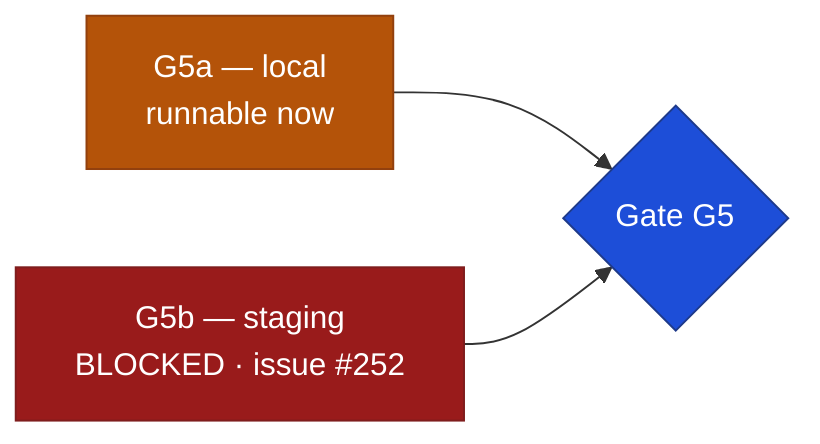

# Gate G5 — Integration & hardening: evidence

Date opened: 2026-09-12 · Engineer 02 (Claude Code, L3) · Approver: Founder (L4).
Brief: `claude-instructions/05-INTEGRATION.md`. Checklist: `../operations/launch-checklist.md`.

**G5 is NOT passed.** Three of its five items measure a deployed environment, and nothing has
ever been deployed. This document records what is proven with real output and what is not,
and does not tick a box it has not earned.



## Status of the five items

| # | Item | Status | Evidence |
|---|---|---|---|
| 1 | Playwright E2E — golden + painful journeys | **PARTIAL** | harness + 2 of 5 journeys (§1) |
| 2 | k6 baseline vs staging, p95 < 2s @ 200 concurrent (ST-6.5) | **BLOCKED** | no staging (§4) |
| 3a | Dependency audit + gitleaks full history | **PARTIAL** | §2 — npm clean, Python not run |
| 3b | External port scan, only 443 public (ST-2.8) | **BLOCKED** | nothing is publicly listening (§4) |
| 4 | Restore drill #2 from PITR on staging, timed (ST-6.4) | **BLOCKED** | no staging, no PITR (§4) |
| 5 | Chaos hour | **NOT STARTED** | §3 |

## 1. Playwright E2E — partial

Stood up in PR #256: `playwright.config.ts`, `e2e/global-setup.ts`, `e2e/support.ts`.
Runs against `npm run start:live`, so the dev preview fixtures are **off** and every
assertion travels to a real row in real PostgreSQL. One worker, **zero retries** — a flake
that passes on retry is a defect that ships.

```
npx playwright test
  ✓ golden journey › a student can register and reach their account (4.8s)
  ✓ golden journey › a reload keeps the student signed in (4.0s)
  2 passed
```

**It found a P0 on its first run.** `register.component.ts` sent `purpose: 'TERMS_AND_PRIVACY'`,
which is not a seeded consent purpose, so **no student had ever been able to create an
account from the application** — every attempt got `422 invalid_consent_purpose`. Fixed at
the root in PR #255: the contract now enumerates the seeded set, so a wrong purpose is a
compile error rather than a runtime 422 nobody sees. Issue #254.

That defect was invisible to 638 unit tests, because a mock cannot refuse a request, and
invisible to the earlier "stack proven end to end" run, because that run called the API
directly with a correct purpose rather than driving the form.

**Still owed (issue #253):** the rest of the golden journey (profile → application → submit
→ status, which needs a Luhn-valid SA ID fixture for D-007), the return-cycle ×3 outreach
flag, rejection → appeal by a *different* reviewer, waitlist position display, and the
engine-down `UNSCREENED` flow. The last four each need admin/reviewer accounts with real
role rows, or a lever to force the matching engine down — fixture machinery that is itself a
build, not a line of test code.

**Not wired into CI.** The suite passes locally only, so this gate is currently protected by
someone remembering to run it.

### Two host truths worth keeping
- `ng serve` binds to **IPv6 loopback only**. A `127.0.0.1` health check never succeeds, so
  Playwright reports a server that failed to start while it is serving on `localhost`.
- Every fresh page load restores the session through `POST /auth/refresh`, and that call
  **rotates the cookie**. Navigating again before it settles sends the superseded token,
  which the API correctly rejects — indistinguishable from a session bug until traced.

## 2. Dependency audit + secret scan — partial

| Check | Result |
|---|---|
| `apps/web` — `npm audit` | **found 0 vulnerabilities** |
| `packages/contracts` — `npm audit` | 2 high → **found 0 vulnerabilities** after PR #258 |
| Dependabot open alerts | 1 high (`js-yaml` GHSA-2883-xcg3-v3hh) → patched, PR #258 |
| gitleaks, full history | **passing on every push** — `security.yml` runs `gitleaks detect` with `fetch-depth: 0`, so the whole history is scanned, not just the diff |
| `apps/api` — Python audit | **NOT RUN** |

The js-yaml advisory arrived transitively (`openapi-typescript` → `@redocly/openapi-core` →
`js-yaml`). Real risk was low — a build-time devDependency whose only input is our own
`openapi.yaml` — and it was patched anyway, because a known high advisory left open to argue
about reachability is how the dangerous ones get lost.

**The Python audit is not done.** `pip-audit` would not install: the API venv reports
`No module named pip`. Dependabot does cover `uv.lock` and showed nothing open for it, which
is reasonable evidence but is not the same as an audit run against the installed tree.

## 3. Chaos hour — not started

Three cases: kill the matching worker mid-job (assert FALLBACK + job recovery); kill the DB
connection mid-status-transaction (assert status, event and outbox are all-or-nothing); flood
the outbox (assert the workers drain and DEAD surfaces).

The **DB atomicity case is genuinely testable locally** against real PostgreSQL and is the
highest-value one, since a partial write there means a student's status and the record of why
disagree. The other two are partly limited by the local `fakeredis` stand-in.

## 4. BLOCKED — the staging dependency (issue #252)

`.github/workflows/deploy.yml` is stubbed and **disabled**: both jobs carry `if: ${{ false }}`
pending `RAILWAY_TOKEN` and `VERCEL_TOKEN`. There is no Railway project, no Vercel project,
and no managed PostgreSQL with point-in-time recovery.

Items 2, 3b and 4 cannot be executed, only pretended. A p95 measured on a developer laptop
against a `fakeredis` stand-in is not evidence about production; publishing it would be worse
than recording the gap.

**This is above L3 and escalated rather than worked around.** Provisioning staging means
creating accounts, issuing and storing deploy tokens, configuring managed PostgreSQL with
PITR, and setting CORS origins and DNS — every one a secrets or security decision, which is
**L4, human-only**. It is also Stage 06 work being pulled forward.

**Recommendation:** split the gate. **G5a** is local and proceeds now. **G5b** (items 2, 3b,
4) stays open and blocks G5 until staging exists. The alternative — pausing Stage 05 entirely
— would have left the E2E suite unwritten, and that suite has already found a defect that
stopped every student at the front door.

## 5. Carried from Stage 04 (`handoff-s04-s05.md` §2)

Still open, and Stage 05's browser pass is where they belong:

- **Throttled-3G LCP / CLS / INP** — never measured.
- **Manual keyboard walk log** — never written.
- **S16-REJ design sign-off** — never recorded; needs the Founder, not code.

## 6. Needs the Founder

| Item | Blocks |
|---|---|
| Provision staging, or accept the G5a / G5b split | G5 |
| Consent bundling: one checkbox currently records two POPIA purposes (PR #255) | launch |
| S16-REJ design sign-off | G4 |
| Real `hello@` / `privacy@` addresses | launch copy |
| `GOVERNANCE_SHA` is still `<PINNED_SHA>`, and `GOVERNANCE_REPO` names a **renamed** repo — `MALULEKE-KS/system-design-template` is now `KSDRILL-SA/governova` | launch checklist "governance/ synced + pinned" |
