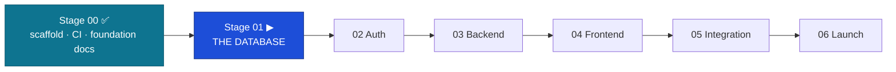

# Handoff: Stage 00 (Foundation) → Stage 01 (Database)

The relay baton — everything the next engineer (terminal Claude Code) needs to pick up at the
highest level. Date: 2026-06-13 · From: Engineer 02 (Claude Code, L3) · Approver: Founder (L4).



## 0. Status at a glance — completed ✅ vs to complete ⬜

| # | Item | Status |
|---|------|--------|
| — | Documentation suite (product · lifecycle · sdlc · engineering-architecture · diagrams · professional naming) | ✅ complete |
| — | Store-topology correction to 3-store + stage briefs aligned | ✅ complete |
| G0 | Stage 00 — scaffold · CI gates (violation proof) · env hygiene | ✅ complete *(merged)* |
| — | Gate G0 `docker compose up` smoke check | ⬜ Founder (no Docker on build host) |
| **G1** | **Stage 01 — the database** | ▶ **next** |
| G2–G6 | auth → backend → frontend → integration → launch | ⬜ to complete |
| — | FWD: financial (v1.5) · institution (v2) · MongoDB/ChromaDB bootstrap (Stage 03) | ⬜ flag-gated, later |
| — | Founder actions: revoke PAT · branch protection (Pro) · pin governance SHA | ⬜ pending |

## 1. What is built (verified green on `main`)

- **Monorepo (adr-0002):** `apps/api` (FastAPI, `/healthz` only), `apps/web` (Angular 18 + `libs/{ui,auth,data-access,util}`, **Tailwind + shadcn/spartan token theme**), `packages/contracts` (`openapi.yaml` + codegen), `infra/docker-compose.dev.yml` (**postgres16 + mongo7 + chromadb + redis7**, healthchecks), `governance/` (pinned-SHA sync stub), `PARKED.md`.
- **CI gates armed & green:** `api` (ruff + import-linter + pytest), `web` (vitest + build), `contract` (validates `openapi.yaml`), `security` (gitleaks CLI), `deploy` (ordered, disabled). Layering gate **proven to bite** (router importing `sqlalchemy` → CI failed → reverted).
- **Documentation suite** under `docs/` (semantic folders, clean filenames): product, decisions, architecture (TAD + engineering-architecture), database (lifecycle, doctrine, data-model, schema), experience, process (sdlc, implementation, workflow, manifest, this handoff), audits, governance. Stage briefs `00–06` aligned.
- **Final review:** `pytest` ✓ · `ruff` ✓ · `import-linter` KEPT ✓ · `vitest` ✓ · `ng build` ✓ · CI green · zero stale doc references.

## 2. Locked stack & decisions

| | |
|---|---|
| Stack | Angular 18 + FastAPI (adr-0001, in governance) |
| Stores | **PostgreSQL** (auth/apps/tracking/match record) · **MongoDB** (AI reasoning, S5.33) · **ChromaDB** (embeddings, S5.45) · **Redis** (deny-list/cache) |
| Auth | RS256 JWT; refresh in HttpOnly cookie, access in Angular memory (S3.13/S3.14) |
| ADRs | 0002 monorepo · 0003 hybrid data access · **0004 REJECTED** (PG-only) · **0005** frontend (Tailwind + spartan/ui; Aceternity/Magic reproduced in Angular) |
| Deploy | Railway (API) before Vercel (web) — S6.29 |

## 3. How we work (must follow)

- **Governance:** Engineer 02 = L3 build-only; the **Founder (L4) approves/merges**; cite `S{C}.{N}`; flag violations, never silently comply. `.ksdrill/` holds the GOVERNOVA constitutions (gitignored clone).
- **GitHub workflow** (`docs/process/github-workflow.md`): every task → **Issue first** (type `Task`, assignee `MALULEKE-KS`, labels, stage milestone, `FundsLink Academy` project + Status) → **branch** → **PR** with `Closes #N` → documented self-review → **squash-merge**. One task = one branch = one PR.
- **Docs standard:** clean, professional **Mermaid** for anything words can't carry — including PR descriptions. Professional naming: semantic folders, clean kebab filenames, version in the control table (never the filename).
- **Layering (enforced):** router → service → repository; only repositories import DB drivers (import-linter). No business logic in UI (S4.12). No hardcoded business values — config table (DB-D24). Secrets never in code (S3.20).
- **Tooling:** `gh` via full path `"/c/Program Files/GitHub CLI/gh.exe"`; auto squash-merge granted EXCEPT PRs that change `.claude/` permissions (Founder merges those).

## 4. ▶ NEXT TASK — Stage 01: THE DATABASE

**Command:** “execute stage 01”. **Brief:** `claude-instructions/01-DATABASE.md` (carries the 3-store note). **Forbidden:** endpoints, services, Angular, auth logic — the database exists alone until G1.

**Read first:** `docs/database/` (lifecycle, doctrine, data-model, `schema.sql`) · `docs/process/implementation-process.md §3` · reference `docs/architecture/technical-architecture.md §4`, `docs/decisions/adr-0003-data-access.md`.

**Tasks:** Alembic migration 0001 (wrap the validated `schema.sql` — do **not** redesign) · seeds 0002 · **DB-D37 constraint test suite** (attempt every violation, assert rejection) · integrity-job skeleton · partition maintenance · repository base layer · restore drill · EXPLAIN baseline.

**Gate G1:** upgrade-from-zero + downgrade→upgrade roundtrip clean; constraint suite 100% green in CI; `make integrity` clean on seeded DB; restore-drill log committed; EXPLAIN shows index scans.

**Store scope:** Stage 01 is **PostgreSQL** only. Embeddings → ChromaDB, reasoning → MongoDB; **their collection bootstrap + the DB-D35 cross-store integrity job land with the matching module (Stage 03)**, behind repository seams.

## 5. Founder open actions (not code)

- **Revoke** the Session-00 PAT now that setup is done.
- **Branch protection** on `main` (S1.16) — enable on GitHub Pro.
- **Gate G0 Docker check:** `docker compose -f infra/docker-compose.dev.yml up -d && curl localhost:8000/healthz`.
- **`governance/sync.sh`** `GOVERNANCE_SHA` is a `<PINNED_SHA>` placeholder — pin to a real commit when first vendoring governance.

---

## 6. Paste-ready opening prompt for the terminal

```
You are Claude Code, Engineer 02 (Senior Engineer, L3, build-only) in the KSDRILL relay,
working on FundsLink Academy. Read CLAUDE.md, then docs/governance/constitution-index.md
(the entry point), then docs/process/handoff-s00-s01.md (full build history + how we work).

Run the governance Session Startup Protocol (.ksdrill/ holds C0–C10). Confirm: 3-store topology
(PostgreSQL + MongoDB + ChromaDB + Redis; ADR-0004 rejected), the issue→branch→linked-PR→squash
workflow (assignee MALULEKE-KS, labels, the "Stage 01 — Database" milestone, the FundsLink Academy
project + Status), and clean Mermaid in docs and PRs.

Then EXECUTE STAGE 01 — THE DATABASE per claude-instructions/01-DATABASE.md: Alembic migration
wrapping the validated docs/database/schema.sql (do not redesign), seeds, the DB-D37 constraint
test suite, integrity-job skeleton, partition maintenance, repository base layer, restore drill,
EXPLAIN baseline. PostgreSQL only this stage (Mongo/Chroma bootstrap is Stage 03). Cite standard
IDs, one PR per logical unit, and STOP at Gate G1 for the Founder.
```

> **Stage 02 onward:** each phase runs in its own session — copy its prompt from
> [session-playbook.md](session-playbook.md) (§1 Database … §6 Launch). At every gate, Claude hands
> off and points you to the next session's prompt.

---

*Stage 00 closed by Engineer 02 (Claude Code, L3) on 2026-06-13. Foundation verified solid; no blocking gaps for Stage 01.*
