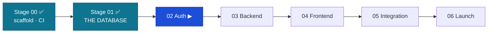

# Handoff: Stage 01 (Database) → Stage 02 (Auth)

The relay baton. Everything Stage 02 needs to pick up at the highest level.
Date: 2026-06-14 · From: Engineer 02 (Claude Code, L3) · Approver: Founder (L4).

## 0. Status — Stage 01 COMPLETE (Gate G1 passed + review hardening)

**Before implementing Stage 02:** Review the frameworks that govern this relay:
- `.ksdrill/workflow/ai-assisted-software-development-workflow/SKILL.md` — the 8-step implementation workflow
- `.ksdrill/workflow/ai-review-challenge-framework/SKILL.md` — stage-specific review questions and the Universal Final Challenge

THE DATABASE is built, hardened, secured, and proven. **9 migrations, 121 tests, all green
in CI.** Single head = `0009`.

## 1. Full build history

- **Engineer 01 — Claude (design):** master-spec, TAD v1.1, DB-DOCTRINE (DB-D1–D44), ERD v1.1
  + validated `schema.sql`, ADRs (monorepo, hybrid data access, 3-store; ADR-004 PG-only
  **rejected**), the constraints/triggers/transition-tables/RBAC.
- **Engineer 02 — Claude Code (Stage 00):** monorepo scaffold, 3-store dev compose, CI gates.
- **Engineer 02 — Claude Code (Stage 01 — this relay):** see §2.

## 2. What is built (verified green on `main`)

| Migration | Brings |
|-----------|--------|
| 0001 | Structural DDL (baseline) — tables, 3 trigger fns, monthly partitions |
| 0002 | Seeds — lookups, RBAC matrix (9 roles/34 perms/44 grants), transitions, config, eligibility rulesets |
| 0003 | Review hardening — FK + review-queue indexes, APPROVED-dup block, domain CHECKs, default partitions |
| 0004 | Application lifecycle — priority lane, post-approval states, doc validity, language, WhatsApp |
| 0005 | Security — least-privilege `fundslink_app` role, append-only revoke, search_path pin |
| 0006 | Security — privilege lockdown (revoke PUBLIC, role timeouts/limits, read-only role) |
| 0007 | Security — Row-Level Security (core student tables, fail-closed) |
| 0008 | Alignment — `updated_at` auto-stamp completion |
| 0009 | Security — RLS completeness (motivation, pre-screen, returns, appeals, audit) |

**Proven:** upgrade 0001→0009 from zero + roundtrip clean · 121 tests (constraints/DB-D37,
security, RLS, integrity, partitions, touch) · `make integrity` clean · restore drill PASS ·
EXPLAIN index scans on all 5 hot queries · ruff + import-linter (layering KEPT). **PRs:**
#39/41/43/45/47/49/51/53/56/58/60/62 + docs.

## 3. Standards satisfied
DB-D2/D8/D9/D16/D18/D20/D21/D23/D24/D28/D30/D36/D37/D39/D40/D44; ADR-003; TAD §3.4 (RBAC),
§3.5 (tenancy), §4.4 (PII); BR-S04/S10/S11/S12, BR-E02/E03/E10, BR-T04, BR-A08/N03/N04;
MASTER-SPEC §5.7/§5.8/§16.2/§3.4; S3.20, S5.3/S5.4/S5.21, S7.1.

## 4. ▶ NEXT TASK — Stage 02: AUTH

Owner: **Engineer 02 (Claude Code)** — backend/auth build (S10.2). Brief:
`claude-instructions/02-AUTH.md` + TAD §3.1. Read `docs/database/README.md` first.

### Contracts Stage 02 MUST honor (from the database)
1. **Connect the app as `fundslink_app`**, never the owner. Provision its LOGIN password from
   a secret manager (`ALTER ROLE fundslink_app LOGIN PASSWORD …`); owner is for migrations only.
2. **Seed the SYSTEM principal with `user.id = 'SYSTEM'`** — `fn_human_final` keys on that literal.
3. **Per request set `app.user_id` + `app.user_role`** (RLS is fail-closed). Jobs use `SYSTEM`.
4. **Add RLS to the auth tables** (`user`, `refresh_token*`) with a SYSTEM-context login/token
   path (D-015) — you have no `user_id` at login.
5. **Any new append-only table** ⇒ `REVOKE UPDATE, DELETE … FROM fundslink_app` in its migration.
6. Endpoints come FROM `packages/contracts/openapi.yaml` (S2.7); each declares a permission
   (deny-by-default lint). Auth path per C3 (RS256, split-token storage S3.13/S3.14).

### Do NOT touch
The locked migrations 0001–0009, the trigger functions, the RLS helpers/policies, the
least-privilege grants. Extend via new migrations only (additive, DB-D36).

## 5. Open items (all resolved/parked — none block Stage 02)
- Product rulings D-001…D-015 + OQ resolutions: `docs/product/scenarios-and-decisions.md`.
- Deployment-layer security (TLS, PgBouncer, backups/PITR, key rotation, role password):
  `docs/operations/security-deployment-checklist.md` (Stage 06 gate).

## 6. Paste-ready opening prompt for Stage 02

Use the **§2 (Stage 02)** prompt in [`session-playbook.md`](session-playbook.md). It already
carries the constitution-index + handoff reads and the issue→branch→PR→squash workflow.

---

*Stage 01 closed by Engineer 02 (Claude Code, L3), 2026-06-14. THE DATABASE: correct, fast,
humane, and unbreakable-by-privilege — proven by output. Awaiting the Founder's DONE stamp.*
