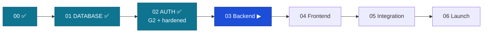

# Handoff: Stage 02 (Auth) → Stage 03 (Backend modules)

The relay baton. Everything Stage 03 needs to pick up at the highest level.
Date: 2026-06-15 · From: Engineer 02 (Claude Code, L3, sole operator) · Approver: Founder (L4).

## 0. Status — Stage 02 COMPLETE (Gate G2 passed, then hardened, then DB-integrated)
Auth is built, gate-green, hardened against the stress-test audit, and verified to sit on every
DB security wall. **Migrations 0001→0014, 216 API tests + 7 web tests, contract-diff +
permission-lint now REAL.**

## 1. Full build history
- **Engineer 01 — Claude (design):** master-spec, TAD v1.2, C0–C10, DB-DOCTRINE, ERD, OpenAPI contract, ADRs, the stress-test audit (ST-1…6).
- **Engineer 02 — Claude Code (Stage 00):** monorepo scaffold, CI gates (with placeholders).
- **Engineer 02 — Claude Code (Stage 01):** THE DATABASE — migrations 0001–0009, least-privilege `fundslink_app`, RLS, append-only triggers, 121 tests.
- **Engineer 02 — Claude Code (Stage 02, sole operator):** see §2.

## 2. What is built (verified green on `main`)
| PR | Brings |
|----|--------|
| #66 | migration 0010 — auth-table RLS + SYSTEM principal (D-015) |
| #68 | app security baseline — config (env-only), CORS (S3.29), headers (S3.31), Sentry, RLS context |
| #70 | crypto core — RS256 JWT, bcrypt+HIBP, refresh tokens, Redis 3-layer rate-limit + deny-list |
| #72 | authentication vertical — register/login/refresh/logout, family-revoke-on-reuse, get_current_user, **contract-diff gate REAL**; migration 0011 (token_version) |
| #74 | RBAC — `require(Permission)`, **deny-by-default permission-lint REAL**, cross-user 403 harness (ST-2.3) |
| #76 | MFA (TOTP) — enrol/activate + step-up enforcement (privileged roles); migration 0012 |
| #78 | Angular `libs/auth` — in-memory token (S3.14), 401-refresh dedup interceptor (S7.12), guards, S04/S05 screens, Sentry web |
| #80/#82 | account lifecycle — verify-email / forgot / reset / change-password + Angular S06/S07; migration 0013 |
| #86 | hardening — timing-safe login, JWT key-rotation verify, uniform 500 envelope, Retry-After, lockout email, TOTP replay guard |
| #88 | auth↔DB integration — least-privilege guard + `/readyz` + migration 0014 (app SELECT-only on RBAC/lookup tables) |

**Standards satisfied:** S2.7, S3.2–S3.4, S3.13–S3.24, S3.29, S3.31, S3.33–S3.36, S7.12, ST-2/ST-2.9, TAD §2.3/§3.1/§4.4, DB-D36, BR-A05, D-015.

## 3. Contracts Stage 03 MUST honor (from auth + DB)
1. **Connect as `fundslink_app`** (the runtime guard + `/readyz` enforce non-superuser/NOBYPASSRLS).
2. **Per request set the RLS context** — `set_user_context` (authenticated) / `set_system_context` (jobs). No context ⇒ no rows.
3. **Protect every new route** with `Depends(require(Permission.X))` or an explicit `public_endpoint`/`authenticated_only` marker — the deny-by-default lint fails CI otherwise.
4. **Endpoints come FROM `packages/contracts/openapi.yaml`** (S2.7); contract-diff + permission-lint gate every PR.
5. **New owned table** ⇒ RLS (0007 pattern) + (append-only ⇒ REVOKE UPDATE,DELETE). New reference/lookup ⇒ `fundslink_app` SELECT-only (0014 pattern).
6. **Status changes** ⇒ transition-table check + status event + outbox row in ONE transaction; SYSTEM can never reach a final decision (`fn_human_final`).
7. **Money** (when v1.5) ⇒ raw parameterised SQL + NUMERIC + append-only ledger (ADR-003); ledger immutability is now constitutional (**S5.65**); two-step approval (§16.4).
8. **Store isolation becomes machine-enforced the moment the polyglot stores come online (S5.3).** When the matching module bootstraps **MongoDB + ChromaDB**, it MUST land the guards that make "funding amounts live in PostgreSQL only — never MongoDB or Redis" un-violable, not merely documented:
   - (a) **No monetary fields in MongoDB / Beanie models** — the matching reasoning doc carries `score`/text/tags only; assert in CI (a lint or model check that fails on a money-typed field).
   - (b) **Redis key allowlist** — only `denylist:*`, `rl:*`, and matching's cache/quota keys; no Redis *value* is a money amount.
   - (c) **Cross-store integration test (S7.15)** — a match round-trip writes **no** amount outside PostgreSQL.

   Rationale: today S5.3's "never MongoDB/Redis" half holds only by convention (the schema keeps money in PG, ADR-003 is a review rule, and the other stores don't exist yet). Stage 03 is the first phase where a violation is *possible* — so it is the phase that must make it *impossible*. Funding amounts stay `NUMERIC` in PG (S5.28 / DB-D29 / DB-D42).

## 4. MANDATORY before the Stage-03 handoff (post-phase verification)
Verify Stage 03 satisfies the relevant findings in **`docs/audits/stress-test-audit.md`** (esp.
ST-2.3 IDOR/cross-user, ST-2.4 upload weaponization, ST-2.6 matching cost attack, ST-1 growth)
and **`docs/product/scenarios-and-decisions.md`** (D-001…). Cite the ST/D ids. See the
CONSTITUTION-INDEX "Post-phase verification" rule.

## 5. Do NOT touch
Locked migrations 0001–0014, RLS policies/helpers, append-only triggers, least-privilege grants,
the auth module's security paths. Extend via new additive migrations only (DB-D36).

## 6. Open items / L4 decisions carried forward
- Live infra (Founder): stamp G2; live Sentry receipt (real DSNs + deploy); provision `fundslink_app` LOGIN password + RS256/PII keys for staging.
- Pending **C5 ledger-immutability amendment** (MASTER-SPEC §16.2) — ratify before v1.5 ledger.
- Funding/donations forward design: `docs/architecture/funding-donations-architecture.md` (v1.5+).
- Residual LOW auth items (optional): registration 409 reveals email-taken (UX vs enumeration); PENDING user gets an unusable token; add S3.34 alerts on password change/reset.

## 7. ▶ NEXT TASK — Stage 03: BACKEND MODULES
Owner: **Engineer 02 (Claude Code)** — NEW session. Brief: `claude-instructions/03-BACKEND.md`.
Order (data dependency): profile → application → eligibility → matching → tracking → notification.
Paste-ready opening prompt: **§3 (Stage 03)** in [`session-playbook.md`](session-playbook.md).

---
*Stage 02 closed by Engineer 02 (Claude Code, L3, sole operator), 2026-06-15. Awaiting the Founder's DONE stamp. Do NOT start Stage 03 in this session.*
