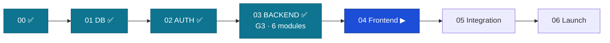

# Handoff: Stage 03 (Backend modules) → Stage 04 (Frontend)

The relay baton. Everything Stage 04 needs to pick up at the highest level.
Date: 2026-06-15 · From: Engineer 02 (Claude Code, L3, sole operator) · Approver: Founder (L4).

## 0. Status — Stage 03 COMPLETE (Gate G3 passed)
Six backend modules built in dependency order, one module = one PR = one gate check. The full
contract surface is implemented; the headless pipeline demo runs end-to-end via API only.

**Final G3 evidence — re-run from a clean tree on 2026-06-15 (every gate, real output):**

| Gate | Command | Result |
|------|---------|--------|
| Lint | `ruff check .` | **All checks passed** |
| Layering (router→service→repo) | `lint-imports` | **1 kept, 0 broken** |
| Permission deny-by-default (S3.21) | `permission_lint.py` | **OK — 30 routes declare a posture** |
| Contract-first (S2.7) | `contract_diff.py` | **OK — 30 ops match `openapi.yaml`** |
| Store isolation (S5.3) | `store_isolation_lint.py` | **OK — no money field in Mongo; Redis allowlisted** |
| Migrations up (DB-D36) | `alembic upgrade head` | **0015 (head)** |
| Migration roundtrip | `downgrade base && upgrade head` | **clean** |
| Partition horizon (DB-D44) | `python -m app.db.partitions` | **+12-month horizon (4 tables)** |
| Integrity (DB-D39) | `python -m app.db.integrity` | **all checks clean** |
| API suite | `pytest -q` | **315 passed** |
| Stage-03 module coverage | `pytest --cov` | **94%** (≥ C7 Python 80%) |
| Pipeline demo (G3) | `pytest tests/pipeline -s` | **PASS — all 4 decision paths + Human-Final** |

*Reproduce locally (no Docker): `initdb` a throwaway trust cluster on a spare port, `createdb fundslink`,
export `ALEMBIC_DATABASE_URL`/`DATABASE_URL`, run the gates, stop + delete the cluster. CI mirrors this.*

## 1. Full build history
- **Engineer 01 — Claude (design):** master-spec, TAD, C0–C10, DB-DOCTRINE, ERD, OpenAPI contract, ADRs, the stress-test audit.
- **Engineer 02 — Claude Code (Stage 00):** monorepo scaffold, CI gates.
- **Engineer 02 — Claude Code (Stage 01):** THE DATABASE — migrations 0001–0009, RLS, append-only triggers, least-privilege.
- **Engineer 02 — Claude Code (Stage 02):** auth vertical — RS256 JWT, refresh rotation, MFA, RBAC, account lifecycle; migrations 0010–0014.
- **Engineer 02 — Claude Code (Stage 03, this baton):** six backend modules — see §2.

## 2. What is built (verified green on `main`)
| PR | Module | Brings |
|----|--------|--------|
| #100 | profile | student_profile CRUD; document pipeline (magic-byte, EXIF strip, sha256, AV-pending, signed URLs separate origin — ST-2.4); SA ID AES-GCM + HMAC blind index (BR-A04) |
| #102 | application | lifecycle state machine (BR-S04); status event + outbox in ONE txn (BR-N01); Human-Final (BR-E03); duplicate-active 409 (BR-E06); OTHER motivation (BR-E05); appeal (BR-E07); admin review |
| #104 | eligibility | pre-screening engine (§5.7) — ruleset evaluator (BR-E01/E02); RETURNED fix-list + return cycles + 3-cycle outreach (BR-E04); UNSCREENED degradation; resubmit. Fix: status events use `clock_timestamp()` (DB-D24 ordering) |
| #106 | matching | match_result (PG) + reasoning (MongoDB/Beanie, S5.33) + embeddings (ChromaDB seam, S5.45); 202 queued; spend breaker + quota (ST-2.6); FALLBACK (S8.51); **S5.3 store-isolation guard + CI lint + S7.15 cross-store test + DB-D35 reconcile**. Adds beanie + migration 0015 |
| #108 | tracking | external-application dashboard (BR-T01/T03/T04); T-3 deadline reminders (BR-T05) + 30/45/60 silence jobs (BR-T06) → outbox |
| #110 | notification | outbox workers SKIP LOCKED; channel adapters (email live, SMS stub, in-app); consent (BR-N03) + preference (BR-N02); retry/backoff/DEAD |

**Standards satisfied:** S2.7, S2.19, S2.23, S3.21–S3.23, S3.33, S4.79, S5.3, S5.21, S5.28, S5.33, S5.45, S7.1, S7.15, S7.25, S8.51, BR-A03/A04, BR-S01–S08, BR-E01–E07, BR-M01–M04, BR-N01–N03, BR-T01–T06, D-001/D-004/D-006/D-010/D-011/D-014.

## 2a. How this engineer worked — mirror this discipline
- **"Done" = command output.** Every gate above was re-run from a clean tree and pasted.
- **Issue → branch → linked PR (`Closes #N`) → documented self-review (S10.27) → squash-merge → delete branch.** One module per PR.
- **Branch before touching anything.** Once (module 4) I slipped onto `main`; caught it with `git branch --show-current` *before any commit* and moved the changes to the branch. Check first, every time.
- **The two not-mine files were never staged:** `docs/database/explain-baseline.md`, `docs/operations/restore-drill-log.md`.
- **No Docker:** throwaway PG trust cluster on a spare port. `git push`/`gh` hit intermittent DNS/TLS — wrap in a short retry loop.

## 3. S10.37 — post-phase adversarial verification (constitutional; this handoff is not accepted without it)
Verified Stage 03 against `docs/audits/stress-test-audit.md` (ST) and `docs/product/scenarios-and-decisions.md` (D-NNN):

**ST findings satisfied:**
- **ST-1.2** queued matching + cached embeddings + 202 → matching module ✅
- **ST-1.3** N outbox workers, SKIP LOCKED → notification module ✅
- **ST-2.3** IDOR/cross-user — RLS fail-closed + a cross-user 403/404 suite in **every** module ✅
- **ST-2.4** upload weaponization — magic-byte allowlist, EXIF strip, AV-pending, separate serving origin, size cap ✅ *(strict CSP is a frontend/deploy header — Stage 04/06)*
- **ST-2.6** matching cost attack — per-user quota + spend circuit breaker + FALLBACK ✅
- **ST-3.1** FK/outbox/dashboard indexes — used as built in Stage 01 ✅ · **ST-3.4** currency ZAR NUMERIC ✅
- **ST-2.1** MFA on privileged roles — carried from Stage 02 (admin review is `ADMIN_REVIEWER`) ✅

**D-NNN rulings honored:**
- **D-001** open intake (no submission deadline) ✅ · **D-004** one active app/year (`uq_app_active_per_year`: APPROVED/SUSPENDED/REVOKED block, only COMPLETED frees — verified against the live index) ✅
- **D-006** `application_return.respond_by` set on every return ✅ · **D-010** Human-Final proven (DB trigger rejects SYSTEM approve — asserted in the pipeline demo) ✅
- **D-011** derived seeds used as-is (notify triggers, tracked transitions) ✅ · **D-014** no silent edits under review (no edit endpoint; new info via documents / RETURN→resubmit) ✅

**Flagged to the Founder (deferred — NOT silently skipped):**
1. **`dataExport`** (GET /students/me/data-export, POPIA §15.6) — contracted but **outside the brief's six modules**; not built (scope discipline). Schedule it.
2. **D-005** document-validity return (`valid_until` past → RETURN) — the pre-screen checks document *presence*, not *expiry*; the expiry→return path (BR-E10) is not yet wired.
3. **D-007** SA ID required *before SUBMIT* — the profile accepts an encrypted ID but submit does not yet *require* one. A service guard is needed.
4. **D-002/D-013** priority/emergency lane (URGENT/CRITICAL) — columns exist (`lk_priority`, `needed_by`) but no contract endpoint surfaces setting priority.
5. **D-003/D-012** post-approval lifecycle (APPROVED→SUSPENDED/REVOKED/COMPLETED) — transitions seeded, but no endpoint (the `adminReview` enum maxes at APPROVED_PROPOSED); the second-authorizer APPROVE step is v1.5 money-adjacent (BR-S05).
6. **Channel↔consent policy** (notification): SMS requires `MARKETING_SMS`; EMAIL/IN_APP transactional — a POPIA product decision to ratify.

## 4. Contracts Stage 04 (frontend) MUST honor
1. **Generate the TS client from `packages/contracts/openapi.yaml`** — no hand-written API types (S4.x). 30 operations are live.
2. **Access token in Angular memory only** (S3.14); the 401-refresh-dedup interceptor already exists in `libs/auth` (S7.12).
3. **No business logic in the UI** (S4.12) — the backend owns every rule. Surface `error.code` (stable), never branch on `error.message`.
4. Every list endpoint is **cursor-paginated** (`{items, meta:{next_cursor}}`). Money is a **decimal string** (`requested_amount`) — render, never `parseFloat` for logic.
5. The four mandatory screen states (loading/error/empty/success) per the UX map; the rejection screen (S16-REJ) gets its own design review before merge (S4 gate).

## 5. Do NOT touch
Locked migrations 0001–0015, RLS policies/helpers, append-only triggers, `fn_human_final`, least-privilege grants, the auth + backend module security paths. Extend via new additive migrations only (DB-D36). The two working-tree files `docs/database/explain-baseline.md` and `docs/operations/restore-drill-log.md` are not yours — never stage them.

## 6. ▶ NEXT TASK — Stage 04: FRONTEND
Owner: **Engineer 02 (Claude Code)** — NEW session. Brief: `claude-instructions/04-FRONTEND.md`.
Paste-ready opening prompt: **§4 (Stage 04)** in [`session-playbook.md`](session-playbook.md).

---
*Stage 03 closed by Engineer 02 (Claude Code, L3, sole operator), 2026-06-15. Awaiting the Founder's G3 DONE stamp. Do NOT start Stage 04 in this session.*
