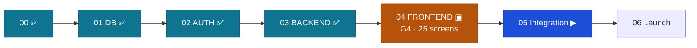

# Handoff: Stage 04 (Frontend) → Stage 05 (Integration)

The relay baton. Everything Stage 05 needs to pick up at the highest level.
Date: 2026-09-12 · From: Engineer 02 (Claude Code, L3, sole operator) · Approver: Founder (L4).

## 0. Status — Stage 04 BUILD COMPLETE, G4 PARTIALLY EVIDENCED

Every screen in the journey is built, the full stack has run end to end against real
PostgreSQL, and the repository is at zero open issues. **Two G4 criteria are not yet
evidenced** (§2). This document does not claim the gate. The Founder reviews it.

### G4 evidence — real output, clean tree on `main`, 2026-09-12

| Gate criterion | Command | Result |
|---|---|---|
| Vitest green | `ng test --no-watch` | **35 files / 634 tests passed** |
| Typecheck (app + 4 libs + specs) | `npm run typecheck` | **clean, exit 0** |
| Production build | `ng build --configuration production` | **exit 0, no budget breach** |
| First load — initial bundle | build table | **377.14 kB raw / 101.52 kB transfer** |
| axe WCAG 2.2 AA (jsdom) | in-suite, every screen | **zero serious/critical** |
| Colour contrast (real browser) | Lighthouse accessibility | **100, zero failures** — home (anonymous), dashboard, S16 decision |
| A03 refuses an inadequate rejection | `admin.spec.ts` | **PASS** — refuses <40 words, refuses no next-step confirmation, refuses no reason category; allows only when all three hold |
| ≤200 kB first load, student routes | build table, no DSN | **~106–130 kB transfer** (see §1) |
| ≤200 kB first load, student routes | build table, **with a production Sentry DSN** | **⚠ ~236–260 kB — see §3, Founder decision** |
| Throttled-3G LCP / CLS / INP | — | **NOT MEASURED** (§2) |
| Manual keyboard walk log | — | **NOT WRITTEN** (§2) |
| S16-REJ Founder design sign-off | — | **NOT RECORDED** (§2) |

## 1. First load, worked out

`Initial total` is **101.52 kB transfer**. A student route adds its own lazy chunks on top:

| Route | Initial | + app-shell | + route chunk | Total transfer |
|---|---|---|---|---|
| `/app` (dashboard) | 101.52 | 3.67 | 4.20 | **109.39 kB** |
| `/app/applications/:id` (heaviest) | 101.52 | 3.67 | 6.84 | **112.03 kB** |
| `/` (marketing home, anonymous) | 101.52 | — | 4.25 | **105.77 kB** |

Adding the two largest unnamed shared chunks (9.77 + 7.71 kB) as a worst case still lands at
**~129.5 kB** — comfortably inside the 200 kB bar. This criterion passes on bytes.

## 2. What is NOT evidenced, and why

Three items are outstanding. None is a defect; each is unfinished measurement or an
unrecorded approval, and each is stated here rather than assumed.

1. **Throttled-3G LCP / CLS / INP.** Needs a real browser driving a production build. Both
   browser automation servers (`chrome-devtools`, `playwright`) failed to connect in the
   session that produced this document, and an earlier attempt to run a build and a server
   concurrently exhausted host memory. The bytes are measured; the *timings* are not.
   Stage 05 owns this alongside the rest of the browser-pass backlog.
2. **Manual keyboard walk log.** axe covers programmatic accessibility on every screen and
   Lighthouse confirms contrast, but a human tab-through of each journey has never been
   written down. Same blocker, same owner.
3. **S16-REJ design sign-off.** `stage-04-design-package.md` §9 requires the kind-rejection
   screen to have its own Founder design review *before merge*. The screen shipped in the
   #220 work; the sign-off was never recorded. **This needs the Founder, not more code.**

## 3. Escalation — Sentry on the first-load path (Doctrine L11)

**The finding.** `src/app/core/observability.ts` loads the Sentry SDK through
`provideAppInitializer` whenever a DSN is configured. The SDK is its own lazy chunk:
**461.00 kB raw / 129.60 kB transfer**. Local dev and CI have no DSN and never fetch it,
which is why every number in §1 is clean — but production will have one.

**What is already right.** The initializer does not `await` the import, by explicit design
("the SDK must not stand between the user and first paint"), and `DeferredErrorHandler`
buffers up to 20 errors so nothing thrown during the window is lost. So this does not block
first paint, and it is not a regression — it is the *improvement* that moved Sentry out of
the initial bundle in the first place.

**Why it still matters.** G4 measures a mid-range South African phone on 3G. On that
profile 129.60 kB of non-blocking bytes still competes for the same scarce bandwidth as the
route the student is waiting for, starting at bootstrap. Counting all first-visit bytes, a
student route in production becomes roughly **236–260 kB** — over the 200 kB bar.

**Why it is escalated rather than fixed.** Whether the 200 kB bar counts render-blocking
bytes or all first-visit bytes is a definition the Founder owns, and whether production
carries a DSN at all is a Stage 06 deploy decision. Both sit above L3.

**Recommendation.** Keep Sentry, move the fetch off the first-visit critical path: start it
on first idle (`requestIdleCallback`, with a `setTimeout` fallback) or after the first route
settles, instead of at bootstrap. The buffer already covers the longer window, so the change
is small and costs no error fidelity. If the Founder reads the 200 kB bar as
render-blocking bytes only, then no change is needed and this note simply records why.

## 4. What Stage 04 actually built

- **25 screens** — S01–S21 student, A01–A03 admin — in journey order, each with all five
  states, one `h1`, axe clean. A04 recusal is not built: **no endpoint exists** for it.
- **The stack runs.** PostgreSQL 16.14 + FastAPI + Angular, locally, end to end: register →
  login → reload keeps the session → profile → application → submit → real status trail.
  The earlier record saying this host could not run PostgreSQL was wrong.
- **Four standing gates** were added, each because something real slipped past:
  `route-integrity.spec.ts` (ten dead links, hidden by a redirecting `**`),
  `promises.spec.ts` (five user-facing claims the system did not keep),
  `contract-coverage.spec.ts` (eight API capabilities with no button — including sign-out,
  which existed nowhere), `account-data-integrity.spec.ts` (nothing hardcoded in an account).
- **#220 was not a contract gap.** `decision_reason` was already in
  `application_status_event.note` and had simply never been read back. S16 now exists.

## 5. Known caveats carried into Stage 05

- MFA has no "turn off" / "regenerate codes", and no endpoint reports whether it is already on.
- `review_sla_days = 14` lives in the config table; no contract endpoint exposes it.
- The waitlist policy "postgraduate first, then by need" is described but not implemented.
- The dashboard leads with `applications()[0]`; the contract does not guarantee ordering.
- Tracking silence threshold is computed client-side from the device clock.
- A03's 40-word floor stops a two-word decline; it cannot detect boilerplate, and the
  next-step checkbox is an **attestation, not a verification**.

## 6. Outstanding from the Founder

| Item | Blocks |
|---|---|
| Real `hello@` / `privacy@` addresses | `src/app/content/organisation.ts` still says PLACEHOLDER |
| S16-REJ design sign-off | G4 |
| Ruling on §3 (Sentry / the 200 kB definition) | G4 |
| NPC / PBO / §18A registration number | marketing copy; must never be invented |
| Consented student stories | testimonials; tests currently enforce their absence |
| `GOVERNANCE_SHA` pin, `main` branch protection | carried since Stage 03 |

## 7. Next session

`docs/process/session-playbook.md` §5 — Stage 05 Integration. Its first work is the
browser-pass backlog this document leaves open: throttled-3G timings, the keyboard walk log,
nav overflow behaviour (arrows never render in jsdom), and hero LCP.
